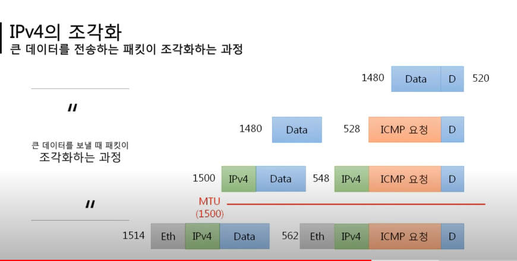

# 6. ICMP 프로토콜 - 멀리 있는 컴퓨터끼리 데이터 주고받기(2)

### (3) 라우팅 테이블

- 패킷을 어디로 보내야 하는지 네트워크 대역을 설정
    - 최적의 경로를 지도처럼 저장한 것
    - 지도에 적힌 대역만 찾아갈 수 있음 -> 기본값(기본 게이트웨이) 설정해줌 (모르면 일단 문 밖으로라도 나가라)

### (4) 다른 네트워크와 통신 과정

- 이더넷은 가까운 곳에서 통신할 수 있음
- 다른 네트워크 대역으로 넘어갈 때
    - 수신 측에서 3계층의 목적지 IP 주소 확인 -> 본인 아님 -> 본인의 라우팅 테이블 확인 -> 이더넷 프로토콜 재생성(내용 바꿔서 다시 포장): 목적지&출발지 MAC 주소를 자기 옆에 있는 네트워크 대역에서 통신할 수 있는 것으로 수정(가까운 곳에서만 쓰므로) -> 다시 포장해서 보냄 -> 같은 과정 반복 -> 최종 목적지에서 알맞는 응답 해주고 거꾸로 다시 돌아감
        - 이더넷 프로토콜은 네트워크 대역이 바뀔 때마다 새로 작성됨

### (5) IPv4 조각화

- 여러 개의 작은 패킷 쪼개짐
    - 큰 IP 패킷들이 적은 MTU(Maximun Tranmission Unit)를 갖는 링크를 통해 전송돼야 함
    - 목적지까지 패킷을 전달하는 과정에 통과하는 각 라우터마다 전송에 적합한 프레임으로 변환 필요
    - 조각화 -> 최종 목적지 도달까지 재조립X(일반적)

    

    
