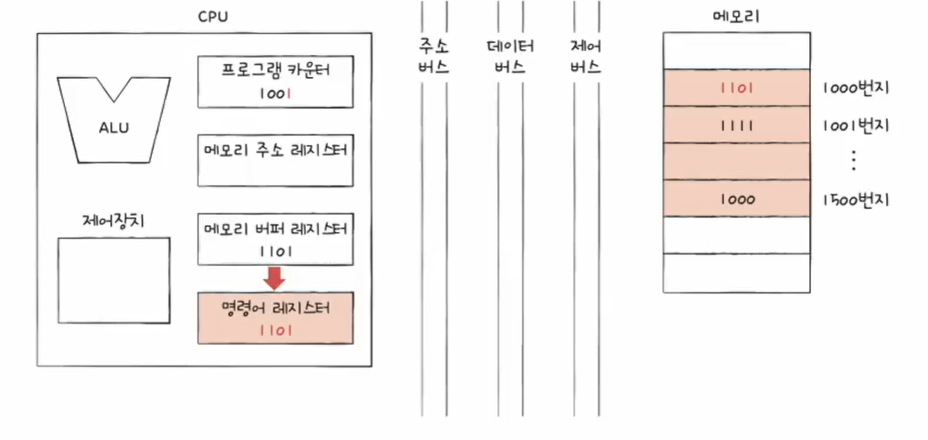
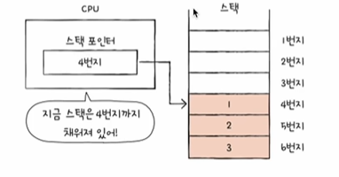
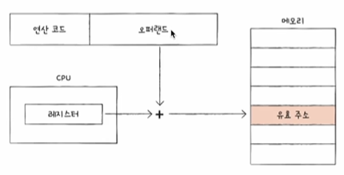

# 레지스터..
- CPU 내부의 작은 임시저장장치
- 프로그램 속 명령어 & 데이터는 실행 전후로 레지스터에 저장
- CPU 내부에는 다양한 레지스터들이 있고, 각기 다른 역할을 한다

# 레지스터 종류

- 프로그램 카운터는 주소를 CPU로 갖고 왔다면 1 증가!!
=> 프로그램을 순차적으로 실행할 수 있는 원리

- 순차적인 실행 흐름이 끊기는 경우
    - 특정 메소리 주소로 실행 흐름을 이동하는 명령어 실행 시
    (e.g. JUMP, CONDITIONAL JUMP, CALL RE)
    - 인터럽트 발생 시
    - etc...
1. 프로그램 카운터 : 메모리에서 가져올 명령어의 주소(메모리에서 읽어 들일 명령어의 주소)를 저장
2. 명령어 레지스터 : 해석할 명령어(방금 메모리에서 읽어 들인 명령어)를 저장
3. 메모리 주소 레지스터 : 메모리의 주소를 저장(CPU가 메모리로부터 읽어 들이고자 하는 주소를 주소 버스로 보낼 떄 거치는 레지스터)
4. 메모리 버퍼 레지스터 : 메모리와 주고받을 값(데이터와 명령어) / CPU가 정보를 데이터 버스로 주고받을 때 거치는 레지스터
5. 플래그 레지스터 : 연산 결과 또는 CPU 상태에 대한 부가적인 정보를 저장
6. 범용 레지스터 : 다양하고 일반적인 상황에서 자유롭게 사용(주소, 명령어, 데이터에 제약없이 담을 수 있다)
7. 스택 포인터 : 스택의 꼭대기를 가리킴
8. 페이스 레지스터 : 기준 주소를 저장

# 특정 레지스터를 이용한 주소 지정 방식
1. 스택 주소 지정 방식 
- 스택과 스택 포인터를 이용한 주소 지정 방식

- 스택 포인터 : 스택의 꼭대기를 가리키는 레지스터(스택이 어디까지 차 있는지에 대한 표시)

2. 변위 주소 지정 방식 : 오퍼랜드 필드의 값(변위)과 특정 레지스터의 값을 더하여 유효 주소 얻기
