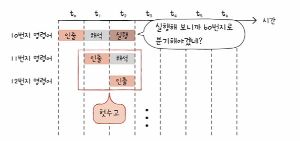
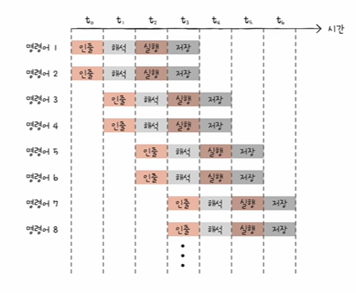

# 명령어 병렬 처리 기법
1. 명령어 파이프 라인?
- 명령어가 처리되는 과정을 비슷한 시간 간격으로 나누면?
    1. 명령어 인출(Instruction Fetch)
    2. 명령어 해석(Instruction Decode)
    3. 명령어 실행(Execute Instruction)
    4. 결과 저장(Write BAck)
    - 같은 단계가 겹치지만 않는다면 CPU는 '각 단계를 동시에 실행할 수 있다'(하나의 명령어를 실행하는 동안 다른 명령어 해석..)
- 파이프라인 위험 : 명령어 파이프라인이 성능 향상에 실패하는 경우(파이프라인 해저드)
    1) 데이터 위험 : 명령어 간의 의존성에 의해 야기
    - 모든 명령어를 동시에 처리할 수는 없다
    (이전 명령어를 끝까지 실행해야만 비로소 실행할 수 있는 경우)

    ```
    명령어 1: R1 <- R2 + R3 // R2 레지스터 값과 R3 레지스터 값을 더한 값을 R1 레지스터에 저장
    명령어 2 : R4 <- R1 + R5 // R1 레지스터 값과 R5 레지스터 값을 더한 값을 R4 레지스터에 저장
    ```
    2) 제어 위험 : 프로그램 카운터의 갑작스러운 변화
    

    3) 구조 위험 : 서로 다른 명령어가 같은 CPU 부품(ALU, 레지스터)를 쓰려고 할 떄

2. 슈퍼 스칼라

- CPU 내부에 여러 개의 명령어 파이프라인을 포함한 구조
- 이론적으로는 파이프라인 개수에 비례하여 처리 속도 증가
- But 파이프라인 위험도의 증가로 인해 파이프라인 개수에 비례하여 처리 속도가 증가하진 않음

3. 비순차적 명령어 처리(OOOE, out of order execution)
- 합법적인 새치기
- 전공서에서 많이 다루는 내용은 아니지만 현대 CPU 발전에 있어서 중요한 기술이다
- 아무 명령어나 순서를 바꿀 수는 없다(그 값을 토대로 다른 연산을 수행해야 한다면 순서 바꿀 수 없음)
