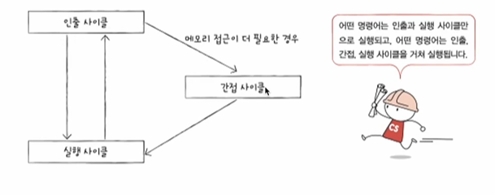
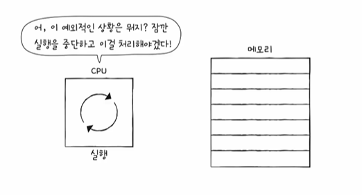

# 명령어 사이클
- 프로그램 속 명령어들은 일정한 주기가 반복되어 실행
- 이 주기를 명령어 사이클이라고 함
- 인출 사이클 : 가장 먼저 CPU로 메모리의 내용을 가져오는 작업을 인출이라고하고 그 주기를 뜻함
- 실행 사이클 : 갖고 왔으면 실행...
- 인출 - 실행 - 인출 - 실행의 과정을 반복한다
- 그런데 COU로 명령어를 가지고 와도 바로 실행이 불가능한 경우도 있다...(간접 주소 지정 방식)
=> 이 경우 접근을 해야 되는 경우를 위해서 간접 사이클이 추가된다...

# 인터럽트
- 인터럽트라고 하는 개념이 없다면 cpu는 위 주기를 바탕으로 실행
- 인터럽트 : 정해진 흐름대로 CPU가 프로그램을 처리하고 있는데 이런 정해진 흐름을 끊어버리는 것
- 'CPU가 꼭 주목해야 할 떄', 'CPU가 얼른 처리해야 할 다른 작업이 생겼을 떄' 발생
- "강대리, 이거 급한 거니까 지금 하던 일 멈추고 이것부터 처리해주게"
- 동기 인터럽트(예외)와 비동기 인터럽트(하드웨어 인터럽트)로 종류가 나뉨

# 인터럽트의 종류
1. 동기 인터럽트(예외)
- CPU가 예기치 못한 상황을 접했을 떄 발생
- 동기 인터럽트의 종류에는 폴트, 트랩, 중단, 소프트웨어 인터럭트 4가지 종류가 있다

- 추후 운영체제 시간에 좀 더 자세히 다룬다 함...

2. 비동기 인터럽트(하드웨어 인터럽트) 
- 주로 입출력 장치에 의해 발생
- 알림(세탁기 완료 알림, 전자레인지 조리 알람)과 같은 역할
- 입출력 작업 도중에도 효율적으로 명령어를 처리하기 위해 하드웨어 인터럽트 사용
