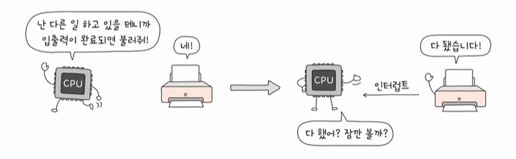

# 명령어 사이클
- 프로그램 속 명령어들은 일정한 주기가 반복되어 실행
- 이 주기를 명령어 사이클이라고 함
- 인출 사이클 : 가장 먼저 CPU로 메모리의 내용을 가져오는 작업을 인출이라고하고 그 주기를 뜻함
- 실행 사이클 : 갖고 왔으면 실행...
- 인출 - 실행 - 인출 - 실행의 과정을 반복한다
- 그런데 COU로 명령어를 가지고 와도 바로 실행이 불가능한 경우도 있다...(간접 주소 지정 방식)
=> 이 경우 접근을 해야 되는 경우를 위해서 간접 사이클이 추가된다...

# 인터럽트
- 인터럽트라고 하는 개념이 없다면 cpu는 위 주기를 바탕으로 실행
- 인터럽트 : 정해진 흐름대로 CPU가 프로그램을 처리하고 있는데 이런 정해진 흐름을 끊어버리는 것
- 'CPU가 꼭 주목해야 할 떄', 'CPU가 얼른 처리해야 할 다른 작업이 생겼을 떄' 발생
- "강대리, 이거 급한 거니까 지금 하던 일 멈추고 이것부터 처리해주게"
- 동기 인터럽트(예외)와 비동기 인터럽트(하드웨어 인터럽트)로 종류가 나뉨

# 인터럽트의 종류
1. 동기 인터럽트(예외)
- CPU가 예기치 못한 상황을 접했을 떄 발생
- 동기 인터럽트의 종류에는 폴트, 트랩, 중단, 소프트웨어 인터럭트 4가지 종류가 있다

- 추후 운영체제 시간에 좀 더 자세히 다룬다 함...

2. 비동기 인터럽트(하드웨어 인터럽트) 
- 주로 입출력 장치에 의해 발생
- 알림(세탁기 완료 알림, 전자레인지 조리 알람)과 같은 역할
- 입출력 작업 도중에도 효율적으로 명령어를 처리하기 위해 하드웨어 인터럽트 사용
- 입출력장치는 CPU에 비해 느리다
- 인터럽트가 없다면 CPU는 프린트 완료 여부를 확인하기 위해 주기적으로 확인해야 한다
- 하지만 인터럽트가 있다면 입출력 작업 동안 CPU는 다른 일을 할 수 있다!!

# 하드웨어 인터럽트의 처리 순서
- 인터럽트의 종류를 막론하고 인터럽트 처리 순서는 대동소이하다.

1. 입출력장치는 CPU에 인터럽트 요청 신호를 보냅니다

2. CPU는 실행 사이클이 끝나고 명령어를 인출하기 전 항상 인터럽트 여부를 확인합니다.
    - CPU가 인터럽트를 받아들이기로 했다면 인터럽트 서비스 루틴을 실행...
    - <strong>인터럽트 서비스 루틴이란..</strong>
    인터럽트가 발생했을 떄 해당 인터럽트를 어떻게 처리하기 위핸 프로그램
    - 인터럽트 서비스 루틴 또한 프로그램이기 떄문에 일반적으로 메모리에 저장됨

3. CPU는 인터럽트 요청을 확인하고 인터럽트 플래그를 통해 현재 인터럽트를 받아들일 수 있는지 여부를 확인합니다
    - 인터럽트 플래그 : 인터럽트 요청 신호를 받아들일지 무시할지를 결정하는 비트
4. 인터럽트를 받아들일 수 있다면 CPU는 지금까지의 작업을 백업합니다. 
5. CPU는 인터럽트 벡터(각각의 인터럽트를 구분하기 위한 정보)를 참조하여 인터럽트 서비스 루틴을 실행합니다
    - 'CPU가 인터럽트를 처리한다'
    => '인터럽트 서비스 루틴을 실행하고, 본래 수행하던 작업으로 다시 되돌아온다' (+ 그리고 인터럽트의 시작 주소는 인터럽트 백터를 통해 알 수 있다)

6. 인터럽트 서비스 루틴 실행이 끝나면 4에서 백업해 둔 작업을 복구하여 실행을 재개합니다.

#### 인터럽트 주요 용어 간단 정리
- 인터럽트 요청 신호 : CPU의 작업을 방해하는 인터럽트에 대한 요청
- 인터럽트 플래그 : 인터럽트 요청 신호를 받아들일지 무시할지를 결정하는 비트
- 인터럽트 벡터 : 인터럽트 서비스 루틴의 시작 주소를 포함하는 인터럽트 서비스 루틴의 식별 정보
- 인터럽트 서비스 루틴 : 인터럽트를 처리하는 프로그램

