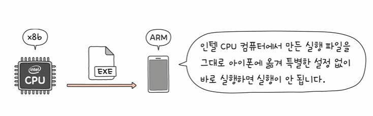

# 명령어 집합

- 명령어 집합(구조) : CPU가 이해할 수 있는 명령어들의 모음
(인텔의 CPU가 이해할 수 있는 명령어들의 집합이 있고 아이폰  CPU가 이해할 수 있는 명령어들의 집합이 있다)
=> 명령어 집합(구조) : CPU의 언어인 셈
- 명령어가 달라지면 그에 대한 나비효과로 많은 것들이 달라진다
- 명령어 해석 방식, 레지스터의 종류와 개수, 파이프라이닝의 용이성...
- 명령어 집합의 가장 큰 두개의 카테고리(CISC, RISC)

# CISC(Complex Instruction Set Computer)
- 복잡한 명령어 집합을 활용하는 컴퓨터 (CPU)
- x86, x86-64는 CISC 기반 명령어 집합 구조
- 다양하고 강력한 명령어를 활용
- 상대적으로 적은 수의 명령어로도 프로그램을 실행할 수 있다
- 메모리를 최대한 아끼며 개발해야 했던 시절에 인기가 높았으나... 명령어 파이프라이닝이 불리하다는 치명적인 단점
- 명령어가 워낙 복잡하고 다양한 기능을 제공 하는 탓에 명령어의 크기와 실행되기까지의 시간이 일정하지 않음, 복잡한 명령어 때문에 명령어 하나를 실행하는 데에 여러 클럭 추가 필요
 

# RISC(Reduced Instruction Set Computer)
- 명령어의 종류가 적고, 짧고 규격화된 명령어 사용
- 메모리 접근 최소화(load, store), 레지스터 십분 활용
- 다만 명령어의 종류가 CISC보다 적기에 더 많은 명령어로 프로그램을 동작시킴

# 정리..
| CISC | RISC |
| ---- | ---- |
| 복잡하고 다양한 명령어 | 단순하고 적은 명령어 |
| 가변 길이 명령어 | 고정 길이 명령어 |
| 다양한 주소 지정 방식 | 적은 주소 지정 방식 |
| 프로그램을 이루는 명령어의 수가 적음 | 프로그램을 이루는 명령어의 수가 많음 |
| 여러 클럭에 걸쳐 명령어 수행 | 1클럭 내외로 명령어 수행 |
| 파이프라이닝하기 어려움 | 파이프라이닝하기 쉬움|
