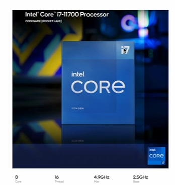
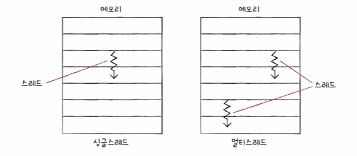

# 베울 순서...
1. 클럭
2. 코어 & 멀티 코어
3. 스레드 & 멀티 스레드

# CPU의 속도를 빠르게 만들어보자
1. 컴퓨터 부품들은 '클럭 신호'에 맞춰 일사분란하게 움직인다.
    - 그럼 클럭 신호가 빠르게 반복되면 CPU를 비롯한 컴퓨터 부품들은 그에 맞춰 빠르게 움직이나? YES
    - 클럭 속도
        1) 클럭 속도 : 헤르츠(Hz) 단위로 측정
        2) 헤르츠 : 1초에 클럭이 반복되는 횟수
        3) 클럭이 '똑-딱-'하고 1초에 한번 반복되면 1Hz
        4) 클럭이 1초에 100번 반복되면 100Hz
    - 필요 이상으로 클럭을 높이면 발열이 심각해짐(ㅜㅜ)
    - 클럭 속도를 늘리는 방법 이외에 cpu를 좀 더 빠르게 동작시킬 수 있는 방법 2가지 : 코어 & 멀티 코어
        1) 코어 수를 늘리는 방법("듀얼 코어", "멀티 코어")
        2) 스레드 수를 늘리는 방법("멀티 스레드")

2. CPU는 '명령어 사이클' 이라는 정해진 흐름에 맞춰 명령어들을 실행한다.

# 코어와 멀티 코어

1. 코어(Core)란?
    - 현대적인 관점에서 "CPU"라는 용어를 재해석 해야 함
    - '명령어를 실행하는 부품'?
    - 전통적으로 '명령어를 실행하는 부품'은 원칙적으로 하나만 존재
    - But 오늘날 CPU에는 명령어를 실행하는 부품이 여러개 존재
    - 명령어를 실행하는 부품을 코어라는 용어로 사용
    - 두 개 이상의 코어를 갖고 있는 CPU를 멀티코어라 부름
    - 꼭 코어의 수에 비례하여 속도가 증가하지는 않습니다

# 스레드와 멀티 스레드
- 하드웨어적인 Thread와 소프트웨어적인 Thread가 있다
1. 하드웨어 스레드
- 하드웨어 스레드 : 하나의 코어가 동시에 처리하는 명령어 단위
    - 하나의 코어가 한 번에 하나의 명령어를 받아들여서 실행한다면... 1코어 1스레드 CPU
    - 2개의 코어가 2개씩의 명령어를 동시에 실행한다면.. 2코어 4스레드 CPU(멀티 스레드 CPU)
    - 8코어 16스레드라면 한 코어가 2개씩의 명령어를 수행한다는것을 알 수 있다
- 하이퍼스레딩 : 인텔 회사의 멀티스레드 기술
- 멀티스레드 프로세서를 실제로 설계하는 일을 매우 복잡하지만, 가장 큰 핵심은 레지스터
- 하나의 명령어를 실행하기 위해 꼭 필요한 레지스터들을 편의상 '레지스터 세트'라고 표시
- 하드웨어 스레드 : 논리 프로세스라고 부른다(실제 프로세서의 개수는 아니지만 메모리에 저장되고 있는, 실행되고 있는 프로그램이 느끼기에 몇 개의 CPU가 있느냐 하드웨어 스레드 개수만큼 있다 라는 점에서 논리 프로세서라고...뭔말)

2. 소프트웨어 스레드
- 소프트웨어 스레드 : 하나의 프로그램에서 독립적으로 실행되는 단위(운영체제 파트에서 더욱 자세히 다룰 예정)
