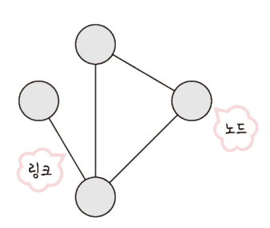

# CHARPTER2. 네트워크

## SECTION!. 네트워크의 기초

### 네트워크란?

- 네트워크는 컴퓨터 등의 장치들이 통신 기술을 이용하여 구축하는 연결망을 지칭하는 용어

- 노드(node)와 링크(link)가 서로 연결되어 있거나 연결되어 있으며 리소스를 공유하는 집합

- 여기서 노드란 서버, 라우터, 스위치 등 네트워크 장치를 의미하고 링크는 유선 또는 무선을 의미