# CHARPTER2. 네트워크

## SECTION!. 네트워크의 기초

### 네트워크란?

- 네트워크는 컴퓨터 등의 장치들이 통신 기술을 이용하여 구축하는 연결망을 지칭하는 용어

- 노드(node)와 링크(link)가 서로 연결되어 있거나 연결되어 있으며 리소스를 공유하는 집합

- 여기서 노드란 서버, 라우터, 스위치 등 네트워크 장치를 의미하고 링크는 유선 또는 무선을 의미

### 처리량과 지연 시간

- 네트워크를 구축할 때는 '좋은' 네트워크로 만드는 것이 중요!
- 좋은 네트워크란?? => 많은 처리량을 처리할 수 있으며 지연 시간이 짧고 장애 빈도가 적으며 좋은 보안을 갖춘 네트워크

1. 처리량

- 처리량(throughput)이란 링크를 통해 전달되는 단위 시간당 데이터양 
- 단위 : bps(bits per secound), 초당 전송 또는 수신되는 비트 수라는 의미...
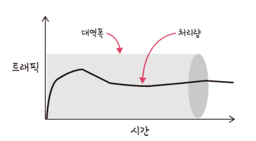
- 처리량은 사용자들이 많이 접속할 때마다 커지는 트래픽, 네트워크 장치 간의 대역폭, 네트워크 중간에 발생하는 에러, 장치의 하드웨어 스팩에 영향을 받음
- 대역폭 : 주어진 시간 동안 네트워크 연결을 통해 흐를 수 있는 최대 비트 수

2. 지연 시간

- 지연 시간(latency)이란 요청이 처리되는 시간, 어떤 메시지가 두 장치 사이를 왕복하는 데 걸린 시간을 말함
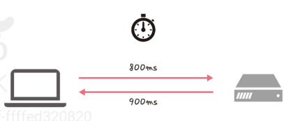
- 지연 시간은 매체 타입(무선, 유선), 패킷 크기, 라우터의 패킷 처리 시간에 영향을 받음

### 네트워크 토플로지와 병목 현상

1. 네트워크 토플로지

- 네트워크 설계시 고려해야 하는 요소임..
- 네트워크 토플로지(network topology)는 노드와 링크가 어떻게 배치되어 있는지에 대한 방식이자 연결 형태를 의미
    1) 트리 토플로지

    - 트리 토폴로지는 계층형 토폴로지라고 하며 트리 형태로 배치한 네트워크 구성
    - 노드의 추가, 삭제가 쉬우며 특정 노드에 트래픽이 집중될 때 하위 노드에 영향을 끼칠 수 있다
    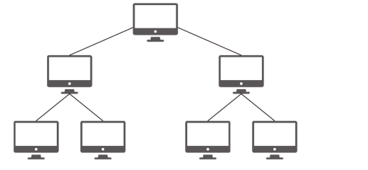

    2) 버스 토플로지

    - 버스 토플로지는 중앙 통신 회선 하나에 여러 개의 노드가 연결되어 공유하는 네트워크 구성을 말하며 근거리 통신망(LAN)에서 사용한다
    - 설치 비용이 적고 신뢰성이 우수하며 중앙 통신 회선에 노드를 추가하거나 삭제하기 쉽다
    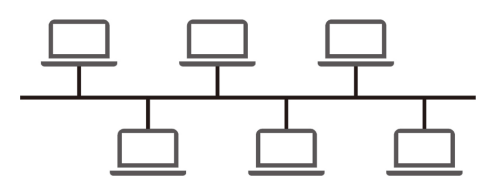

    - 그러나 스푸핑이 가능한 문제점이 있다...
    - 스푸핑이 뭐냐면.. LAN 상에서 송신부의 패킷을 송신과 관련 없는 다른 호스트에 가지 않도록 하는 스위치 기능을 마비시키거나 속여서 특정 노드에 해당 패킷이 오도록 처리하는 것을 말함
    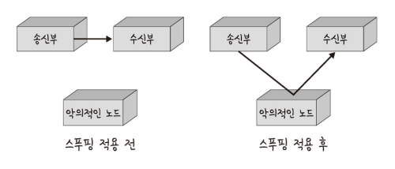

    3) 스타 토플로지

    - 스타 토플로지는 중앙에 있는 노드에 모두 연결된 네트워크 구성을 말한다
    - 노드를 추가하거나 에러를 탐지하기 쉽고 패킷의 충돌 발생 가능성이 적다
    - 어떠한 노드에 장애가 발생해도 쉽게 에러를 발견할 수 있다
    - 장애 노드가 중앙 노드가 아닐 경우 다른 노드에 영향을 끼치는 것이 적다....
    - 하지만 중앙 노드에 장애가 발생하면 전체 네트워크를 사용할 수 없고 설치 비용이 고가이다...
    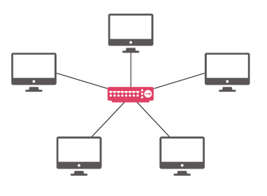

    4) 링형 토플로지

    - 링형 토플로지는 각각의 노드가 양 옆의 두 노드와 연결하여 전체적으로 고리처럼 하나의 연속된 길을 통해 통신을 하는 망 구성 방식이다
    - 데이터는 노드에서 노드로 이동을 하게 되며, 각각의 노드는 고리 모양의 길을 통해 패킷을 처리한다
    - 노드 수가 증가되어도 네트워크 상의 손실이 거의 없고 충돌이 발생되는 가능성이 적고 노드의 고장 발견을 쉽게 찾을 수 있다
    - 하지만 네트워크 구성 변경이 어렵고 회선에 장애가 발생하면 전체 네트워크에 영향을 크게 끼치는 단점이 있다..
    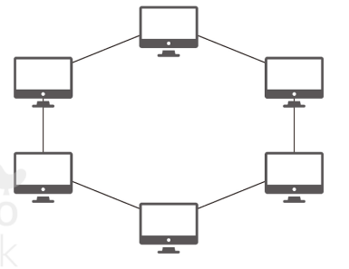

    5) 메시 토플로지

    - 메시 토플로지는 망형 토플로지라고도 하며 그물망처럼 연결되어 있는 구조이다
    - 한 단말 장치에 장애가 발생해도 여러 개의 경로가 존재하므로 네트워크를 계속 사용할 수 있고 트래픽도 분산 처리가 가능하다
    - 하지만.. 노드의 추가가 어렵고 구축 비용과 운용 비용이 고가인 단점이 있다... 다 단점이 있네;;;
    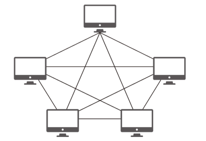

2. 병목 현상

- 네트워크의 구조라고도 일컫는 토플로지가 중요한 이유는 병목 현상을 찾을 때 중요한 기준이 되기 때문이다...
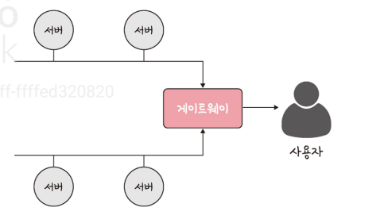
- 네트워크가 어떤 토플로지를 갖는지, 도한 어떠한 경로로 이루어져 있는지 알아야 병목 현상을 올바르게 해결할 수 있기 때문에!!!
- 병목 현상 :  전체 시스템의 성능이나 용향이 하나의 구성 요소로 인해 제한을 받는 현상!! 
    - 예를 들어 서비스에서 이벤트를 열었을 때 트래픽이 많이 생기고 그 트래픽을 잘 관리하지 못하면 병목 현상이 생겨 사용자는 웹 사이트에 들어가지 못한다..

### 네트워크 분류

- 네트워크는 규모를 기반으로 분류할 수 있다
- 사무실과 개인적으로 소유 가능한 규모인 LAN과 
- 서울시 등 시 정도의 규모인 MAN
- 그리고 세계 규모의 WAN으로 나뉨
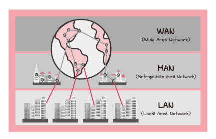

1. LAN

- 근거리 통신망을 의미하며 같은 건물이나 캠퍼스 같은 좋은 공간에서 운영된다
- 전송 속도가 빠르고 혼잡하지 않다

2. MAN

- 대도시 지역 네트워크를 나타내며 도시 같은 넓은 지역에서 운영
- 전송 속도는 평균이며 LAN보다는 더 많이 혼잡

3. WAN

- 광역 네트워크를 의미하며 국가 또는 대륙 같은 더 넓은 지역에서 운영
- 전송 속도는 낮으며 MAN보다 더 혼잡

### 네트워크 성능 분석 명령어

- 네트워크 병목 현상의 주된 원인 : 네트워크 대역폭, 네트워크 토플로지, 서버 CPU, 메모리 사용량, 비효율적인 네트워크 구성
- 이때는 네트워크 관련 테스트와 네트워크와 무관한 테스트를 통해 네트워크로부터 발생한 문제점인 것을 확인한 후 네트워크 성능 분석을 해봐야 함....

1. ping

- 네트워크 상태를 확인하려는 대상 노드를 향해 일정 크기의 패킷을 전송하는 명령어
- 해당 노드의 패킷 수신 상태와 도달하기까지 시간 등을 알 수 있으며 해당 노드까지 네트워크가 잘 연결되어 있는지 확인 가능
- TCP/IP 프로토콜 중에 ICMP 프로토콜을 통해 동작하며, 이 때문에 ICMP 프로토콜을 지원하지 않는 기기를 대상으로 실행할 수 없거나 네트워크 정책상 ICMP나 traceroute를 차단하는 대상의 경우 ping 테스팅은 불가능
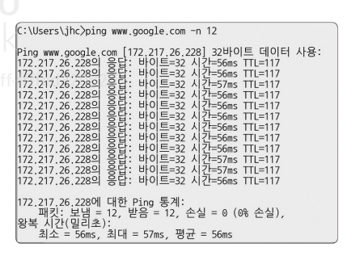

2. netstat

- 접속되어 있는 서비스드르이 네트워크 상태를 표시하는 데 사용되며 네트워크 접속, 라우팅 테이블, 네트워크 프로토콜 등 리스트를 보여줌
- 서비스의 포트가 열려 있는지 확인할 때 씀
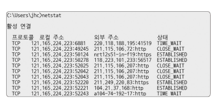

3. nslookup

- DNS에 관련3된 내용을 확인하기 위해 쓰는 명령어
- 특정 도메인에 매핑된 IP를 확인하기 위해 사용
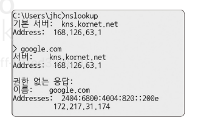

4. tracert

- 윈도우 에서 tracert이고 리눅스에서는 traceroute는 명령어로 구동된다
- 목적지 노드까지 네트워크 경로를 확인할 때 사용하는 명령어 
- 목적지 노드까지 구간들 중 어느 구간에서 응답 시간이 느려지는지 등을 확인할 수 있다
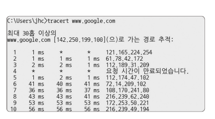

### 네트워크 프로토콜 표준화

- 네트워크 프로토콜이란? 다른 정치들끼리 데이터를 주고받기 위해 설정된 공통된 인터페이스
- 기업이나 개인이 아닌 IEEE 또는 IETF라는 표준화 단체가 이를 정한다..
- 예를 들어 웹을 접속할 때 쓰이는 HTTTP는 서로 약속된 인터페이스인 프로토콜을 통해 노드들은 ㅜ엡 서비스를 기반으로 데이터를 주고 받는다..
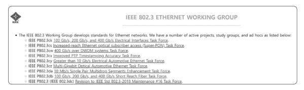
