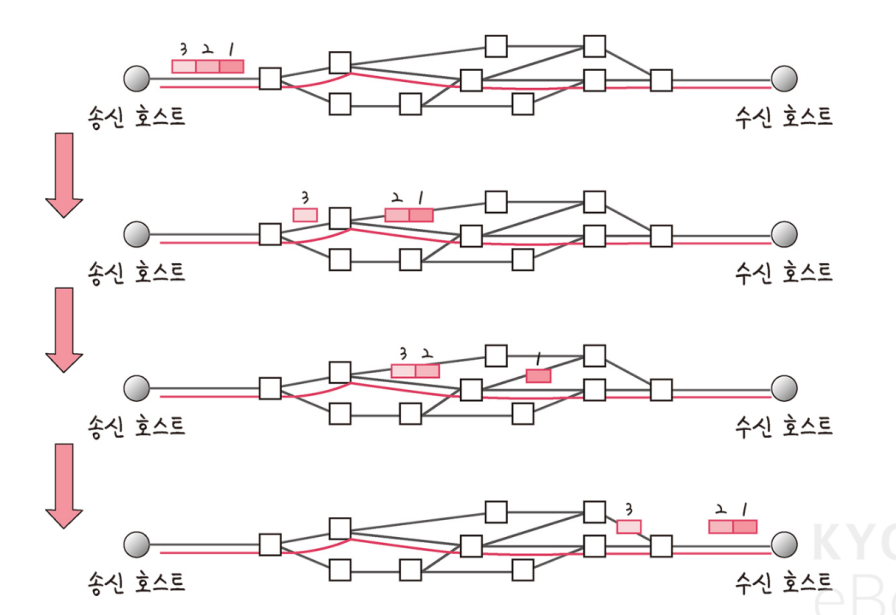
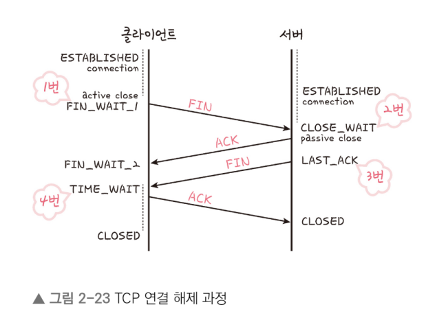
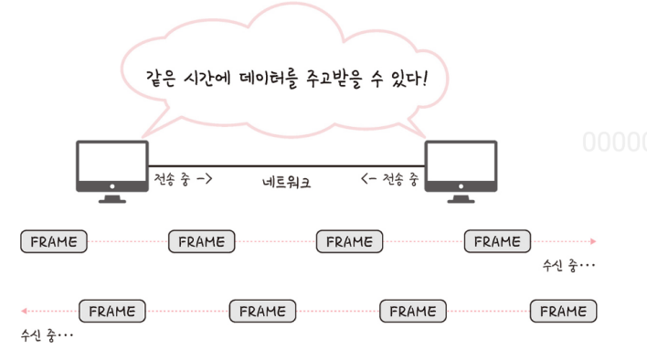
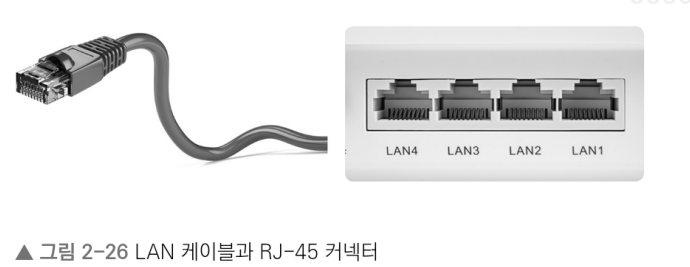
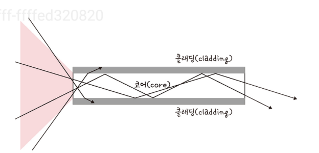
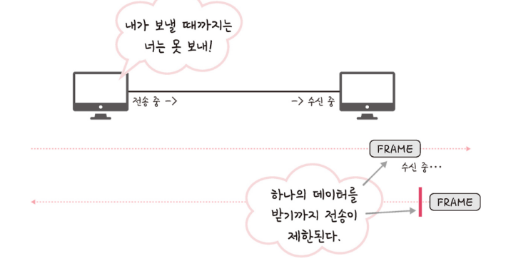
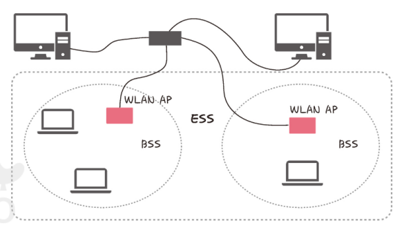
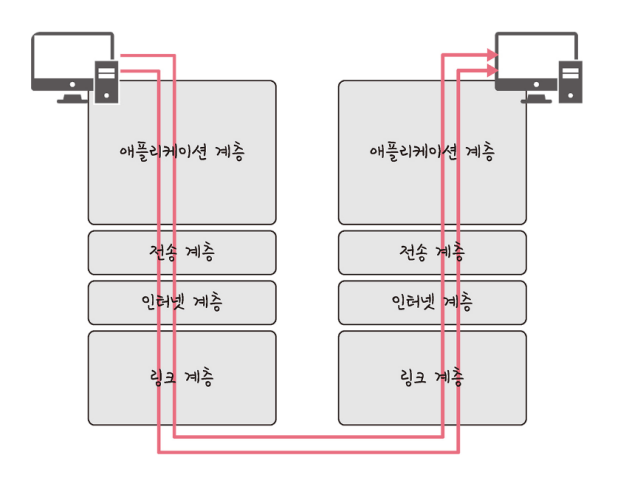
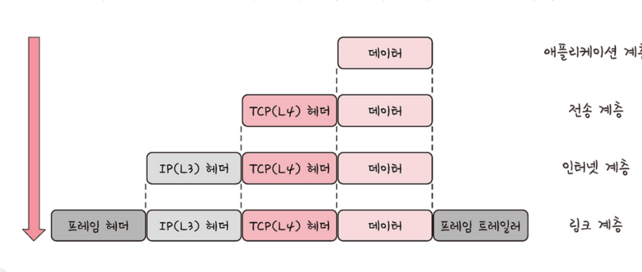

## SECTION2. TCP/IP 4계층 모델

- 인터넷 프로토콜 스위트는 인터넷에서 컴퓨터들이 서로 정보를 주고받는 데 쓰이는 프로토콜의 집합이며, 이른 TCP/IP 4계층 모델로 설명하거나 OSI 7계층 모델로 설명하기도 한다
- 4계층 모델은 네트워크에서 사용되는 통신 프로토콜의 집합으로 계층들은 프로토콜의 네트워킹 범위에 따라 네 개의 추상화 계층으로 구성된다

### 계층 구조

- TCP/IP 계층은 네 개의 계층을 가지고 있으며 OSI 7계층과 많이 비교한다
- TCP/IP  계층과 달리 OSI 계층은 애플리케이션 계층을 세 개로 쪼개고 링크 계층을 데이터 링크 계층, 물리 계층으로 나눠서 표현하는 것이 다르며, 인터넷 계층을 네트워크 계층으로 부른다는 점이 다르다
- 이 계층들은 특정 계층이 변경되었을 때 다른 계층이 영향을 받지 않도록 설계되어있다

1. 애플리케이션 계층

- FTP, HTTP, SSH, SMTP, DNS등 응용 프로그램이 사용되는 프로토콜 계층이며 웹 서비스, 이메일 등 서비스를 실질적으로 사람들에게 제공하는 층
- FTP : 장치와 장치 간의 파일을 전송하는 데 사용되는 표준 통신 프로토콜
- SSH : 보안되지 않은 네트워크에서 네트워크 서비스를 안전하게 운영하기 위한 암호화 네트워크 프로토콜
- HTTP : World Wide Web을 위한 데이터 통신의 기초이자 웹 사이트를 이용하는 데 쓰는 프로토콜
- SMTP : 전자 메일 전송을 위한 인터넷 표준 통신 프로토콜
- DNS : 도메인 이름과 IP 주소를 매핑해주는 서버, 예를 들어 www.naver.com에 DNS 쿼리가 오면 [Root DNS] -> [.com DNS] -> [.naver DNS] -> [.www DNS] 과정을 거쳐 완벽한 주소를 찾아 IP 주소를 매핑한다 / 이를 통해 IP 주소가 바뀌어도 사용자들에게 똑같은 도메인 주소로 서비스할 수 있다

2. 전송 계층

- 송신자와 수신자를 연결하는 통신 서비스를 제공하며 연ㄱ결 지향 데이터 스트림 지원, 신뢰성, 흐름 제어를 제공할 수 있으며 애플리케이션과 인터넷 계층 사이의 데이터가 전달될 때 중계역할을 한다
- 대표적으로 TCP와 UDP가 있다
- TCP는 패킷 사이의 순서를 보장하고 연결지향 프로토콜을 사용해서 연결을 하여 신뢰성을 구축해서 수신 연부를 확인하며 "가상회선 패킷 교환 방식"을 사용한다
- UDP는 순서를 보장하지 않고 수신 여부를 확인하지 않으며 단순히 데이터만 주는 '데이터그램 패킷 교환 방식'을 사용한다

1) 가상회선 패킷 교환 방식

- 각 패킷에는 가상회선 식별자가 포함되며 모든 패킷을 전송하면 가상회선이 해제되고 패킷들은 전송된 '순서대로' 도착하는 방식을 말한다

2) 데이터그램 패킷 교환 방식

패킷이 독립적으로 이동하며 최적의 경로를 선택하여 가는데, 하나의 메시지에서 분할된 여러 패킷은 서로 다른 경로로 전송될 수 있으며 도착한 '순서가 다를 수' 있는 방식을 뜻한다

3) TCP 연결 성립 과정

- TCP는 신뢰성을 확보할 때 '3-웨이 핸드셰이크'라는 작업을 진행한다
- 클라이언트와 서버가 통신할 때 다음과 같은 세 단계의 과정을 거친다
    1. SYN 단계 : 클라이언트는 서버에 클라이언트의 ISN을 담아 SYN을 보낸다. ISN은 새로운 TCP 연결의 첫번째 패킷에 할당된 임의의 시퀀스 번호를 말하며 이는 장치마다 다를 수 있다

    2. SYN + ACK 단계 : 서버는 클라이언트의 STN을 수신하고 서버의 ISN을 보내며 승인번호로 클라이언트의 ISN + 1을 보낸다
    
    3. ACK 단계 : 클라이언트는 서버의 ISN + 1한 값인 승인번호를 담아 ACK를 서버에 보낸다

    - 이렇게 3-웨이 핸드셰이크 과정 이후 신회성이 구축되고 데이터 전송을 시작한다
    - TCP는 이 과정이 있기 때문에 신뢰성이 있는 계층이라고 하며 UDP는 이 과정이 없기 때문에 신뢰성이 없는 계층이라고 한다
    - SYN : 연결 요청 플래그
    - ACK : 응답 플래그
    - ISN : 초기 네트워크 연결을 할 때 할당된 32 비트 고유 시퀀스 번호

4) TCP 연결 해제 과정

- 연결을 해제할 때는 4-웨이 핸드셰이크 과정이 발생한다
    1. 먼저 클라이언트가 연결을 닫으려고 할 때 FIN으로 설정된 세그먼트를 보낸다. 그리고 클라이언트는 FIN_WAIT_1 tkdxofh emfdjrkrh tjqjdml dmdekqdmf rlekflsek
    2. 서버는 클라이언트로 ACK 라는 승인 세그먼트를 보낸다. 그리고 CLOSE_WAIT 상태로 들어간다. 클라이언트가 세그먼트를 받으면 FIN_WAIt_2 상태에 들어간다
    3. 서버는 ACK를 보내고 일정 시간 이후에 클라이언트에 FIN이라는 세그먼트를 보낸다
    4. 클라이언트는 TIME_WAIT 상태가 되고 다시 서버로 ACK를 보내서 서버는 CLOSED 상태가 된다. 이후 클라이언트는 어느 정도의 시간을 대기한 후 연결이 닫히고 클라이언트와 서버는 모든 자원의 연결이 해제된다

    - 여기서 왜 일정 시간 뒤에 닫아야 하느냐...?

    1. 지연 패킷이 발생할 경우를 대비하기 위함. 패킷이 뒤늦게 도달하고 이를 처리하지 못한다면 데이터 무결성 문제가 발생

    2. 두 장치가 연결이 닫혔늕3ㅣ 확인하기 위해서 

    - TIME_WAIT : 소캣이 바로 소멸되지 않고 일정 시간 유지되는 상태를 말하며 지연 패킷 등의 문제점을 해결하는 데 쓰인다. CentOS6, 우분투에는 60초로 설정되어 있으며 윈도우는 4분으로 설정되어 있다. 즉 OS머다 조금씩 다를 수 있다
    - 데이터 무결성 : 데이터의 정확성과 일관성을 유지하고 보증하는 것

3. 인터넷 계층

- 장치로부터 받은 네트워크 패킷을 IP주소로 지정된 목적지로 전송하기 위해 사용되는 계층
- IP. ARP. ICMP 등이 있으며 패킷을 수신해야 할 상대의 주소를 지정하여 데이터를 전달
- 상대방이 제대로 받았는지에 대해 보장하지 않는 비연결형적인 특징을 가지고 있다

4. 링크 계층

- 전선, 광섬유, 무선 등으로 실질적으로 데이터를 전달하며 장치 간에 신호를 주고받는 '규칙'을 정하는 계층
- 네트워크 접근 계층이라고도 한다
- 이를 물리 계층과 데이터 링크 계층으로 나누기도 하는데 물리 계층은 무선 LAN과 유선 LAN을 통해 0과 1로 이루어진 데이터를 보내는 계층을 말하며
- 데이터 링크 계층은 '이뎌넷 프레임'을 통해 에러 확인, 흐림 제어, 접근 제어를 담당하는 계층을 말한다

1) 유선 LAN(IEEE802.3)

- 유선 LAN을 이루는 이더넷은 IEEE802.3이라는 프로토콜을 따르며 전이중화 통신을 쓴다
    - 전이중화 통신 : 양쪽 장치가 동시에 송수신할 수 있는 방식 / 송신로와 수신로로 나눠서 데이터를 주고받으며 현대의 고속이뎌넷은 이 방식을 기반으로 통신하고 있다
    

- CSMA/CD : 유선 LAN에 '반이중화 통신' 중 하나인 CSMA/CD(Carrier Sense Multiple Access with Collision Detection) 방식을 썼다. 이 방식은 데이터를 보낸 이후 충돌이 발생한다면 일정 시간 이후 재전송하는 방식을 말하는데 수신로와 송신로를 각각 둔 것이 아니고 한 경로를 기반으로 데이터를 보내기 때문에 데이터를 보낼때 충돌에 대해 대비해야 했기 때문이다..

- 유선 LAN을 이루는 케이블 : TP 케이블이라고 하는 트위스트 페어 케이블과 광섬유 케이블이 대표적임
    - 트위스트 페어 케이블 :  하나의 케이블처럼 보이지만 실제로는 여덟 개의 구리선을 두 개씩 꼬아서 묶은 케이블을 지칭 / 여러 개의 구리선으로 이루어짐 
    
    - 케이블은 구리선을 실드 처리하지 않고 덮은 UTP 케이블과 실드 처리하고 덮은 STP로 나뉜다 / 여기서 우리가 많이 볼 수 있는 케이블은 UTP 케이블로 흔히 LAN 케이블이라고 한다
    
    - 광섬유 케이블 : 광섬유로 만든 케이블로 레이저를 이용해서 통신하기 때문에 구리선과는 비교할 수 없을 만큼의 장거리 및 고속 통신이 가능하다
    - 보통 100Gbps의 데이터를 전송하며 다음 그림처럼 광섬유 내부와 외부를 다른 밀도를 가지는 유리나 플라스틱 섬유로 제작해서 한 번 들어간 빛이 내부에서 계속적으로 반사하며 전진하여 반대편 끝까지 가는 원리를 이용한 것 / 빛우ㅏ 귤절률이 높은 부분을 코어라고 하며 낮은 부분을 클래딩이라고 한다
    

2) 무선 LAN(ㅑㄸㄸㄸ802.11) 

- 무선 LAN 장치는 수신과 송신에 같은 채널을 사용하기 때문에 반이중화 통신을 사용한다

- 반이중화 통신 : 양쪽 장치는 서로 통신할 수 있지만, 동시에는 통신할 수 없으며 한 번에 한 방향만 통신할 수 있는 방식 / 일반적으로 장치가 신호를 수식하기 시작하면 응답하기 전에 전송이 완료될 때까지 기다려야 한다 / 또한 둘 이상의 장치가 동시에 전송하면 충돌이 발생하여 메시지가 손실되거나 왜곡될 수 있기 때문에 충돌 방지 시스템이 필요하다!

- CSMA/CA : 반이중화 통신 중 하나로 장치에서 데이터를 보내기 전에 캐리어 감지 등으로 사전에 가능한 한 충돌을 방지하는 방식을 사용한다
    1. 데이터를 송신하기 전에 무선 매체를 살핀다
    2. 캬라오 감지 : 회선이 비어 있는지를 판단한다
    3. IFS : 랜덤 값을 기반으로 정해진 시간만큼 기다리며, 만약 무선 매체가 사용 중이면 점차 그 간격을 늘려가며 기다린다
    4. 이후에 데이터를 송신한다

    - 이와 반대되는 전이중화 통신은 양방향 통신이 가능하므로 충돌 가능성이 없기 때문에 충돌을 감지하거나 방지하는 메커니즘이 필요하지 않다!!

- 무선 LAN을 이루는 주파수  : 무선 LAN은 무선 신호 전달 방식을 이용하여 2대 이상의 장치를 연결하는 기술이다! / 비유도 매체인 공기에 주파수를 쏘아 무선 통신망을 구축하는데, 주파수 대역은 5GHz 대역을 사용하여 채널 수도 많고 동시에 사용할 수 있기 때문에 상대적으로 깨끗한 전파 환경을 구축하는 것이 좋다

- 와이파이 : 전자기기들이 무선 LAN 신호에 연결할 수 있게 하는 기술로, 이를 사용하려면 무선 접속 장치(AP)가 있어야 한다 / 흔히 이를 공유기라고 하며, 이를 통해 유선 LAn에 흐르는 신호를 무선 LAN 신호로 바꿔주어 신호가 닿는 범위 내에서 무선 인터넷을 사용할 수 있게 된다 / 무선 LAN을 이용한 기술로는 와이파이 뿐만 아니라 지그비, 블루투스 등도 있다

- BSS : 기본 서비스 집합을 의미하며, 단순 공유기를 통해 네트워크에 접속하는 것이 아닌 동일 BSS 내에 있는 AP들과 장치들이 서로 통신이 가능한 구조를 말한다 / 근거리 무선 통신을 제공하고, 하나의 AP만을 기반으로 구축이 되어 있어 사용자가 한 곳에서 다른 곳으로 자유롭게 이동하며 네트워크에 접속하는 것을 불가능하다

- ESS : 하나 이상의 연결된 BSS 그룹 / 장거리 무선 통신을 제공하며 BSS보다 더 많은 가용성과 이동성을 지원 / 사용자가 한 장소에서 다른 장소로 이동하며 중단 없이 네트워크에 계속 연결할 수 있다!!

- 이더넷 프레임 : 데이터 링크 계층은 이더넷 프레임을 통해 전달받은 데이터의 에러를 검출하고 캡슐화한다
    - Preamble : 이더넷 프레임이 시작임을 알린다
    - SFD(Start Frame Delimiter) : 다음 바이트부터 MAC 주소 필드가 시작됨을 알린다
    - DMAC, SMAC : 수신, 송식 MAC 주소를 말한다
    - EtherType : 데이터 계층 위의 계층인 IP 프로토콜을 정의 / 예를 들어 IPv4 또는 IPv6
    - Payload : 전달받은 데이터
    - CRC : 에러 확인 비트
    - MAC 주소 : 컴퓨터나 노트북 등 각 장치에는 네트워크에 연결하기 위한 장치(LAN 카드)가 있는데, 이를 구별하기 위한 식별번호를 말한다 / 6바이트(48비트)로 구성

3) 계층 간 데이터 송수신 과정

- 애플리케이션 계층에서 전송 계층으로 필자가 보내는 요청값들이 캡슐화 과정을 거쳐 전달되고
- 다시 링크 계층을 통해 해당 서버와 통신을 하고
- 해당 서버의 링크 계층으로부터 애플리케이션까지 비캡슐화 과정을 거쳐 데이터가 전송된다

1. 캽슐화 과정

- 캡슐화 과정은 상위 계층의 헤더와 데이터를 하위 계층의 데이터 부분에 포함시키고 해당 계층의 헤더를 삽입하는 과정을 말한다
- 애플리케이션 계층의 데이터가 전송 계층으로 전달되면서 '세그먼트' 도는 '데이터그램'화되며 TCP 헤더나 붙어지게 된다 / 그리고 이후 인터넷 계층으로 가면서 IP 헤어다 붙어지게 되며 패킷화가 되고, 이후 링크 계층으로 전달되면서 프레임 헤더와 프레임 트레일러가 붙어 프레임화가 된다

2. 비캡슐화 과정

- 하위 계층에서 상위 계층으로 가며 각 계층의 헤더 부분을 제거하는 과정을 말한다

- 캡슐화된 데이터를 받게 되면 링크 계층에서부터 타고 올라오면서 프레인화된 데이터를 다시 패킷화를 거쳐 세그먼트, 데이터그램화를 거쳐 메시지화가 되는 비캡슐화 과정이 일어난다
- 그 이후 최종적으로 사용자에게 애플리케이션의 PDU인 메시지로 전달된다

### PDU 

- PDU : 네트워크의 어떠한 계층에서 계층으로 데이터가 전달될 때 한 덩어리의 단위
- 제어 관련 정보들이 포함된 '헤더', 데이터를 의미하는 '페이로드'로 구성되어 있으며 계층마다 부르는 명칭이 다르다
    - 애플리케이션 계층 : 메시지
    - 전송 계층 : 세그먼트(TCP), 데이터그램(UDP)
    - 인터넷 계층 : 패킷
    - 링크 계층 : 프레임(데이터 링크 계층), 비트(물리 계층)