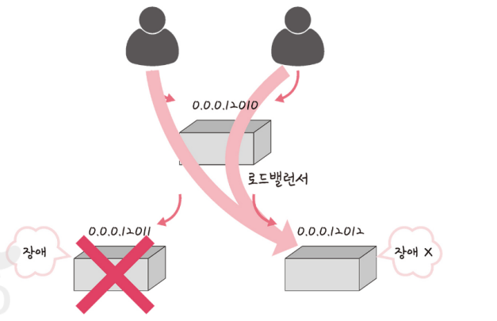
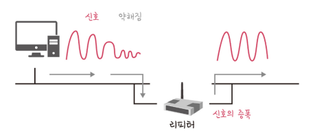
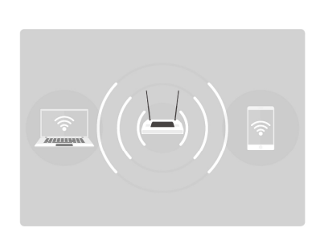

## 네트워크 기기

### 네트워크 기기의 처리 범위

- 네트워크 기기는 계층별로 처리 범위를 나눌 수 있다
- 물리 계층을 처리할 수 있는 기기와 데이터 링크 계층을 처리할 수 있는 기기 등이 있다
- 상위 계층을 처리하는 기기는 하위 계층을 처리할 수 있지만 그 반대는 불가하다.
- 예를 들어 L7 스위치는 애플리케이션 계층을 처리하는 기기로, 그 밑의 모든 계층의 프로토콜을 처리할 수 있다 / 하지만 AP는 물리 계층밖에 처리하지 못한다
- 애플리케이션 계층 : L7 스위치

### 애플리케이션 계층을 처리하는 기기

- 애플리케이션 계층을 처리하는 기기로는 L7 스위치가 있다

1. L7 스위치

- 스위치는 여러 장비를 연결하고 데이터 통신을 중재하며 목적지가 연결된 포트로만 전기 신호를 보내 데이터를 전송하는 통신 네트워크 장비이다
- L7 스위치는 로드밸런서라고도 하며, 서버의 부하를 분산하는 기기이다
- 클라이언트로부터 오는 요청들을 뒤쪽의 여러 서버로 나누는 역할을 하며 시스템이 처리할 수 있는 트래픽 증가를 목표로 한다
- URL. 서버, 캐시, 쿠키들을 기반으로 트래픽을 분산한다
- 바이러스, 불필요한 외부 데이터 등을 걸러내는 필터링 기능 또한 가지고 있으며 응용 프로그램 수준의 트래픽 모니터링도 가능하다

2. L4 스위치와 L7 스위치 차이

- 로드밸런서로는 L7 스위치뿐만 아니라 L4 스위치도 있다
- L4 스위치는 전송 계층을 처리하는 기기로 스트리밍 관련 서비스에서는 사용할 수 없으며 메시지를 기반으로 인식하지 못하고 IP와 포트를 기반으로 트래픽을 분산한다
- 반면 L7 로드밸런서는 IP, 포트 외에도 URL. HTTP 헤더, 쿠키 등을 기반으로 트래픽을 분산한다
- 클라우드 서비스(AWS 등)에서 L7 스위치를 이용한 로드밸런싱은 ALB 컴포넌트로 하며, L4 스위치를 이용한 로드밸런싱은 NLB 컴포넌트로 한다

3. 헬스 페크

- L4 스위치 또는 L7 스위치 모두 헬스 체크를 통해 정상적인 서버 또는 비정상적인 서버를 판별하는데, 헬스 체크는 전송 주기와 재전송 횟수 등을 설정한 이후 반복적으로 서버에 요청을 보내는 것을 말한다
- 물론 요청이 서버에 부하가 되지 않을 만큼 요청 횟수가 적절하다
- TCP, HTTP등 다양한 방법으로 요청을 보내며 이 요청이 정상적으로 이루어졌다면 정상적인 서버로 판별한다

4. 로드밸런서를 이용한 서버 이중화

- 로드밸런서는 대표적인 기능으로 서버 이중화를 들 수 있다
- 서비스를 안정적으로 운용하기 위해서는 2대 이상의 서버는 필수적이다
- 에러가 발생하여 서버가 1대가 종료되더라도 서비스는 안정적으로 운용되어야 하기 때문..
- 로드 밸런서는 2대 이상의 서버를 기반으로 가상 Ip를 제공하고 이를 기반으로 안정적인 서비스를 제공

### 인터넷 계층을 처리하는 기기

- 인터넷 계층을 처리하는 기기로는 라우터. L3 스위치가 있다

1. 라우터

- 여러 개의 네트워크를 연결, 분할, 구분시켜주는 역할을 하며 다른 네트워크에 존재하는 장치끼리 서로 데이터를 주고받을 때 패킷 소모를 최소화하고 경로를 최적화하여 최소 경로로 패킷을 포워딩하는 라우팅을 하는 장비

2. L3 스위치

- L3 스위치란 L2 스위치의 기능과 라우팅 기능을 갖춘 장비
- 라우터라고 해도 무방함
- 라우터는 소프트웨어 기반의 라우팅과 하드웨어 기반의 라우팅을 하는 것으로 나눠지고 하드웨어 기반의 라우팅을 담당하는 장치를  L3 스위치라고 한다..

### 데이터링크 계층을 처리하는 기기 : L2 스위치, 브리지

1. L2 스위치

- 장치들의 MAC 주소를 MAC 주소 테이블을 통해 관리하며, 연결된 장치로부터 패킷이 왔을 때 패킷 전송을 담당
- IP 주소를 이해하지 못해 IP 주소를 기반으로 라우팅은 불가능하며 단순히 패킷의 MAC 주소를 읽어 스위칭하는 역할을 한다
- 목적지가 MAC 주소 테이블에 없다면 전체 포트에 전달하고 MAC 주소 테이블의 주소는 일정 시간 이후 삭제하는 기능도 있다

2. 브리지

- 두 개의 근거리 통신망(LAN)을 상호 접속할 수 있도록 하는 통신망 연결 장치로, 포트와 포트 사이의 다리 역할을 하며 장치에서 받아온 MAC 주소를 MAC 주소 테이블로 관리한다
- 브리지는 통신망 범위를 확장하고 서로 다른 LAN 등으로 이루어진 하나의 통신망을 구축할 때 쓰인다

### 물리 계층을 처리하는 기기 : NIC, 리피터, AP

1. NIC

- LAN 카드라고 하는 네트워크 인터페이스 카드는 2대 이상의 컴퓨터 네트워크를 구성하는 데 사용
- 네트워크와 빠른 속도로 데이터를 송수신할 수 있도록 컴퓨터 내에 설치하는 확장 카드
- 각 LAN 카드에는 주민등록번호처럼 각각을 구붖하기 위한 고유의 식별 번호인 MAC 주소가 있다

2. 리피터

- 들어오는 약해진 신호 정도를 증폭하여 다른 쪽으로 전달하는 장치
- 이를 통해 패킷이 더 말리 갈 수 있다
- 하지만 이는 광케이블이 보급됨에 따라 현재 안쓴다고...

3. AP

- 패킷을 복사하는 기기
- AP에 유선 LAN을 연결한 후 다른 장치에서 무선 LAN 기술(와이파이 등)을 사용하여 무선 네트워크 연결을 할 수 잇다
