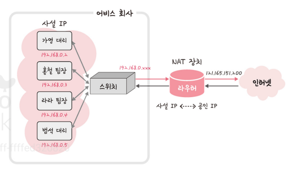

## IP 주소

### ARP 

- 컴퓨터와 컴퓨터 간의 통신은 흔히들 IP 주소 기반으로 통신한다고 알고 있지만 정확히 이야기하면 IP 주소에서 ARP를 통해 MAC 주소를 찾아 MAC 주소를 기반으로 통신한다
- ARP(Address Resolution Protocol)란 IP 주소로부터 MAC 주소를 구하는 IP와 MAC 주소의 다리 역할을 하는 프로토콜
- ARP를 통해 가상 주소인 IP 주소를 실제 주소인 MAC 주소로 변환
- 이와 반대로 RARP를 통해 실제 주소인 MAC 주소로 가상 주소인 IP 주소로 변환

- 브로드 캐스트 : 송신 호스트가 전송한 데이터가 네트워크에 연결된 모든 호스트에 전송되는 방식
- 유니캐스트 : 고유  주소로 식별된 하나의 네트워크 목적지에 1:1로 데이터를 전송하는 방식

### 홉바이홉 통신

- 홉바이홉(hop by hop) 통신 : IP 주소를 통해 통신하는 과정
- 여기서 hop? 영어 뜻 자체로는 건너뛰는 모습을 의미 / 통신망에서 각 패킷이 여러 개의 라우터를 건너가는 모습을 비유적으로 표현

- 수 많은 서브 네트워크 안에 있는 라우터의 라우팅 테이블을 IP를 기반으로 패킷을 전달하고 또 전달해나가며 라우팅을 수행하며 최종 목적지까지 패킷을 전달
    => 통신 장치에 있는 '라우팅 테이블'의 IP를 통해 시작 주소부터 시작하여 다음 IP로 계속해서 이동하는 '라우팅' 과정을 거쳐 패킷이 최종 목적지까지 도달하는 통신을 말함
- 라우팅 : IP 주소를 찾아가는 과정
- 라우팅 테이블
    - 라우팅 테이블 : 송신지에서 수신지까지 도달하기 위해 사용되며 라우터에 들어가 있는 목적지 정보들과 그 목적지로 가기 위한 방법이 들어 있는 리스트를 뜻함
    - 라우팅 테이블에는 게이트웨이와 모든 목적지에 대해 해당 목적지에 도달하기 위해 거쳐야 할 다음 라우터의 정보를 가지고 있다
- 게이트퉤이
    - 게이트웨이 : 서로 다른 통신망, 프로토콜을 사용하는 네트워크 간의 통신을 가능하게 하는 관문 역할을 하는 컴퓨터나 소프트웨어를 두루 일컫는 용어
    
    - 사용자는 인터넷에 접속하기 위해 수많은 톨게이트인 게이트웨이를 거쳐야 하며 게이트웨이는 서로 다른 네트워크상의 통신 프로토콜을 변환해주는 역할을 하기도 한다
    - 게이트웨이를 확인하는 방법은 라우팅 테이블을 통해 볼 수 있으며 라우팅 테이블은 윈도우 명령 프롬프트에서 netstat -r 명령어를 실행하여 확인할 수 있다
    

### IP 주소 체계

- IP 주소는 IPv4와 IPv6로 나뉜다
- IPv4는 32비트를 8비트 단위로 점을 찍어 표기하며 123.45.67.89 같은 방식으로 IP 주소를 나타낸다
- IPv6는 64비트를 16비트 단위로 점을 찍어 표기하며 2001:db8:ff00:42:8329 같은 방식으로 IP 주소를 나타낸다

- 추세는 IPv6로 가고 있지만 현재 가장 많이 쓰이는 주소 체계는 IPv4이다

- 클래스 기반 할당 방식
    - IP 주소 페계는 과거를 거쳐 발전해오고 있으며 처음에는 A, B, C, D, E 다섯 개의 클래스를 구분하는 클래스 기반 할당 방식을 썼다
    - 앞에 있는 부분을 네트워크 주소, 그 뒤에 있는 부분을 컴퓨터에 부여하는 주소인 호스트 주소로 놓아서 사용합니다
    - 클래스 A, B, C는 일대일 통신으로 사용되고 클래스 D는 멀티캐스트 통신, 클래스 E는 앞으로 사용할 예비용으로 쓰는 방식
    
    - 네트워크 첫번째 주소는 네트워크 주소로 사용되고 가장 마지막 주소는 브로드캐스트용 주소로 네트워크에 속해 있는 모든 컴퓨터에 데이터를 보낼 때 사용된다
    - 이 방식은 사용하는 주소보다 버리는 주소가 많은 단점이 있었고 이른 해소하기 위해. DHCP, IPv6, NAT가 나옴

- DHCP
    - IP 주소 및 기타통신 매개변수를 자동으로 할당하기 위한 네트워크 관리 프로토콜
    - 이 기술을 통해 네트워크 장치의 IP 주소를 수동으로 설정할 필요없이 인터넷에 접속할 때마다 자동으로 IP 주소를 할당할 수 있다
    - 많은 라우터와 게이트웨이 장비에 DHCP 기능이 있으며 이를 통해 대부분의 가정용 네트워크에서 IP 주소를 할당한다

- NAT
    - 패킷이 라우팅 장치를 통해 전송되는 동안 패킷이 IP 주소 정보를 수정하여 IP 주소를 다른 주소로 매핑하는 방법
    - IPv4 주소 체계만으로는 많은 주소들을 모두 감당하지 못하는 단점이 있는데 이를 해결하기 위해 NAT로 공인 IP와 사설 IP로 나눠서 많은 주소를 처리
    - NAT를 가능하게 하는 소프트웨어는 ICS, RRAS, Netfilter등이 있다
    
    - NAT를 쓰는 이유는 주로 여러 대의 호스트가 하나의 공인 IP 주소를 사용하여 인터넷에 접속하기 위함이다
    - 단점 : NAT를 여러 명이 동시에 인터넷을 접속하게 되므로 실제로 접속하는 호스트 숫자에 따라서 접속 속도가 느려질 수 있다는 단점이 있다