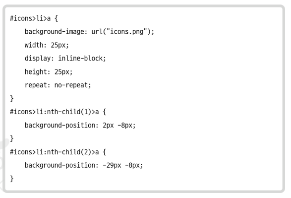

## HTTP

- 기본적으로 HTTP는 앞서 설명한 전송 계층 위에 있는 애플리케이션 계층으로서 웹 서비스 통신에 사용됩니다
- HTTP/1.0부터 시작해서 발전을 거듭하여 지금은 HTTP/3이다..

### HTTP/1.0

- 기본적으로 한 연결 당 하나의 요청을 처리하도록 설계되었습니다
- 서버로부터 파일을 가져올 때마다 TCP의 3-웨이 핸드셰이크를 계속해서 열어야 하기 때문에 RTT가 증가하는 단점이 있습니다
- RTT
    - 정의 : 패킷이 목적지에 도달하고 나서 다시 출발지로 돌아오기까지 걸리는 시간이며 패킷 왕복 시간
    - RTT의 증가를 해결하기 위한 방법
        - 매번 연결할 때마다 RTT가 증가하니 서버에 부담이 많이 가고 사용자 응답 시간이 길어졌습니다
        - 이를 해결하기 위해 이미지 스플리팅, 코드 압축, 이미지 Base64 인코딩을 사용한곤 한다

        1. 이미지 스플리팅

        - 많은 이미지를 다운로드받게 되면 과부하가 걸리기 때문에 많은 이미지가 합쳐있는 하나의 이미지를 다운로드 받고
        - 이를 기반으로 background-image의 position을 이용하여 이미지를 표기하는 방법
        
        - 앞의 코드처럼 하나의 이미지 background-image: url("icons.png");, background-position 등을 기반으로 이미지를 설정한다

        2. 코드 압축

        - 멀티플렉싱이란 여러 개의 스트림을 사용하여 송수신한다는 것
        - 이를 통해 특정 스트림의 패킷이 손실되었다고 하더라도 해덩 스트림에만 영향을 미치고 나머지 스트림은 멀쩡하게 동작할 수 있다
        - 스트림(stream) : 시간이 지남에 따라 사용할 수 있게 되는 일련의 데이터 요소를 가리키는 데이터 흐름
        
        - 하나의 연결 내 여러 스트림을 캡처한 모습 / 병렬적인 스트림들을 통해 데이터를 서빙하고 있다

        3. 헤더 압출

        - HTTP/1.x에는 크기가 큰 헤더라는 문제가 있었다
        
        - 이를 HTTP/2에서는 헤더 압축을 써서 해결하는데, 허프만 코딩 압축 알고리즘을 사용하는 HPACK 압축 형식을 가진다
        - 허프만 코딩 : 문자열을 문자 단위로 쪼개 빈도수를 세어 빈도가 높은 정보는 적은 비트 수를 사용하여 표현하고, 빈도가 낮은 정보는 비트 수를 많이 사용하여 표현해서 전체 데이터의 표현에 필요한 비트양을 줄이는 원리

        4. 서버 푸시

        - HTTP/1.1에서는 클라이언트가 서버에 요청을 해야 파일을 다운로드받을 수 있었다면, HTTP/2는 클라이언트 요청 없이 서버가 바로 리소스를 푸시할 수 있다
        
        - html에는 css나 js 파일이 포함되기 마련인데 html을 읽으면서 그 안에 들어 있던 css 파일을 서버에서 푸시하여 클라이언트에 먼저 줄 수 있다

### HTTPS

- HTTP/2는 HTTPS 위에서 동작한다
- HTTPS란 애플리케이션 계층과 전송 계층 사이에 신뢰 계층인 SSL/TLS 계층을 넣은 신뢰할 수 있는 HTTP 요청을 말한다
- 이를 통해 '통신을 암호화' 한다
- SSL/TLS
    - SSL은 SSL 1.0부터 시작해서 SSL3.0 / TLS 1.0 ~ TLS 1.3까지 버전이 올라가며 마지막으로 TLS로 명칭이 변경되었다
    - 보통 이를 합쳐 SSL/TLS로 많이 부른다
    - SSL/TLS은 전송 계층에서 보안을 제공하는 프로토콜이다 / 클라이언트와 서버가 통신할 때 SSL/TLS를 통해 제3자가 메시지를 도청하거나 변조하지 못하도록 한다
    
    - SSL/TLS는 보안 세션을 기반으로 데이터를 암호화하며 보안 세션이 만들어질 때 인증 메커니즘, 키 교환 암호화 알고리즘, 해싱 알고리즘이 사용된다
        1. 보안 세션

        - 보안이 시작되고 끝나는 동안 유지되는 세션을 말함
        - SSL/TLS는 핸드셰이크를 통해 보안 세션을 생성하고 이를 기반으로 상태 정보등을 공유
        - 세션 : 운영체제가 어떤한 사용자로부터 자신의 자산 이용을 처락하는 일정한 기간을 뜻함

        2. 암호화 알고리즘

        - 키 교환 암호화 알고리즘으로는 대수곡선 기반의 ECDHE또는 모듈식 기반의 DHE를 사용한다
        - 둘 다 디피-헬만 방식을 근간으로 만들어졌다
        
        - 처음에 공개 값을 공유하고 각자의 비밀 값과 혼합한 후 혼합 값을 공유한다 그 다음 각자의 비밀 값과 또 혼합한다 / 그 이후에 공통의 암호키가 생성된다

### HTTP/3

- HTTP1.1 및 HTTP/2와 함께 World Wide Web에서 정보를 교환하는 데 사용되는 HTTP의 세 번째 버전
- TCP 위에서 돌아가는 HTTP/2 와는 달리 HTTP/3은 QUIC이라는 계층 위에서 돌아가며 TCP 기반이 아닌 UDP 기반으로 돌아간다

- 초기 연결 설정 시 지연 시간 감소
    - QUIC은 TCP를 사용하지 않기 때문에 통신을 시작할 때 번거로운 3-핸드쉐이크 과정을 거치지 않아도 된다
    
    - QUIC은 첫 연결 설정에 1-RTT만 소요 / 클라이언트가 서버에 어떤 신호를 한 번 주고 서버도 거기에 응답하기만 하면 바로 본 통신을 시작
    - QUIC은 순방향 오류 수정 메커니즘이 적용된다 -> 전송한 패킷이 손실되었다마녀 수신 측에서 에러를 검출하고 수정하는 방식이며 열악한 네트워크 환경에서도 낮은 패킷 손실률을 자랑한다