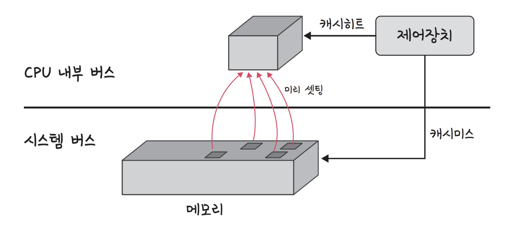
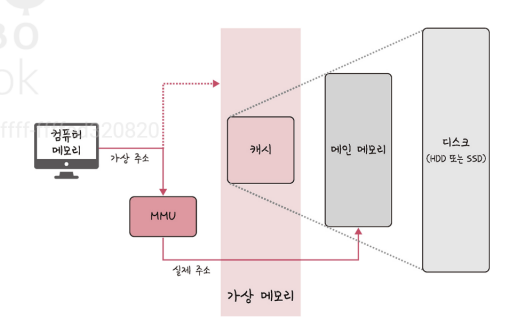

## 메모리

- CPU는 그저 '메모리'에 올라와 있는 프로그램의 명령어들을 실행
- 메모리의 계층과 메모리 관리를 알아보자

### 메모리 계층 

- 메모리 계층은 레지스터, 캐시, 메모리, 저장장치로 구성

- 레지스터 : CPU 안에 있는 작은 메모리, 휘발성, 속도 가장 빠름, 기억 용량이 가장 적습니다
- 캐시 : L1, L2 캐시를 지칭합니다. 휘발성, 속도 빠름, 기억 용량이 적습니다 참고로 L3 캐시도 있습니다
- 주기억장치 : RAM을 가리킨다. 휘발성, 속도 보통, 기억 용량이 보통입니다
- 보조기억장치 : HDD, SDD를 일컬으며 휘발성, 속도 낮음, 기억 용량이 많습니다

- 램은 하드디스크로부터 일정량의 데이터를 복사해서 임시 저장하고 이를 필요 시마다 CPU에 빠르게 전달하는 역할을 한다
- 계층 위로 올라갈수록 가격은 비싸지는데 용량은 작아지고 속도는 빨라지는 특징이 있습니다 -> 이러한 계층이 있는 이유는 경제성과 캐시 때문이다
- 예를 16GB RAM은 8만원이면 산다, 하지만  16GB SSD는 훨씬 더 싼 가격에 살 수 있죠 이러한 경제성 때문에 계층을 두어 관리한다
- 이러한 계층 구조는 일상생활에서 경험할 수 있는데 게임을 실행하다 보면 '로딩 중'이라는 메시지가 나오는 것을 볼 수 있다 / 이는 하드디스크 또는 인터넷에서 데이터를 읽어 RAM으로 전송하는 과정이 아직 끝나지 않음을 의미합니다

1. 캐시

- 데이터를 미리 복사해 놓는 임시 저장소이자 바른 장치와 느린 장체에서 속도 차이에 따른 병목 현상을 줄이기 위한 메모리를 말합니다
- 이를 통해 데이터를 접근하는 시간이 오래 걸리는 경우를 해결하고 무언가를 다시 계산하는 시간을 절약할 수 있습니다.
- 실제로 메모리와 CPU 사이의 속도 차이가 너무 크기 때문에 그 중간에 레지스터 계층을 둬서 속도 차이를 해결합니다

2. 시간 지역성

- 최근 사용한 데이터에 다시 접근하려는 특성

3. 공간 지역성

- 최근 접근한 데이터를 이루고 있는 공간이나 그 가까운 공간에 접근하는 특성

4. 캐시히트와 캐시미스

- 케시에게 원하는 데이터를 찾았다면 캐시히트
- 해당 데이터가 캐시에 없다면 주메모리로 가서 데이터를 찾아오는 것을 캐시미스
- 캐시히트를 하게 되면 해당 데이터를 제어장치를 거쳐 가져오게 된다

5. 캐시매핑

- 캐시가 히트되기 위해 매핑하는 방법을 말하며 CPU의 레지스터와 주 메모리(RAM) 간에 데이터를 주고받을 때를 기반으로 설명
- 레지스터는 주 메모리에 비하면 굉장히 작고 주 메모리는 굉장히 크기 때문에 작은 레지스터가 캐시 계층으로써 역할을 잘 해주려면 이 매핑을 어떻게 하느냐가 중요하다
- 캐시매핑 분류
    - 직접 매핑 : 메모리가 1~100이 있고 캐시가 1~10이 있다면 1:1~10, 2:1~20... 이런 식으로 매핑하는 것을 말한다 / 처리가 빠르지만 충돌 발생이 잦다
    - 연관 매핑 : 순서를 일치시키지 않고 관련 있는 캐시와 메모리를 매핑한다 / 충돌이 적지만 모든 블록을 탐색해야 해서 속도가 느리다
    - 집합 연관 매핑 : 직접 매핑과 연관 매핑을 합쳐 놓은 것 / 순서는 일치시키지만 집합을 둬서 저장하여 블록화되어 있기 때문에 검색은 좀 더 효율적이다 / 예를 들어 메모리가 1 ~ 100이 있고 캐시가 1~10이 있다면 캐시 1~5에는 1~50의 데이터를 무작위로 저장시키는 것을 말한다

6. 웹 브라우저의 캐시

- 소프트웨어적인 대표적인 캐시로는 웹 브라우저의 작은 저장소 쿠키, 로컬 스토리지, 세션 스토리지가 있다
- 이러한 것들은 보통 사용자의 커스텀한 정보나 인증 모듈 관련 사항들을 웹 브라우저에 저장해서 추후 서버에 요청할 때 자신을 나타내는 아이덴팉티나 중복 요청 방지를 위해 쓰인다

7. 쿠키

- 만료기한이 잇는 키-값 저장소이다
- same site 옵션을 strict로 설정하지 않았을 경우 다른 도메인에서 요청했을 때 자동 전송되며, 4KB까지 데이터를 저장할 수 있고 만료기한을 정할 수 있다
- 쿠키를 설정할 때는 document, cookie로 쿠키를 볼 수 없게 httponly 옵션을 거는 것이 중요하며, 클라이언트 또는 서버에서 만료기한 등을 정할 수 있는데 보통 서버에서 만료 기한을 정한다

8. 로컬 스토리지

- 로컬 스토리지는 만료기한이 없는 키 - 값 저장소이다
- 10MB까지 저장할 수 있으며, 웹 브라우저를 닫아도 유지되고 도메인 단위로 저장, 생성된다.
- HTML5를 지원하지 않는 웹 브라우저에서는 사용할 수 없으며 클라이언트에서만 수정 가능하다

9. 세션 스토리지

- 세션 스토리지는 만료기한이 없는 키-값 저장소이다
- 탭 단위로 세션 스토리지를 생성하며, 탭을 닫을 때 해당 데이터가 삭제된다
- 5MB까지 저장이 가능하며 HTML5를 지원하지 않는 웹 브라우저에서는 사용할 수 없습니다
- 클라이언트에서만 수정 가능하다

10. 데이터베이스의 캐싱 계층

- 데이터베이스 시스템을 구축할 때도 메인 데이터베이스 위에 레디스 데이터베이스 계층을 캐싱 계층으로 둬서 성능을 향사시키기도 한다
- 우리 프로젝트할 때 썼었지~

### 메모리 관리

- 운영체제의 대표적인 할 일 중 하나가 메모리 관리이다
- 컴퓨터 내의 한정된 메모리를 극한으로 활용해야 한다

1. 가상 메모리(virtual memory)

- 메모리 관리 기법의 하나로 컴퓨터가 실제로 이용 가능한 메모리 자원을 추상화하여 이를 사용하는 사용자들에게 매우 큰 메모리로 보이게 만드는 것을 말한다

- 이때 가상적으로 주어진 주소를 가상 주소라고 하며, 실제 메모리상에 잇는 주소를 실제 주소라고 한다
- 가상 주소는 메모리관리장치에 의해 실제 주소로 변환되며, 이 덕분에 사용자는 실제 주소를 의식할 필요 없이 프로그램을 구축할 수 있게 된다
- 가상 메모리는 가상 주소와 실제 주소가 매핑되어 있고 프로세스의 주소 정보가 들어 잇는 패이지 테이블로 관리된다(이때 속도 향상을 위해 TLB를 쓴다)
- TLB : 메모리와 CPU 사이에 있는 주소 변환을 위한 캐시 / 페이지 테이블에 잇는 리스트를 보고나하며 CPU가 페이지 테이블까지 가지 않도록 해 속도를 향상시킬 수 있는 캐시 계층

2. 스와핑
- 가상 메모리에는 존재하지만 실제 메모리인 RAM에는 현재 없는 데이터나 코드에 접근할 경우 페이지 폴트가 발생한다
- 이를 방지하기 위해 당장 사용하지 않는 영역을 하드디스크로 옮겨 필요할 때 다시 RAM으로 불러와 올리고
- 사용하지 않으면 다시 하드디스크로 내림을 반복하여 RAM을 효과적으로 관리하는 것을 스와핑(swapping)이라고 한다

3. 페이지 폴트(page fault)

- 프로세스의 주소 공간에는 존재하지만 지금 이 컴퓨터의 RAM에는 없는 데이터에 접근했을 경우에 발생한다
- 이때 운영체제는 다음 과정으로 해당 데이터를 메모리로 가져와서 마치 페이지 폴트가 전혀 발생하지 않은 것처럼 프로그램이 작동하게 해준다
- 페이지 폴트 과정...
    1. CPU는 물리 메모리를 확인하여 해당 페이지가 없으면 트랩을 발생해서 운영체제에 알립니다
    2. 운영체제는 CPU의 동작을 잠시 멈춥니다
    3. 운영체제는 페이지 테이블을 확인하여 가상 메모리에 페이지가 존재하는지 확인하고 없으면 프로세스를 중단하고 현재 물리 메모리에 비어 있는 프레임이 있는지 찾습니다. 물리 메모리에도 없다면 스와핑이 발동됩니다
    4. 비어 있는 프레임에 해당 페이지를 로드하고, 페이지 테이블을 최신화합니다
    5. 중단되었던 CPU를 다시 시작합니다
    - 페이지 : 가상 메모리를 사용하는 최소 크기 단위
    - 프레임 : 실제 메모리를 사용하는 최소 크기 단위

4. 스레싱

- 메모리의 페이지 폴트들이 높은 것을 의미하며, 이는 컴퓨터의 심각한 성능 저하를 초래합니다
- 스레싱은 메모리에 너무 많은 프로세스가 동시에 올라가게 되면 스와핑이 많이 일어나서 발생한다
- 페이지 폴트가 일어나면 CPU 이용률이 낮아진다// CPU 이용률이 낮아지게 되면 운영체제는 "CPU가 한가한가?"라고 생각하여 가용성을 더 높이기 위해 더 많은 프로세스를 메모리에 올리게 된다 / 이와 같은  악순환이 반복되며 스레싱이 일어난다
- 이를 해결하기 위한 방법으로는 메모리를 늘리거나,. HDD를 사용한다면 HDD를 SDD로 바꾸는 방법이 있다 + 작업 세트 & PFF
    - 작업 세트 : 프로세스의 과거 사용 이력인 지역성을 통해 결정된 페이지 집합을 만들어서 미리 메모리에 로드하는 것 / 미리 메모리에 로드하면 탐색에 드는 비용을 줄일 수 있고 스와핑 또한 줄일 수 있다
    - PFF : 페이지 폴트 빈도를 조절하는 방법으로 상한선과 하한선을 만드는 방법 / 만약 상한선에 도달한다면 페이지를 늘리고 하한선에 도달한다면 페이지를 줄이는 것

5. 메모리 할당

- 메모리에 프로그램을 할당할 때는 시작 메모리 위치, 메모리 할당 크기를 기반으로 할당하는데, 연속 할당과 불연속 할당으로 나뉜다
- 연속 할당 : 메모리에 연속적으로 공간을 할당하는 것을 말한다 / 프로세스들이 순차적으로 공간에 할당한다 / 이는 메모리를 미리 나누어 관리하는 고정 분할 방식과 매 시점 프로그램의 크기에 맞게 메모리를 분할하여 사용하는 가변 분할 방식이 있다
    - 고정 분할 방식 : 메모리를 미리 나누어 관리하는 방식, 메모리가 미리 나뉘어 잇기 대문에 융통성이 없다, 또한 내부 단편화가 발생한다
    - 가변 분할 방식 : 매 시점 프로그램의 크기에 맞게 동적으로 메모리를 나눠 사용한다 / 내부 단편화는 발생하지 않고 외부 단편화는 발생할 수 있다 / 이는 최초적합(first fit), 최적 적합(best fit), 최악적합(worst fit)이 있다
    - 내부 단편화 : 메모리를 나눈 크기보다 프로그램이 작아서 들어가지 못하는 공간이 많이 발생하는 현상
    - 외부 단편환 : 메모리를 나눈 크기보다 프로그램이 커서 들어가지 못하는 공간이 많이 발생하는 현상, 예를 들어 100MB를 55MB, 45MB로 나눴지만 프로그램의 크기는 70MB일 때 들어가지 못하는 것을 말한다
    - 홀(hole) : 할당할 수 있는 비어 있는 메모리 공간

- 불연속 할당 : 메모리를 연속적으로 할당하지 않는 불연속 할당은 현대 운영체제가 쓰는 방법으로 불연속 할당인 페이징 기법이 있다 / 메모리를 동일한 크기의 페이지로 나누고 프로그램마다 페이지 테이블을 두어 이를 통해 메모리에 프로그램을 할당하는 것 / 페이징 기법 말고도 세그멘테이션, 페이지드 세그멘테이션이 있다
    - 페이징 : 동일한 크기의 페이지 단위로 나누어 메모리의 서로 다른 위치에 프로세스를 할당 / 홀의 크기가 균일하지 않은 문제가 없어지지만 주소 변환이 복잡해진다
    - 세그멘테이션 : 페이지 단위가 아닌 의미 단위인 세그먼트로 나누는 방식 / 프로세스는 코드, 데이터, 스택, 힙 등으로 이루어지는데, 코드와 데이터 등 이를 기반으로 나눌 수도 있으며 함수 단위로 나눌 수도 있음을 읩미한다. 공유와 보안 픅면에서 좋으며 홀 크기가 균일하지 않은 문제가 발생한다
    - 페이지드 세그맨테이션 : 공유나 보안을 의미 단위의 세그먼트로 나누고, 물리적 메모리는 페이지로 나누는 것을 말한다

6. 페이지 교체 알고리즘

- 메모리는 한정되어 있기 때문에 스와핑이 많이 일어난다
- 스와핑은 많이 일어나지 않도록 설계되어야 하며 이는 페이지 교체 알고리즘을 기반으로 스와핑이 일어난다
    1. 오프라인 알고리즘 : 먼 미래에 참조되는 페이지와 현재 할당하는 페이지를 바꾸는 아록리즘이며, 가장 좋은 방법이다. 그러나 미래에 사용되는 프로세스를 우리가 알 수 있을까요? 알 수 없다... / 즉 사용할 수 없는 알고리즘이지만 다른 알고리즘과의 성능 비교에 대한 기준을 제공한다
    2. FIFO(First In, First Out) : 가장 먼저 온 페이지를 교체 영역에 가장 먼저 놓는 방법을 의미
    3. LRU(Least Recentle Used) : 참조가 가장 오래된 페이지를 바꾼다 / 오래된 것을 파악하기 위해 각 페이지마다 계수기, 스택을 두어야 하는 문제점이 있다 / LRU 구현 프로그래밍으로 구현할 때는 보통 두 개의 자료 구조로 구현한다. 바로 해시 테이블과 이중 연결 리스트이다 / 해시 테이블은 이중 연결 리스트에서 빠르게 찾을 수 있도록 쓰고, 이중 연결 리스트는 한정된 메모리를 나타낸다 
    
    4. NUR : LRU에서 발전한 알고리즘.. / 일명 clcok 알고리즘이라고 하며 먼저 0과 1을 가진 비트를 둔다 / 1은 최근에 참조되었고 0은 참조되지 않음을 의미한다 / 시계 방향으로 돌면서 0을 찾고 0을 찾은 순간 해당 프로세스를 교체하고, 해당 부분을 1로 바꾸는 알고리즘이다
    5. LFU(Least Frequently Used) : 가장 참조 횟수가 적은 페이지를 교체한다 -> 많이 사용되지 않은 것을 교체..