## 프로세스와 스레드

- 프로세스(process)는 컴퓨터에서 실행되고 있는 프로그램이자 CPU 스케줄링의 대상이 되는 작업(task)이라는 용어와 거릐 같은 의미로 쓰인다..
- 스레드는 프로세스 내 작업의 흐름을 지칭
- 밑의 그림처럼 프로그램이 메모리에 올라가면 프로세스가 되는 인스턴스화가 일어나고, 이후 운영체제의 CPU 스케줄러에 따라 CPU가 프로세스를 실행합니다
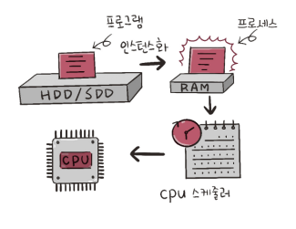

### 프로세스와 컴파일 과정

- 프로세스는 프로그램으로부터 인스턴스화된 것을 말한다
- 예를 들어 프로그램은 구글 크롬 프로그램과 같은 실행 파일이며, 이를 두 번 클릭하면 구글 크롬 '프로세스'가 시작되는 것이다
- 프로그램은 컴파일러가 컴파일 과정을 거쳐 컴퓨터가 이해할 수 있는 기계어로 번역되어 실행될 수 있는 파일이 되는 것을 의미하며 '컴파일 과정'이란 다음과 같다...
- 여기서 말하는 프로그램이란C 언어 기반의 프로그램을 의미하며, 이는 별도의 컴파일 과정 없이 한 번에 한 줄씩 읽어들여서 실행하는 프로그램인 인터프리터 언어(파이썬 등)로 된 프로그램과는 다르다...
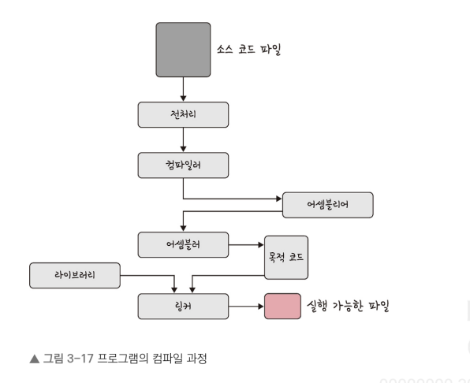

- 전처리 : 소스 코드의 주석을 제거하고 #include 등 헤더 파일을 병학하여 메크로를 치환한다
- 컴파일러 : 오류 처리, 코드 최적화 작업을 하며 어셉블리어로 변환한다
- 어셈블러 : 목적 코드(object code)로 변환한다 / 이때 확장자는 운영체제마다 다른데 리눅스에서는 .o이다 / 예를 들어 가영.c라는 파일을 만들었을 때 가영 .o라는 파일이 만들어지게 된다\
- 링커 : 프로그램 내에 있는 라이브러리 함수 또는 다른 파일들과 목적 코드를 결합하여 실행 파일을 만듭니다. 실행 파일의 확장자는 .exe 또는 .out이라는 확장자를 갖습니다
- 정적 라이브러리와 동적 라이브러리
    - 정적 라이브러리 : 프로그램 빌드 시 라이브러리가 제공하는 모든 코드를 실행 파일에 넣는 방식, 시스템 환경 등 외부 의존도가 낮고 코드 중복 등 메모리 효율성이 떨어지는 단점이 있다
    - 동적 라이브러리 : 프로그램 실행 시 필요할 때만 DLL이라는 함수 정보를 통해 참조하는 방식이며, 메모리 효율성에서의 장점과 외부 의존도가 높아진다는 단점이 있다

###  프로세스의 상태

- 프로세스의 상태는 여러 가지 상태 값을 갖습니다
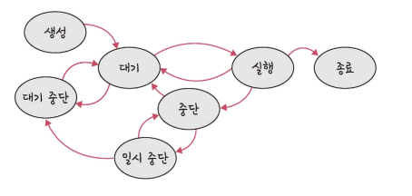

1. 생성 상태(create) : 프로세스가 생성된 상태를 의미하며 fork() 또는 exec() 함수를 통해 생성한다. 이때 PCB가 할당ㅇ된다

- fork() : 부모 프로세스의 주소 공간을 그대로 복사하며, 새로운 자식 프로세스를 생성하는 함수
- 주소 공간만 복사할 뿐이지 부모 프로세스의 비동기 작업 등을 상속하지는 않습니다
- exec() : 새롭2게 프로세스를 생성하는 함수

2. 대기 상태(ready) : 메모리 공간이 충분하면 메모리를 할당밥고 아니면 아닌 상태로 대기하고 있으며 CPU 스케줄러로부터 CPU 소유권이 넘어오기를 기다리는 상태

3. 대기 중단 상태(ready suspended) : 메모리 부족으로 일시 중단된 상태

4. 실행 상태(running) : CPU 소유권과 메모리를 할당받고 인스트럭션을 수행 중인 상태를 의미한다 / 이를 CPU burst가 일어났다고도 표현한다

5. 중단 상태(blocked) : 어떤 이벤트가 발생한 이후 기다리며 프로세스가 차단된 상태 / I/O 디바이스에 의한 인터럽트로 이런 현상이 많이 발생하기도 한다 / 예를 들어 프린트 인쇄 버튼을 눌렀을 때 프로세스가 잠깐 멈춘 듯한 때의 그 상태이다... 

6. 일시 중단 상태(blocked suspended) : 대기 중단과 유사 / 중단된 상태에서 프로세스가 실행되려고 했지만 메모리 부족으로 일시 중단된 상태

7. 종료 상태(terminated) : 메모리와 CPU 소유권을 모두 놓고 가는 상태를 말함 / 종료는 자연스럽게 종료되는 것도 있지만 부모 프로세스가 자식 프로세스를 강제시키는 비자발적 종료(abort)로 종료되는 것도 있다 / 자식 프로세스에 할당된 자원의 한계치를 넘어서거나 부모 프로세스가 종료되거나 사용자가 process, kill등 여러 명령어로 프로세스를 종료할 때 발생한다

### 프로세스의 메모리 구조

- 운영체제는 프로세스에 적절한 메모리를 할당하는데 다음 구조를 기반으로 할당한다
- 위에서부터 스택, 힙, 데이터 영역, 코드 영역으로 나뉜다
- 스택은 위 주소부터 할당되고 힙은 아래 주소부터 할당된다

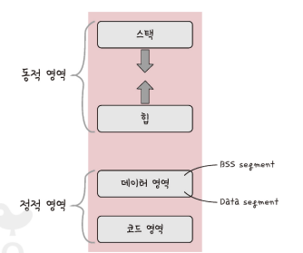

1. 스택 

- 스택에는 지역변수, 매개변수, 함수가 저장되고 컴파일 시에 크기가 결정되며 '동적'인 특징을 갖는다
- 스택 영역은 함수가 함수를 재귀적으로 호출하면서 동적으로 크기가 늘어날 수 있는데, 이때 힙과 스택의 메모리 영역이 겹치면 안 되기 때문에 힙과 스택 사이의 공간을 비워 놓는다

2. 힙

- 힙은 동적 할당할 때 사용되며 런타임 시 크기가 결정된다
- 예를 들어 벡터 같은 동적 배열은 당연히 힙에 동적 할당된다 / 힙은 '동적'인 특징을 가진다

3. 데이터 영역

- 전역변수, 정적변수가 저장되고, 정적인 특징을 갖는 프로그램이 종료되면 사라지는 변수가 들어 있는 영역이다
- 데이터 영역은 BSS 영역과 Data 영역으로 나뉘고, BSS 영역은 초기화가 되지 않은 변수가 0으로 초기화되어 저장되며 Data 영역(Data segment)은 0이 안ㄴ 다른 값으로 할당된 변수들이 저장된다

4. 코드 영역 : 프로그램에 내장되어 있는 소스 코드가 들어가는 영역
- 이 영역은 수정 불가능한 기계어로 저장되어 잇으며 정적인 특징을 가진다

###  PCB

-  PBC(Process Control Block) : 운영체제에서 프로세스에 대한 메타데이터를 저장한 '데이터' / 프로세스 제어 블록이라고도 한다 / 프로세스가 생성되면 운영체제는 해당 PCB를 생성한다
- 프로그램이 실행되면 프로세스가 생성되고 프로세스 주소 값들에 앞서 설명한 스택, 힙등의 구조를 기반으로 메모리가 할당된다
- 그리고 이 프로세스의 메타데이터들이 PCB에 저장되어 관리된다
- 이는 프로세스의 중요한 정보를 포함하고 있기 때문에 일반 사용자가 접근하지 못하도록 커널 스택의 가장 앞부분에서 관리된다
- 메타데이터 : 데이터에 관한 구조화된 데이터이자 데이터를 설명하는 작은 데이터, 대량의 정보 가운데에서 찾고 있는 정보를 효율적으로 찾아내서 이용하기 위해 일정한 규칙에 따라 콘텐츠에 대해 부여되는 데이터

1. PCB의 구조

- PCB는 프로세스 스케줄링 상태, 프로세스 ID 등의 다음과 같은 정보로 이루어져 있다
- 프로세스 스케줄링 상태 : '준비', '일시중단' 프로세스가 CPU에 대한 소유권을 얻은 이후 또는 이후 경과된 시간과 같은 기타 스케줄링 정보
- 프로세스 ID : 프호세스 ID, 해당 프로세스의 자식 프로세스 ID
- 프로세스 권한 : 컴ㅠ터 자원 또는 I/O 디바이스에 대한 권한 정보
- 프로그램 카운터 : 프로세스에서 실행해야 할 다음 명령어의 주소에 대한 포인터
- PCU 레지스터 : 프로세스를 실행하기 위해 저장해야 할 레지스터에 대한 정보
- CPU 스케줄링 정보 : CPU 스케줄러에 의해 중단된 시간 등에 대한 정보
- 계정 정보 : 프로세스 실행에 사용된 CPU 사용향, 실행한 유 저의 정보
- I/O 상태 정보 : 프로세스에 할당된 I/O 디바이스 목록

2. 컨텍스트 스위칭

- PCB를 교환하는 과정을 말한다
- 한 프로세스에 할당된 시간이 끝나거나 인터럽트에 의해 발생한다
- 컴퓨터는 많은 프로그램을 동시에 실행하는 것처럼 보이지만 어떠한 시점에서 실행되고 있는 프로세스는 단 한개이며, 많은 프로세스가 동시에 구동되는 것처럼 보이는 것은 다른 프로세스와의 컨텍스트 스위칭이 아주 빠를 속도로 실행되기 때문입니다
- 참고로 사실 현대 컴퓨터는 멀티코어의 CPU를 가지기 때문에 한 시점에 한개의 프로그램이라는 설명은 틀린 설명이다

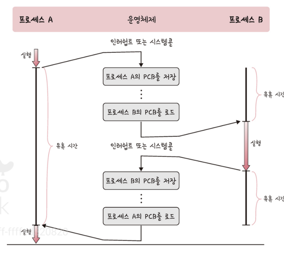

- 앞의 그림처럼 한 개의 프로세스 A가 실행하다 멈추고, 프로세스 A의 PCB를 저장하고 다시 프로세스 B를 로드하여 실행한다 
- 그리고 다시 프로세스 B의 PCB를 저장하고 프로세스 A의 PCB를 로드한다. 컨텍스트 스위칭이 일어날 때 앞의 그림처럼 유휴 시간이 발생하는 것을 볼 수 있다
- 이뿐만 아니라 이 컨텍스트 스위칭에 드는 비용이 더 있다 / 바로 캐시미스이다!!
- 비용 캐시미스 : 컨텍스트 스위칭이 일어날 때 프로세스가 가지고 있는 메모리 주소가 그대로 있으면 잘못된 주소 변환이 생기므로 캐시클리어 과정을 겪게 되고 이 때문에 캐시미스가 발생한다
- 스레드에서의 컨텍스트 스위칭 : 스레드는 스택 영역을 제외한 모든 메모리를 공유하기 때문에 스레드 컨텍스트 스위칭의 경우 비용이 더 적5고 시간도 더 적게 걸린다

### 멀티프로세싱

- 여러 개의 '프로세스', 즉 멀티프로세스를 통해 동시에 두 가지 이상의 일을 수행할 수 있는 것을 말한다. 
- 이를 통해 하나 이상의 일을 병렬로 처리할 수 있으며 특정 프로세스의 메모리, 프로세스 중 일부에 문제가 발생되더라도 다른 프로세스를 이용해서 처리할 수 있으므로 신뢰성이 높은 강점이 있다

1. 웹 브라우저

- 멀티프로세스 구조를 가지고 있으며 다음과 같다.. 사진 없음 이슈...
- 브라우저 프로세스 : 주소 표시줄, 북마크 막대, 뒤로 가기 버튼, 앞으로 가기 버튼 등을 담당하여 네트워크 요청이나 파일 접근 같은 권한을 담당
- 렌더러 프로세스 : 웹 사이트가 보이는 부분의 모든 것을 제어
- 플러그인 프로세스 : 웹 사이트에서 사용하는 플러그인을 제어
- GPU 프로세스 : GPU를 이용해서 화면을 그리는 부분을 제어

2. IPC

- 멀티 프로세스는 IPC(Inter Process Communication) 가 가능하며 IPC는 프로세스끼리 데이터를 주고받고 공유 데이터를 관리하는 메커니즘을 뜻함
- 클라이언트와 서버를 예로 들 수 있는데, 클라이언트는 데이터를 요청하고 서버는 클라이언트 요청에 응답하는 것도 IPC의 예이다
- IPC의 종류로는 공유 메모리, 파일, 소켓, 익명 파이프, 명명 파이프, 메시지 큐가 있다 / 이들은 모두 메모리가 완전히 공유되는 스레드보다는 속도가 떨어진다

3. 공유 메모리(shared memory) 

- 여러 프로세스에 동일한 메모리 블록에 대한 접근 권한이 부여되어 프로세스가 서로 통신할 수 있도록 공유 버퍼를 생성하는 것을 말한다
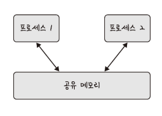
- 기본적으로는 각 프로세스의 메모리를 다른 프로세스가 접근할 수 없지만 공유 메모리를 통해 여러 프로세스가 하나의 메모리를 공유할 수 있다
- IPC 방식 중 어떠한 매개체를 통해 데이터를 주고받는 것이 아닌 메모리 자체를 공유하기 때문에 불필요한 데이터 복사의 오버헤드가 발생하지 않아 가장 빠르며 같은 메모리 영역을 여러 프로세스가 공유하기 때문에 동기화가 필요하다
- 참고로 하드웨어 관점에서 공유 메모리는 CPU가 접근할 수 있는 큰 랜덤 접근 메모리인 RAM을 가리키기도 한다

4. 파일

- 파일은 디스크에 저장된 데이터 또는 파일 서버에서 제공한 데이터를 말한다
- 이를 기반으로 프로세스 간 통신을 한다

5. 소켓

- 동일한 컴퓨터의 다른 프로세스나 네트워크의 다른 컴퓨터로 네트워크 인터페이스를 통해 전송하는 데이터를 의미하며 TCP와 UDP가 있다

6. 익명 파이프

- 프로세스 간에 FIFO 방식으로 읽히는 이시 공간이 파이프를 기반으로 데이터를 주고받으며, 단방향 방식의 읽기 전용, 쓰기 전용 파이프를 만들어서 작동하는 방식을 말함
- 이는 부모, 자식 프로세스 간에만 사용할 수 있으며 다른 네트워크상에서는 사용이 불가능하다

7. 명명된 파이프

- 파이프 서버와 하나 이상의 파이프 클라이언트 간의 통신을 위한 명명된 단방향 또는 이중 파이프를 말함
- 클라이언트/서버 콩신을 위한 별도의 파이프를 제공하며, 여러 파이프를 동시에 사용할 수 있다
- 컴퓨터의 프로세스끼리 또는 다른 네트워크 상의 컴퓨터와도 통신을 할 수 있다
- 서버용 파이프와 클라이언트용 파이프로 구분해서 작동하며 하나의 인스턴스를 열거나 여러 개의 인스턴스를 기반으로 통신한다

8. 메시지 큐

- 메시지를 큐(queue) 데이터 구조 형태로 관리하는 것을 의미
- 이는 커널의 전역변수 형태 등 커널에서 전역적으로 관리되며 다른 IPC 방식에 비해서 사용 방법이 매우 직관적이고 간단하며 다른 코드의 수정 없이 단지 몇 줄의 코드를 추가시켜 간단하게 메시지 큐에 접근할 수 잇는 장점이 있다
- 공유 메모리를 통해 IPC를 구현할 때 쓰기 및 읽기 빈도가 높으면 동기화 때문에 기능을 구현하는 것이 매우 복잡해지는데, 이때 대안으로 메시지 큐를 사요하기도 한다
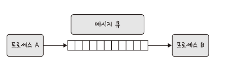

### 스레드와 멀티스레딩

1. 스레드

- 스레드 프로세스의 실행 가능한 가장 작은 단위
- 프로세스는 여러 스레드를 가질 수 있다
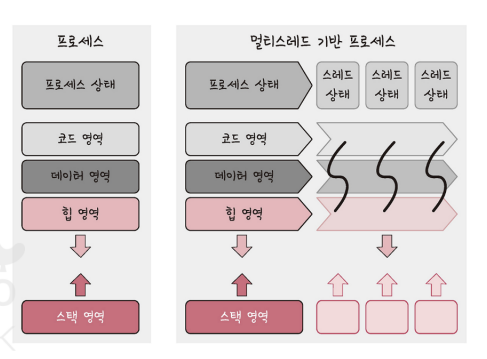

- 코드, 데이터, 스택, 힙을 각각 생성하는 프로세스와는 달리 스레드는 코드, 데이터, 힙은 스레드끼리 서로 공유한다 / 그 외의 영역은 각각 생성된다

2. 멀티스레딩

- 프로세스 내 작업을 여러 개의 스레드, 멀티스레드로 처리하는 기법이며 스레드끼리 서로 자원을 공유하기 때문에 효율성이 높다
- 예를 들어 웹 요청을 처리할 때 새 프로세스를 생성흐는 대시 스레드를 사용하는 웹 서버의 경우 훨씬 적은 리소스를 소비하며, 한 스레드가 중단되어도 다른 스레드는 실행 상태일 수 있기 때문에 중단되지 않은 빠른 처리가 가능하다
- 또한, 동시성에도 큰 장점이 있다 / 하지만 한 스레드에 문제가 생기면 다른 스레드에도 여향을 끼쳐 스레드로 이루어져 있는 프로세스에 영향을 줄 수 있는 단점이 있다
- 동시성 : 서로 독립적인 작업들을 작은 단위로 나누고 동시에 실행되는 것처럼 보여주는 것 
- 멀티스레드의 예로는 웹 브라우저의 렌더러 프로세스를 예로 들 수 있습니다...

- 이 프로세스 내에는 메인 스레드, 워커 스레드, 컴포지터 스리드, 레스터 스레드가 존재..

### 공유 자원과 임계 영역

1. 공유 자원

- 시스템 안에서 각 프로세스, 스레드가 함께 접근할 수 있는 모니터, 프린터, 메모리, 파일, 데이터 등의 자원이나 변수 등을 의미
- 이 공유 자원을 두 개 이상의 프로세스가 동시에 읽거나 쓰는 상황을 경쟁 상태라고 합니다
- 동시에 접근을 시도할 때 접근의 타이밍이나 순서 등이 결괏값에 영향을 줄 수 있는 상태
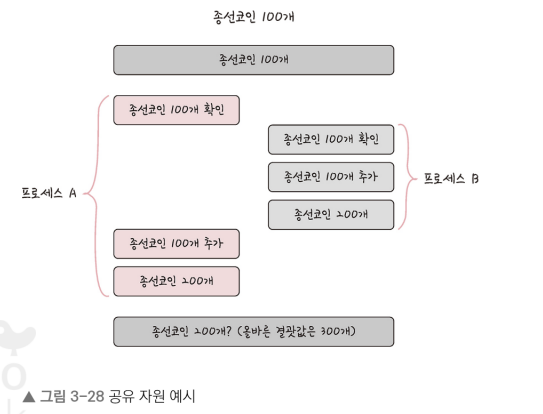

- 프로세스 A와 프로세스 B가 동시에 접근하여 타이밍이 서로 꼬여 정상 결괏값은 300인데 200이 출련된다

2. 임계 영역

- 공유 자원에 접근할 때 순서 등의 이유로 결과가 달라지는 영역을 임계 영역이라고 한다
- 임계 영역을 해결하기 위한 방법은 크게 뮤텍스, 세마포어, 모니터 세 가지가 있으며, 이 방법 모두 상호 배제, 한정 대기, 융통성이란 조건을 만족한다
- 이 방법에 토대가 되는 메커니즘은 잠금이다 / 예를 들어 임계 구역을 화장실이라고 가정하면 화장실에 A라는 사람이 들어간 다음 문을 잠급니다. 그리고 다음 사람이 이를 기다리다 A가 나오면 화장실을 쓸 수 있다
- 상호 배제 : 한 프로세스가 임계 영역에 들어갔을 때 다른 프로세스는 들어갈 수 없다
- 한정 대시 : 특정 프로세스가 영원히 임계 영역에 들어가지 못하면 안된다
- 융통성 : 한 프로세스가 다른 프로세스의 일을 방해해서는 안된다

3. 뮤텍스(mutex) 

- 공유 자우너을 사용하기 전에 설정하고 사용한 후에 해제하는 잠금입니다
- 잠금이 설정되면 다른 스레드는 잠긴 코드 영역에 접근할 수 없습니다 / 도한 뮤텍스는 하나의 상태(잠금 또는 잠근 해제)만 가집니다
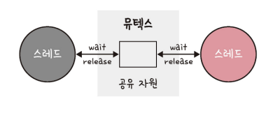

4. 세마포어

- 일반화된 뮤텍스
- 간단한 정수 값과 두 가지 함수 wait(P 함수라고도 함) 및 signal(V 함수라고도 함)로 공유 자원에 대한 접근을 처리합니다
- wiat()는 자신의 차례가 올 때까지 기다리는 함수이며, signal()은 다음 프로세스로 순서를 넘겨주는 함수입니다
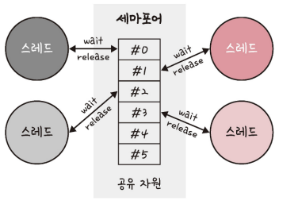

- 프로세스가 공유 자원에 접근하면 세마포어에서 wait()작업을 수행하고 프로세스가 공유 자원을 해제하면 세마포어에서 signal()작업을 수행합니다
- 세마포어에는 조건 변수가 없고 프로세스가 세마포어 값을 수정할 때 다른 프로세스는 동시에 세마포어 값을 수정할 수 없습니다

5. 모니터

- 둘 이상의 스레드나 프로세스가 공유 자원에 안전하게 접근할 수 있도록 공유 자원을 숨기고 해당 접근에 대해 인터페이스만 제공합니다
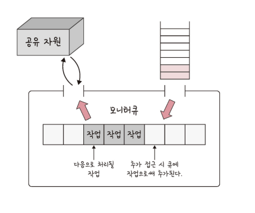
- 앞의 그림처럼 모니터는 모니터큐를 통해 공유 자원에 대한 작업들을 순차적으로 처리합니다
- 모니터는 세마포어보다 구현하기 쉬우며 모니터에서 상호 배제는 자동인 반면에, 세마포어에서는 상호 배제를 명시적으로 구현해야 하는 차이점이 있다

### 교착 상태

- 교착 상태는 두 개 이상의 프로세스들이 서로가 가진 자원을 기다리며 중단된 상태를 말한다

- 예를 들어 프로세스 A가 프로세스 B의 어떤 자원을 요청할 때 프로세스 B도 프로세스 A가 점유하고 있는 자원을 요청하는 것

1. 교착 상태의 원인

- 상호 배제 : 한 프로세스가 자원을 독점하고 있으며 다른 프로세스들은 접근이 불가능하다
- 점유 대기 : 특정 프로세스가 점유한 자원을 다른 프로세스가 요청하는 상태
- 비선점 : 다른 프로세스의 자원을 강제적으로 가져올 수 없다
- 환형 대기 : 프로세스 A는 프로세스 B의 자원을 요구하고, 프로세스 B는 프로세스 A의 자원을 요구하는 등 서로가 서로의 자원을 요구하는 상황

2. 교착 상태의 해결 방법
    1. 자원을 할 당할 때 애초에 조건이 성립되지 않도록 설계
    2. 교착 상태 가능성이 없을 때만 자원 할당되며, 프로세스 당 요청할 자원들의 최대치를 통해 자원 할당 가능 여부를 파악하는 '은행원 알고리즘'을 쓴다
    3. 교착 상태가 발생하면 사이클이 잇는지 찾아보고 이에 관련된 프로세스를 한 개씩 지웁니다
    4. 교착 상태는 매우 드물게 일어나기 때문에 이를 처리하는 비용이 더 커서 교착 상태가 발생하면 사용자가 작업을 종료합니다. 

3. 은행원 알고리즘 : 총 자원의 양과 현재 할당한 자원의 양을 기준으로 안정 또는 불안정 상태로 나누고 안정 상태로 가도록 자원을 할당하는 알고리즘