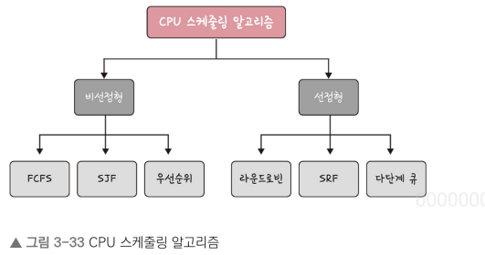
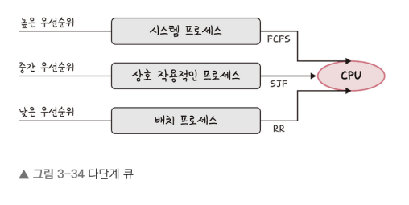

## CPU 스케줄링 알고리즘

- CPU 스케줄러는 CPU 스케줄링 알고리즘에 따라 프로세스에서 해야 하는 일을 스레드 단위로 CPU에 할당한다

- 프로그램이 실행할 때는 CPU 스케줄링 알고리즘이 어떤 프로그램에 CPU 소유권을 줄것인지 결정
- 이 알고리즘은 CPU 이용률은 높게, 주어진 시간에 많은 일을 하게, 준비 큐에 있는 프로세스는 적게, 응답 시간은 짧게 설정하는 것을 목표로 한다

### 비선점형 방식

- 비선점형 방식은 프로세스가 스스로 CPU 소유권을 포기하는 방식이며, 강제로 프로세스를 중지하지 않는다
- 따라서 컨텍스트 스위칭으로 인한 부하가 적다...

1. FCFS

- 가장 먼저 온 것을 가장 먼저 처리하는 알고리즘
- 길게 수행되는 프로세스 때문에 '준비 큐에서 오래 기다리는 현상'이 발생하는 단점이 있다

2. SJF

- 실행 시간이 가장 짧은 프로세스를 가장 먼저 실행하는 알고리즘
- 긴 시간을 가진 프로세스가 실행되지 않는 현상이 일어나며 평균 대시 시간이 가장 짧다
- 하지만 실제로는 실행 시간을 알 수 없기 때문에 과거의 실행했던 시간을 토개로 추측해서 사용한다

3. 우선순위

- 기존 SJF 스케줄링의 경우 긴 시간을 가진 프로세스가 실행되지 않는 현상이 있다
- 이는 오래된 작업일수록 '우선순위를 높이는 방법(aging)'을 통해 단점을 보완한 알고리즘을 말한다

### 선점형 방식

- 현대 운영체제가 쓰는 방식으로 지금 사용하고 있는 프로세스를 알고리즘에 의해 중단시켜 버리고 강제로 다른 프로세스에 CPU 소유권을 할당하는 방식을 말한다

1. 라운드 로빈

- 현대 컴퓨터가 쓰는 스케줄링인 우선순위 스케줄링의 일종으로 각 프로세스는 동일한 할당 시간을 주고 그 시간 안에 끝나지 않으면 다시 준비 큐의 뒤로 가는 알고리즘
- 예를 들어 q 만큼의 할당 시간이 부여되었고 N개의 프로세스가 운영된다고 하면(N-1) * q 시간이 지나면 자기 차례가 오게 됩니다
- 할당 시간이 너무 크면 FCFS가 되고 짧으면 컨텍스트 스위칭이 잦아져서 오버헤드, 즉 비용이 커진다
- 일반적으로 전체 작업 시간은 길어지지만 평균 응답 시간은 짧아진다는 특징이 있다
- 또한 이 알고리즘은 로드밸런서에서 트래픽 분산 알고리즘으로도 쓰인다

2. SRF

- SJF는 중간에 실행 시간이 더 짧은 작업이 들어와도 기존 짧은 작업을 모두 수행하고 그다음 짧은 작업을 이어나가는데, SRF는 중간에 더 짧은 작업이 들어오면 수행하던 프로세스를 중지하고 해당 프로세스를 수행하는 알고리즘이다

3. 다단계 큐

- 우선순위에 따른 준비 큐를 여러 개 사용하고, 큐마다 라운드 로빈이나 FCFS등 다른 스케줄링 알고리즘을 적용한 것을 말한다
- 큐 간의 프로세스 이동이 안 되므로 스케줄링 부담이 적지만 유연성이 떨어지는 특징이 있다

