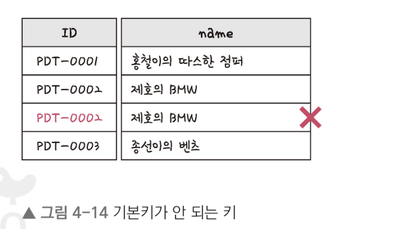

# 데이터베이스

## 데이터베이스의 기본

- 데이터베이스(DB, DataBase)는 일정한 규칙, 혹은 규약을 통해 구조화되어 저장되는 데이터의 모음
- 해당 데이터베이스를 제어, 관리하는 통합 시스템을 DBMS라고 하며, 데이터베이스 안에 있는 데이터들은 특정 DBMS마다 정의된 쿼리 언어를 통해 삽입, 삭제, 수정, 조회 등을 수행할 수 있다
- 또한 데이터베이스는 실시간 접근과 동시 공유가 가능하다


- 위 그림처럼 데이터베이스 위에 DBMS가 있고 그 위에 응용 프로그램이 있으며, 이러한 구조를 기반으로 데이터를 주고 받는다
- 예를 들어 MySQL이라는 DBMS가 있고 그 위에 응용 프로그램에 속하는 Node.js나 php에서 해당 데이터베이스 안에 있는 데이터를 끄집어내 해당 데이터 관련 로직을 구축

### 엔터티

- 엔터티는 사람, 장소, 물건, 사건, 개념 등 여러 개의 속성을 지닌 명사
- 예를 들어 회원이라는 엔터티가 있다면 회원은 이름, 아이디, 주소, 전화번호의 속성을 가짐...
- 물론 이보다 많은 속성이 있지만 서비스의 요구 사항에 맞춰 속성이 정해짐
- 예를 들어 주소라는 속성이 서비스의 요구 사항과 무관한 속성이라면 주소라는 속성은 사라지게 된다..

- 약한 엔터티와 강한 엔터티 : 엔터티는 약한 엔터티와 강한 엔터티로 나뉘는데... 예를 들어 A가 혼자서는 존재하지 못하고 B의 존재 여부에 따라 종송적이라면 A는 약한 엔터티이고 B는 강한 엔터티가 된다.. 예를 들어 방은 건물 안에만 존재하기 때문에 방은 약한 엔터티라고 할 수 있고 건물은 강한 엔터티라고 할 수 있다..


### 릴레이션

- 릴레이션은 데이터베이스에서 정보를 구분하여 저장하는 기본 단위
- 엔터티에 관한 데이터를 데이터베이스는 릴레이션 하나에 담아서 관리


- 위 그림처럼 회원이라는 엔터티가 데이터베이스에서 관리될 때 릴레이션으로 변화된 것을 볼 수 있다
- 릴레이션은 관계형 데이터베이스에서는 테이블이라고 하며, NoSQL 데이터베이스에서는 컬렉션이라고 한다

- 테이블과 컬렉션
- 데이터베이스의 종류는 크게 관계형 데이터베이스와 NoSQL 데이터베이스로 나눌 수 있다
- 이 중 대표적인 관계형 데이터베이스인 MySQL과 대표적인 NoSQL 데이터베이스인 MongoDB를 예로 들며, MySQL의 구조는 레코드-테이블-데이터베이스로 이루어져 있고
- NoSQL 데이터베이스의 구조는 도큐먼트-컬렉션-데이터베이스로 이루어져 있다


- 위 그림처럼 레코드가 쌓여서 테이블이 되고 테이블이 쌓여서 데이터베이스가 되는 것!!


### 속성

- 속성은 릴레이션에서 관리하는 구체적이며 고유한 이름을 갖는 정보
- 예를 들어 '차'라는 엔터티의 속성을 뽑아보면 차 넘버, 바퀴 수, 차 색깔, 차종 등이 있는데 이 중에 서비스의 요구 사항을 기반으로 관리해야 할 필요가 있는 속성들만 엔터티의 속성이 된다


### 도메인

- 도메인이란 릴레이션에 포함된 각각의 속성들이 가질 수 있는 값의 집합을 말한다
- 예를 들어 성별이라는 속성이 있다면 이 속성이 가질 수 있는 값은 {남, 여}라는 집합이 된다


- 앞의 그림처럼 회원이라는 릴레이션에 이름, 아이디, 주소, 전화번호, 성별이라는 속성이 있고 성별은 {남, 여} 라는 도메인을 가지는 것을 알 수 있다


### 필드와 레코드

- 회원이란 엔터티는 member라는 테이블로 속성인 이름, 아이디 등을 가지고 있으며 name, ID, address 등의 필드를 가진다
- 테이블에 쌓이는 행(row) 단위의 데이터를 레코드 / 또한 레코드를 튜플이라고 한다..
- 예를 들어 '책'이라는 엔터티를 정의하고 이를 기반으로 테이블을 만들어 보면
- 먼저 속성에는 책의 제목, 책의 가격, 책의 ISBN, 책의 저자등이 있다
- 수많은 속성 중에서 이름, 저자의 아이디, 출판년도, 장르, 생성일시, 업데이트만 있다고 하면...
- 이 엔터티를 데이터베이스에 넣어 테이블로 만들려면 속성에 맞는 타입을 정의 해야한다
- 보통 한글을 속성 이름으로 쓰지 않고 title, author_id 등으로 영어 이름에 매핑하여 쓴다
``` md
- 책의 아이디 : INT
- 책의 제목 : VARCHAR(255)
- 책의 저자 아이디 : INT
- 책의 출판년도 : VARCHAR(255)
- 책의 장르 : VARCHAR(255)
- 생성 일시 : DATETIME
- 업데이트 일시 : DATETIME
```

1. 필드 타입

- 필드는 타입을 갖느다
- 예를 들어 이름은 문자열이고 전화번호는 숫자
- 이러한 타입들은 DBMS마다 다르고 이 책에서는 MySQL 기준...
- 숫자 타입 : TINYINT, SMALLINT, MEDIUMINT, INT, BIGINT등이 있다
- 날짜 타입 : DATE, DATETIME, TIMESTAMP
    1. DATE : 날짜 부분은 있지만 시간 부분은 없는 값에 사용 / 지원되는 범위는 1000-01-01~9999-12-31 / 3바이트의 용량을 가짐
    2. DATTIME : 날짜 및 시간 부분을 모두 포함하는 값에 사용 / 지원되는 범위는 1000-01-01 00:00:00에서 9999-12-31 23:59:59 / 8바이트의 용량을 가진다
    3. TIMESTAMP : 날짜 및 시간 부분을 모두 포함하는 값에 사용 / 1970-01-01 00:00:01에서 2038-01-19 03:14:07까지 지원 / 4바이트의 용량을 가짐

- 문자 타입 : CHAR, VARCHAR, TEXT, BLOB, ENUM, SET이 있다
    1. CHAR와 VARCHAR 
        - CHAR와 VARCHAR 모두 그 안에 수를 입력해서 몇 자까지 입력할지 정한다(예를 들어 CHAR(30)이면 최대 30지)
        - CHAR는 테이블을 생성할 때 선언한 길이로 고정되며 길이는 0에서 255 사이의 값을 가진다 / 레코드를 저장할 때 무조건 선언한 길이 값으로 '고정'해서 저장
        - VATCHAR는 가변 길이 문자열 / 길이는 0에서 65,535 사이의 값으로 지정할 수 있으며, 입력된 데이터에 따라 용령을 가변시켜 저장 / 예를 들어 10글자의 이메일을 저장할 경우 10글자에 해당하는 바이트 + 길이기록용 1바이트로 저장
        - 그렇게 때문에 지정된 형태에 따라 저장된 CHAR의 경우 검색에 유리하며, 검색을 별로 하지 않고 유동적인 길이를 가진 데이터는 VARCHAR로 저장하는 것이 좋다
    
    2. TEXT와 BLOB
        - 두 개의 타입 모두 큰 데이터를 저장할 때 쓰는 타입이다
        - TEXT는 큰 문자열 저장에 쓰며 주로 게시판의 본문을 저장할 때 쓴다
        - BLOB는 이미지, 동영상 등 큰 데이터 저장에 사용한다 / 그러나 보통은 아마존의 이미지 호스팅 서비스인 S3를 이용하는 등 서버에 파일을 올리고 파일에 관한 경로를 VARCHAR로 저장...

        

    3. ENUM과 SET 
        - ENUM과 SET 모두 문자열을 열거한 타입
        - ENUM은 (x-small, small, medium, large, x-large) 형태로 쓰이며, 이 중에서 하나만 선택하는 단일 선택만 가능하고 ENUM 리스트에 없는 잘못된 값을 삽입하면 빈문자열이 대신 삽입된다 / ENUM을 이용하면 x-small 등이 0, 1 등으로 매핑되어 메모리를 적게 사요하는 이점을 업는다 / ENUM은 최대 65,535 개의 요소들을 넣을 수 있다
        - SET은 ENUM과 비슷하지만 여러 개의 데이터를 선택할 수 있고 비트 단위의 연산을 할 수 있으며 최대 64개의 요소를 집어넣을 수 있다는 점이 다르다 / 참고로 ENUM이나 SET을 쓸 경우 공간적으로 이점을 볼 수 있지만 애플리케이션의 수정에 따라 데이터베이스의 ENUM이나 SET에서 정의한 목록을 수정해야 한다는 단점이 있다


### 관계

- 데이터베이스에 테이블은 하나만 있는 것이 아니다
- 여러 개의 테이블이 있고 이러한 테이블은 서로의 관계가 정의되어 있다
- 그리고 이러한 관계를 관계화살표로 나타낸다


1. 1:1 관계

- 예를 들어 유저당 유저 이메일은 한 개씩 있다!! 이 경우는 1:1관계가 된다
- 1:1 관계는 테이블을 두 개의 테이블로 나눠 테이블의 구조를 더 이해하기 쉽게 만들어 준다


2. 1:N 관계

- 예를 들어 쇼핑몰을 운영한다고 했을 때...
- 한 유저당 여러 갱의 상품을 장바구니에 넣을 수 있는데 이 경우 1:N의 관계가 된다
- 물론 하나도 넣지 않는 0개의 경우도 있으니 0도 포함되는 화살표를 통해 표현해야 한다
- 이렇게 한 개체가 다른 많은 개체를 포함하는 관계를 말한다


3. N:M 관계

- 학생과 강의의 관계를 정의하면 학생도 강의를 많이 들을 수 있고 강의도 여러 명의 학생을 포함할 수 있는데 이 경우  N:M이다
- 지금 보면 중간에 학생_강의라는 테이블이 끼여 있는데
- N:M은 테이블 두개를 직접적으로 연결해서 구축하지는 않고 1:N, 1:M이라는 관계를 갖는 테이블 두 개로 나눠서 설정한다


### 키

- 테이블 간의 관계를 조금 더 명확하게 하고 테이블 자체의 인덱스를 위해 설정된 장치로 기본키, 외래키, 후보키, 슈퍼키, 대체키가 있다
- 키들은 밑의 그림과 같은 관계를 가진다
- 슈퍼키는 유일성이 있고 그 안에 포함된 후보키는 최소성까지 갖춘 키이다
- 후보키 중에서 기본키로 선택되지 못한 키는 대체키가 된다
- 유일성은 중복되는 값은 없으며, 최소성은 필드를 조합하지 않고 최소 필드만 써서 키를 형성할 수 있는 것을 말한다


1. 기본키

- 줄여 PK 또는 프라이머리키라고 많이 부르며, 유일성과 최소성을 만족하는 키이다
- 이는 테이블의 데이터 중 고유하게 존재하는 속성이며 기본키에 해당하는 데이터는 앞의 그림의 ID처럼 중복되어서는 안된다



2. 자연키

- 예를 들어 유저 테이블을 만든다고 가정하면 주민등록번호, 이름, 성별 등의 속성이 있는데..
- 이 중 이름, 성별 등은 중복된 값이 들어올 수 있으므로 부적절하고 남은 것은 주민등록번호이다
- 이런식으로 중복된 값들을 제외하며 중복되지 않는 것을 자연스레 뽑다가 나오는 키를 자연키라고 한다
- 자연키는 언젠가는 변하는 속성을 가진다

3. 인조키

- 예를 들어 유저 테이블을 만든다고 했을 때 회원 테이블을 생성한다고 가정하면 주민등록번호, 이름, 성별등의 속성이 있느네
- 여기에 인위적으로 유저 아이디를 부여한다
- 이를 통해 고유 식별자가 생기는데
- 오라클은 sequence, MySQL은 auto mecrement 등으로 설정된다
- 이렇게 인위적으로 생성한 키를 인조키라고 한다
- 자연키와는 대조적으로 변하지 않는다 -> 기본키는 인조키로 설정

4. 외래키

- FK라고도 하며, 다른 테이블의 기본키를 그대로 참조하는 값으로 개체와의 관계를 식별하는 데 사용한다
- 외래키는 중복되어도 괜찮다
- 밑의 글미을 보면 client 테이블의 기본키인 ID가 product라는 테이블의 user_id라는 외래키로 설정될 수 있음을 보여주고 값이 중복되는 것을 볼 수 있다


5. 후보키 : 기본키가 될 수 있는 후보들이며 유일성과 최소성을 동시에 만족하는 키

6. 대체키 : 후보키가 두 개 이상일 경우 어느 하나를 기본키로 지정하고 남은 후보키

7. 슈퍼키 : 각 레코드를 유일하게 식별할 수 있는 유일성을 갖춘 키