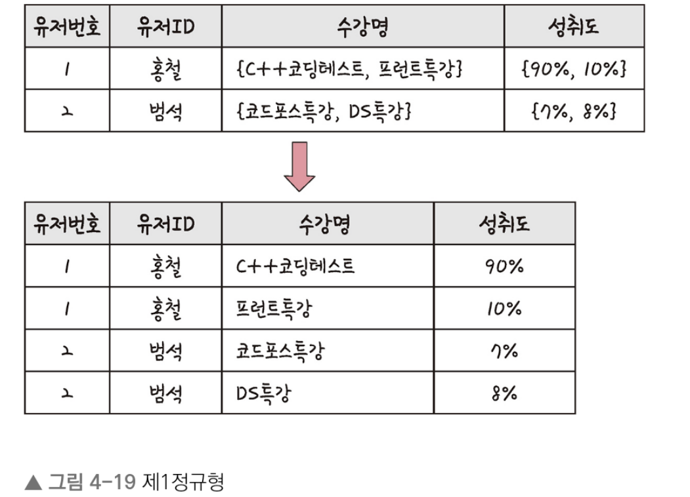
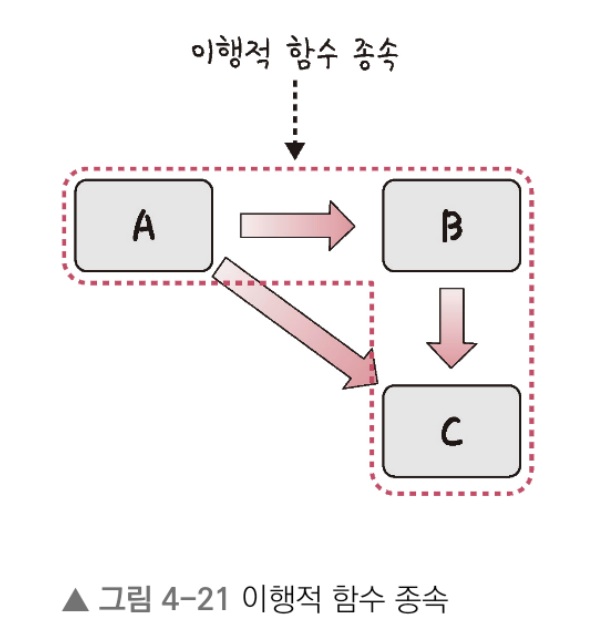
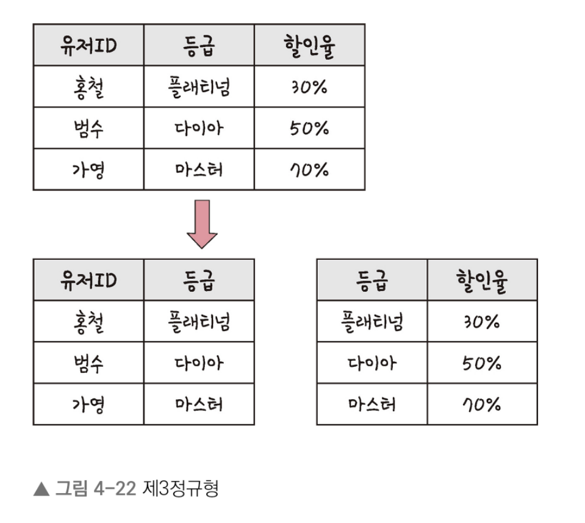

# 데이터베이스

## ERD와 정규화 과정

- ERD는 데이터베이스를 구축할 때 가장 기초적인 뼈대 역할을 하며, 릴레이션 간의 관계들을 정의한 것
- 만약 서비스를 구축한다면 가장 먼저 신경 써야 할 부분이며 이 부분을 신경 쓰지 않고 서비스를 구축한다면 단단하지 않은 골조로 건물을 짓는 것이나 다름 없다

### ERD의 중요성

- ERD는 시스템의 요구사항을 기반으로 작성되며 이 ERD를 기반으로 데이터베이스를 구축한다
- 데이터베이스를 구축한 이후에도 디버깅 또는 비즈니스 프로세스 재설계가 필요한 경우에 설계도 역할을 담당하기도 한다
- 하지만 ERD는 관계형 구조로 표현할 수 있는 데이터를 구성하는 데 유용할 수 있지만 비정형 데이터를 충분히 표현할 수 없다는 단점이 있다
- 비정형 데이터 : 비구조화 데이터를 말하며, 미리 정의된 데이터 모델이 없거나 미리 정의된 방식으로 정리되지 않은 정보를 말함

### 예제로 배우는 ERD(승원 영업부서의 ERD)

- 요구 사항
    1. 영업사원은 0~n명의 고객을 관리
    2. 고객은 0~n개의 주문을 넣을 수 있다
    3. 주문에는 1~n개의 상품이 들어간다
- 사진 짤려서 못넣는 이슈...

### 정규화 과정

- 정규화 과정은 릴레이션 간의 잘못된 종속 관계로 인해 데이터베이스 이상 현상이 일어나서 이를 해결하거나, 저장 공간을 효율적으로 사용하기 위해 릴레이션을 여러 개로 분리하는 과정
- 데이터베이스 이상 현상이란 회원이 한 개의 등급을 가져야 하는데 세 개의 등급을 갖거나 삭제할 때 필요한 데이터가 같이 삭제되고, 데이터를 삽입해야 하는데 하나의 필드 값이 NULL이 되면 안 되어서 삽입하기 어려운 현상을 말함
- 정규화 과정은 정규형 원칙을 기반으로 정규형을 만들어가는 과정이며, 정규화된 정도는 정규형으로 표현한다

1. 정규형 원칙
    - 정규형 원칙이란 같은 의미를 표현하는 릴레이션이지만 좀 더 좋은 구조로 만들어야 하고, 자료의 중복성은 감소해야 하고, 독립적인 관계는 별개의 릴레이션으로 표현해야 하며, 각각의 릴레이션은 독립적인 표현이 가능해야 하는 것을 말한다

2. 제1정규형
    - 릴레이션의 모든 도메인이 더 이상 분해될 수 없는 원자 값만으로 구성되어야 한다
    - 릴레이션의 속성 값 중에서 한 개의 기본키에 대해 두 개 이상의 값을 가지는 반복 집합이 있어서 는 안된다 / 있으면 제거 한다
    
    

    - 위 그림처럼 홍철이란 ID에 수강명이 {C++코딩테이스, 프런트특강}이 있었는데 이것을 나눠서 반복 집합을 제거하는 것을 볼 수 있다

3. 제2정규형
    - 릴레이션이 제1정규형이며 부분 함수의 종속성을 제거한 형태를 말한다
    - 부분 함수의 종속성 제거한 기본키가 아닌 모든 속성이 기본키에 완전 함수 종속적인 것을 말한다
    
    

    - 위의 그림을 보면 기본키인 {유저ID, 수강명}과 완전 종속된 유저번호 릴레이션과 {유저ID, 수강명}에 따른 성취도 릴레이션으로 분리된 것을 볼 수 있다
    - 이때 주의할 점은 릴레이션을 분해할 때 동등한 릴레이션으로 분해해야 하고, 정보 손실이 발생하지 않는 무손실 분해로 분해되어야 한다는 것이다

4. 제3정규형    
    - 제 2정규형이고 기본키가 아닌 모든 속성이 이행적 함수 종속을 만족하지 않는 상태를 말한다
    - 이행적 함수 종속
        1. 이행적 함수 종속이란 A -> B와 B -> C가 존재하면 논리적으로 A -> C가 성립하는데, 이때 집합 C가 집합 A에 이행적으로 함수 종속이 되었다고 한다
        2. 예를 들어 부부쇼핑몰이 있다고 가정한다면 유저ID와 등급, 할인율이 정해져 있는 테이블을 다음과 같이 분해하는 것을 말한다

        
        

5. 보이스/코드 정규형
    - 보이스 코드 정규형은 제 3정규형이고, 결정자가 후보키가 아닌 함수 종속 관계를 제거하여 릴레이션의 함수 종속 관계에서 모든 결정자가 후보키인 상태를 말한다
    - 결정자 : 함수 종속 관계에서 특정 종속자를 결정짓는 요소, 'X+Y'일 때 X는 결정자, Y는 종속자
    - 요구사항 예시..
        1. 각 수강명에 대한 한 학생은 오직 한 강사의 강의만 수강한다
        2. 각 강사는 한 수강명만 담당한다
        3. 한 수강명은 여러 강사가 담당할 수 있다

    - 앞의 릴레이션을 보면(?) {학번, 수강명} 또는 {학번, 강사}가 후보키가 되며, 만약 범석이라는 강사가 '롤'이라는 수강명을 담당한다고 했을 때 이를 삽입하면 학번이 NULL이 되는 문제점이 발생한다
    - 또한 이 릴레이션은 다음과 같은 함수 종속 다이어그램을 가진다
    - 즉, 강사 속성이 결정자이지만 후보키가 아니므로 이 강사 속성을 분리해야 한다!!!!