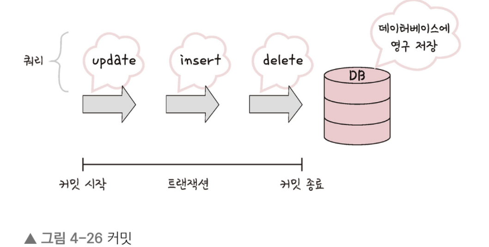
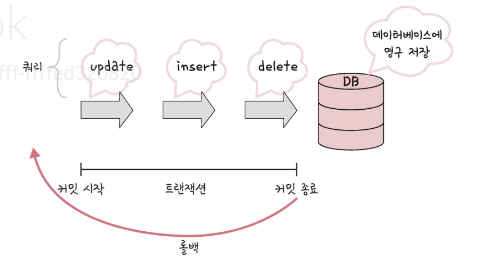

# 데이터베이스

## 트랜잭션과 무결성

### 트랜잭션

- 트랜잭션은 데이터베이스에서 하나의 논리적 기능을 수행하기 위한 작업의 단위를 말한다
- 데이터베이스에 접근하는 방법은 쿼리이므로, 즉 여러 개의 쿼리들을 하나로 묶는 단위!
- 트랜잭션의 특징은 원자성, 일관성, 독립성, 지속성이 있으며 이를 한꺼번에 ACID 특징이라고 한다

1. 원자성

- 트랜잭션과 관련된 일이 모두 수행되었거나 되지 않았거나를 보장하는 특징
- 예를 들어 트랜잭션을 커밋했는데, 문제가 발생하여 롤백하는 경우 그 이후에 모두 수행되지 않음을 보장하는 것을 말함
- 예를 들어 1000만 원을 가지 홍철이가 0원을 가진 규영이에게 500만원을 이체한다고 했을때 결과는 홍철이는 500, 규영이는 500을 가진다...
    - 해당 결과는 다음과 같은 operation 단위들로 이루어진 과정을 거친다...
    1. 홍철이의 잔고를 조회한다
    2. 홍철에게서 500만원을 뺀다
    3. 규영에게 500만원을 넣는다

        - 여기서 1~3의 operation 중 데이터베이스 사용자는 이 세 가지의 과정을 볼 수도 참여할 수도 없다
        - 다만 이 과정이 모두 끝난 이후의 상황인 홍철 500, 규영 500인 상황만 봄
        - 여기서 이 작업을 취소 한다고 했을 때 홍철이는 다시 1000만원, 규영이는 0원을 가져야 한다
        - 일부 operation만 적용된 홍철이는 500만원, 규영이는 0원이 되지 않는 것을 의미!!
        - 그래서 all or nothing이라고 표현한다
        - 또한, 트랜잭션 단위로 여러 로직들을 묶을 때 외부 API를 호출하는 것이 있으면 안된다
        - 만약 있다면 롤백이 일어났을 때 어떻게 해야 할 것인지에 대한 해결 방법이 있어야 하고 트랜잭션 전파를 신경써서 관리해야 한다!

- 커밋과 롤맥
    1. 커밋 : 여러 쿼리가 성공적으로 처리되었다고 확정하는 명령어
        -  트랜잭션 단위로 수행되며 변경된 내용이 모두 영구적으로 저장되는 것을 말한다
        -  커밋이 수행되었다를 하나의 트랜잭션이 성공적으로 수행되었다고도 말한다

        

        - 앞의 그림처럼 update, insert, delete의 쿼리가 하나의 트랜잭션 단위로 수행되고 이후에 데이터베이스에 영구 저장된다
    2. 롤백 : 에러나 여러 이슈 때문에 트랜잭션 전으로 돌여야 할 때 사용하는 것 
        - 트랜잭션으로 처리한 하나의 묶음 과정을 일어나기 전으로 돌리는 일을 말함
        - 이러한 커밋과 롤백 덕에 데이터의 무결성이 보장된다
        - 또한 데이터 변경 전에 변경 사항을 쉽게 확인할 수 있고 해당 작업을 그룹화할 수 있다

        

    3. 트랜잭션 전파 
        - 트랜잭션을 수행할 때 커넥션 단위로 수행하기 때문에 커넥션 객체를 넘겨서 수행해야 한다
        - 하지만 이를 매번 넘겨주기가 어렵기도 하고 귀찮아서 이를 넘겨서 수행하지 않고 여러 트랜잭션 관련 메서드의 호출을 하나의 트랜잭션에 묶이도록 하는 것이다..

        ``` java
        @Service
        @Transactional(readOnly = true)
        public class MemberService {
            private final MemberRepository {
                private final MemberRepository memberRepository;

                public MemberService (MemberRepository memberRepository) {
                    this.memberRepository = memberRepository;
                }
            }
        }
        // 앞의 코드처럼 Spring 프레임워크에서는 @Transactional 애니테이션을 통해 여러 쿼리 관련 코드들을 하나의 트랜잭션으로 처리합니다
        ```

2. 일관성
    - 허용된 방식으로만 데이터를 변경해야 하는 것을 의미
    - 데이터베이스에 기록된 모든 데이터는 여러 가지 조건, 규칙에 따라 유효함을 가져야 한다
    - 예를 들어 홍철이는 1000만원이 있고 범석이는 0원이 있다고 했을 때 범석이가 필자한테 500만원을 입금할 수는 없다... 불가능하니까

3. 격리성
    - 트랜잭션 수행 시 서로 끼어들지 못하는 것을 말함
    - 복수의 병렬 트랜잭셔은 서로 격리되어 마치 순차적으로 실행되는 것처럼 작동되어야 하고, 데이터베이스는 여러 사용자가 같은 데이터에 접근할 수 있어야 한다
    - 격리성은 여러 개의 격리 수준으로 나뉘어 격리성을 보장한다
    - 격리 수준에 따라 발생하는 현상 :  팬텀 리드, 반복 가능하지 않은 조회, 더티 리드가 있다
        1. 팬텀 리드
            - 한 트랜잭션 내에서 동일한 쿼리를 보냈을 때 해당 조회 결과가 다른 경우를 말함
            - 예를 들어 사용자 A가 회원 테이블에서 age 가 12 이상이 회원들을 조회하는 쿼리를 보냈을 때 이 결과로 세 개의 테이블이 조회한다고 하고 그 다음 사용자 B가 age가 15인 회원 레코드를 삽입하면 3개가 아닌 4개의 테이블이 조회됨
        
        2. 반복 가능하지 않은 조회
            - 한 트랜잭션 내의 같은 행에 두 번 이상 조회가 발생했는데, 그 값이 다른 경우를 가리킴
            - 예를 들어 사용자 A가 큰돌의 보석 개수가 100개라는 값을 가진 데이터였는데, 그 이후 사용자 B가 그 값을 1로 변경해서 커밋했다고 하면 사용자 A는 100이 아닌 1을 읽게 된다
            - 팬텀 리드와 다른 점은 반복 가능하지 않은 조회는 행 값이 달라질 수도 있는데, 팬텀 리드는 다른 행이 선택될 수도 있다는 것을 의미
        
        3. 더티 리드
            - 반복 가능하지 않은 조회와 유사하며 한 트랜잭션이 실행 중일 때 다른 트랜잭션에 의해 수정되었지만 아직 커밋되지 않은 행의 데이터를 읽을 수 있을 때 발생한다
            - 예를 들어 사용자 A가 큰돌의 보석 개수 100을 1로 변경한 내용이 커밋되지 않은 상태라도 그 이후 사용자 B가 조회한 결과가 1로 나오는 경우...

4. 지속성
    - 성공적으로 수행된 트랜잭션은 영원히 반영되어야 하는 것을 의미
    - 이는 데이터베이스에 시스템 장애가 발생해도 원래 상태로 복구하는 회복 기능이 있어야 함을 뜻함
    - 데이터베이스는 이를 위해 체크섬, 저널링, 롤백 등의 기능을 제공
    - 체크섬 : 중복 검사의 한 형태로, 오류 정정을 통해 송신된 자료의 무결성을 보호하는 단순한 방법
    - 저널링 : 파일 시스템 또는 데이터베이스 시스템에 변경 사항을 반영하기 전에 로깅하는 것, 트랜잭션 등 변경 사항에 대한 로그를 남기는 것


### 무결성

- 데이터의 정확성, 일과성, 유효성을 유지하는 것을 말하며, 무결성이 유짇되어야 데이터베이스에 저장된 데이터 값과 그 값에 해당하는 현실 세계의 실제 값이 일치하는지에 대한 신뢰가 생김
- 무결성의 종류
    1. 개체 무결성 : 기본키로 선택된 필드는 빈 값을 허용하지 않습니다
    2. 참조 무결성 : 서로 참조 관계에 있는 두 테이블의 데이터는 항상 일관된 값을 유지해야 합니다
    3. 고유 무결성 : 특정 속성에 대한 고유한 값을 가지도록 조건이 주어진 경우 그 속성 값은 모두 고유한 값을 가집니다
    4. NULL 무결성 : 특정 속성 값에 NULL이 올 수 없다는 조건이 주어진 경우 그 속성 값은 NULL이 될 수 없다는 제약 조건입니다