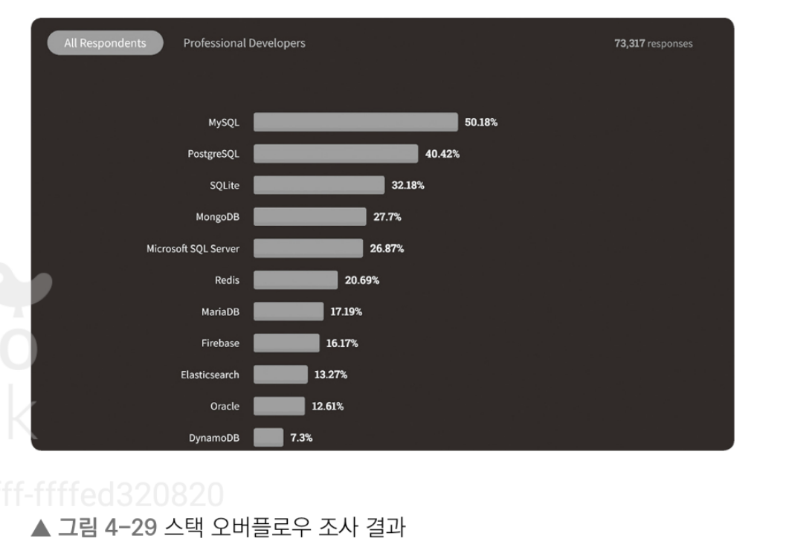
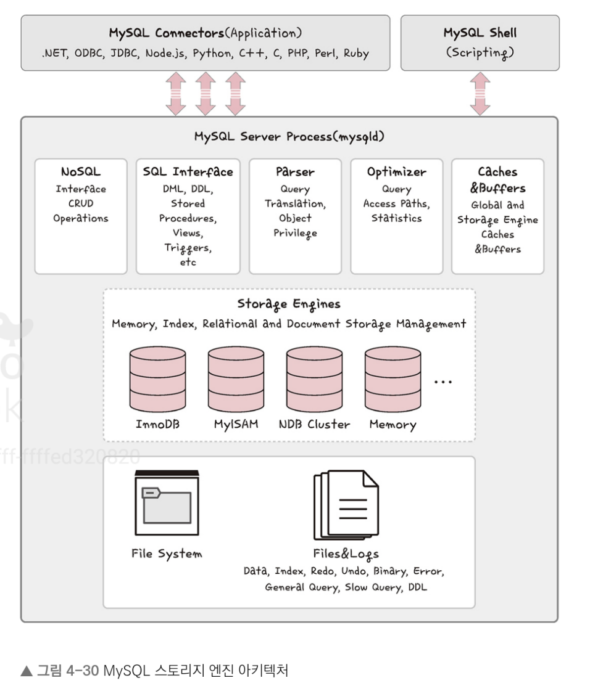
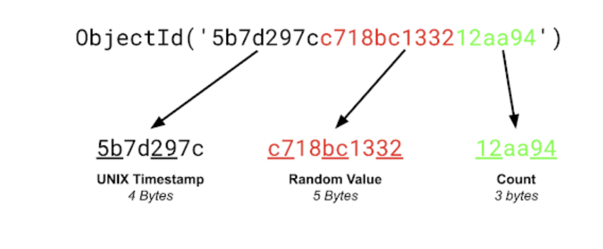

# 데이터베이스

## 데이터베이스의 종류

### 관계형 데이터베이스 
 
 - 관계형 데이터베이스(RDBMS)는 행과 열을 가지는 표 형식 데이터를 저장하는 형태의 데이터베이스를 가리키며 SQL이라는 언어를 써서 조작합니다
 - 종류로는 MySQL, PostgreSQL, 오라클, SQL Server, MSSQL 등이 있다
 - 관계형 데이터베이스의 경우 표준 SQL은 지키기는 하지만, 각각의 제품에 특화시킨 SQL을 사용합니다(귀찮..)
 - 예를 들어 오라클의 경우 PL/SQL이라고 하면 SQL Server에서는 T-SQL, MySQL은 SQL을 씁니다

1. MySQL

- 대부분의 운영체제와 호환되며 현재 가장 많이 사용하는 데이터베이스이다
- 스택 오버 플로우에서 조사한 결과(2021)에서 MySQL은 아직도 압도적으로 가장 많이 쓰는 데이터베이스이며 메타, 트위터 등 많은 기업에서 사용중이다
- C, C++(이걸로 어케 만듦..)로 만들어졌으며 MyISAM 인덱스 압축 기술, B-트리 기반의 인덱스, 스레드 기반의 메모리 할당 시스템, 매우 빠른 조인, 최대 64개의 인덱스를 제공합니다
- 대용량 데이터베이스를 위해 설계되어 있고 롤백, 커밋, 이중 암호 지원 보안 등의 기능을 제공하며 많은 서비스에서 사용합니다





- 데이터베이스의 심장과도 같은 역할을 하는 곳이 바로 스토리지 엔진인데, 모듈식 아키텍처로 쉽게 스토리지 엔진을 바꿀 수 있으며 데이터 웨어하우징, 트랜잭션 처리, 고가용성 처리에 강점을 두고 있습니다
- 스토리지 엔진 위에는 커넥터 API 및 서비스 계층을 통해 MySQL 데이터베이스와 쉽게 상호 작용할 수 있습니다
- 또한, MySQL은 쿼리 캐시를 지원해서 입력된 쿼리 문에 대한 전체 결과 집합을 저장하기 때문에 사용자가 작성한 쿼리가 캐시에 있는 쿼리와 동일하면 서버는 단순히 구문 분석, 최적화 및 실행을 건너뛰고 캐시의 출력만 표시합니다

2. PostgreSQL

- MySQL 다음으로 개발자들이 선호하는 데이터베이스 기술로 널리 인정받는다
- 디스크 조각이 차지하는 영역을 회수할 수 있는 장치인 VACUUM이 특징이다
- 최대 테이블 크기는 32TB이며 SQL뿐만 아니라 JSON을 이용해서 데이터에 접근할 수 있다
- 지정 시간에 복구하는 기능, 로깅, 접근 제어, 중첩된 트랜잭션, 백업 등을 할 수 있습니다.

``` md
<!-- /GPT 질문 내용 -->
1. VACUUM 기능: PostgreSQL의 VACUUM은 디스크 조각을 회수하는 중요한 작업입니다. PostgreSQL은 업데이트나 삭제 작업이 이루어지면 기존 데이터를 물리적으로 즉시 삭제하지 않고, 해당 데이터를 '쓰레기'처럼 표시한 뒤 새로운 데이터를 삽입합니다. 시간이 지나면서 이런 '쓰레기' 공간이 쌓이게 되는데, 이때 VACUUM을 실행하면 이 공간을 회수해 디스크 용량을 최적화하고 성능 저하를 방지합니다. VACUUM FULL 명령어를 사용하면 좀 더 철저하게 데이터를 압축해 공간을 회수할 수 있습니다. 
2. SQL과 JSON 지원: PostgreSQL은 일반적인 관계형 데이터베이스처럼 SQL을 지원할 뿐만 아니라, JSON 형식의 데이터를 저장하고 처리할 수 있습니다. 이를 통해 관계형 데이터 모델과 함께 비정형 데이터를 처리할 수 있는 유연성을 제공합니다. 예를 들어, JSON 데이터를 처리할 때 jsonb 타입을 사용하면 효율적으로 데이터를 조회하고 수정할 수 있습니다.
```


### NoSQL 데이터베이스

- NoSQL(Not only SQL)이라는 슬로건에서 생겨난 데이터베이스
- SQL을 사용하지 않는 데이터베이스를 말하며, 대표적으로는 MongoDB와 redis 등이 있습니다 

1. MongoDB

- JSON을 통해 데이터에 접근할 수 있고, Binary JSON 형태로 데이터가 저장되며 와이어드라이거 엔진이 기본 스토리지 엔진으로 장착된 키-값 데이터 모델에서 확장된 도큐먼트 기반의 데이터베이스
- 확장성이 뛰어나며 빅데이터를 저장할 때 성능이 좋고 고가용성과 샤딩, 레플리카셋을 지원
- 또한, 스키마를 정해 놓지 않고 데이터를 삽입할 수 있기 때문에 다양한 도메인의 데이터베이스를 기반으로 분석하거나 로깅 등을 구현할 때 장점을 보인다(굉장히 유연한 스키마, 수시로 변화하는 대용량 데이터 저장에 용이하다고 함..)
- 또한, MongoDB는 도큐먼트를 생성할 때마다 다른 컬렉션에서 중복된 값을 지니기 힘든 유니크한 값인 ObjectID가 생성됩니다 
- 이는 기본키로 유닉스 시간 기반의 타임스탬프(4바이트), 랜덤 값(5바이트), 카운터(3바이트)로 이루어져 있습니다 



- MongoDB ObjectID : 타임스탬프 + 랜덤 값 + 카운터
- MongoDB 정리 잘하신 분 : https://kciter.so/posts/about-mongodb/

2. redis

- 인메모리 데이터베이스이자 키-값 데이터모델 기반의 데이터베이스 
- 기본적인 데이터 타입은 문자열이며 최대 512MB까지 저장할 수 있다
- 이외에도 셋(set), 해시(has) 등을 지원합니다
- pub/sub 기능을 통해 채팅 시스템, 다른 데이터베이스 앞단에 두어 사용하는 캐싱 계층, 단순한 키-값이 필요한 세션 정보 관리, 정렬된 셋(sorted set) 자료 구조를 이용한 실시간 순위표 서비스에 사용합니다 

``` md
인메모리 데이터베이스란...?

인메모리 데이터베이스(In-Memory Database, IMDB)는 데이터를 디스크나 하드 드라이브에 저장하지 않고, **주기억장치(RAM)**에 저장하고 처리하는 데이터베이스입니다. 이는 디스크 기반 데이터베이스와 비교해 매우 빠른 데이터 읽기/쓰기 속도를 제공하는 것이 가장 큰 특징입니다.

데이터가 RAM에만 저장되기 때문에, 시스템이 재부팅되거나 메모리가 초기화되면 모든 데이터가 사라집니다. 이를 방지하기 위해 일부 인메모리 데이터베이스는 주기적으로 데이터를 디스크에 저장하거나, 시스템 장애 발생 시 데이터를 복구하는 메커니즘을 제공합니다.

전통적인 디스크 기반 데이터베이스는 대량의 데이터를 영구적으로 저장할 수 있지만, 인메모리 데이터베이스는 RAM의 크기에 따라 저장할 수 있는 데이터 용량이 제한됩니다. 이 때문에 주로 대용량 데이터를 처리하는 시스템에서는 인메모리 데이터베이스와 디스크 기반 데이터베이스를 함께 사용해 성능과 안정성을 최적화합니다.
```

