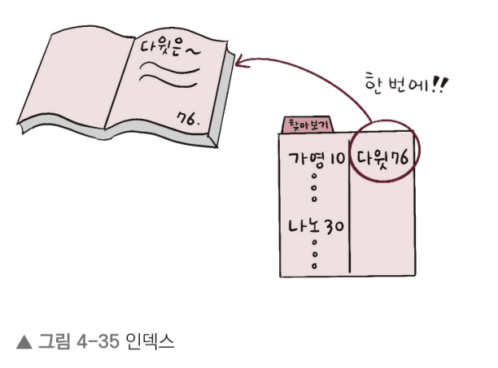
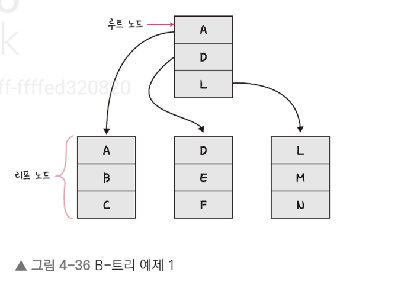
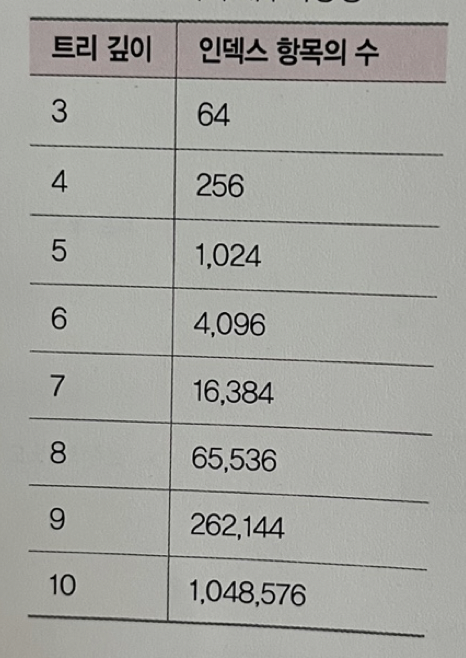
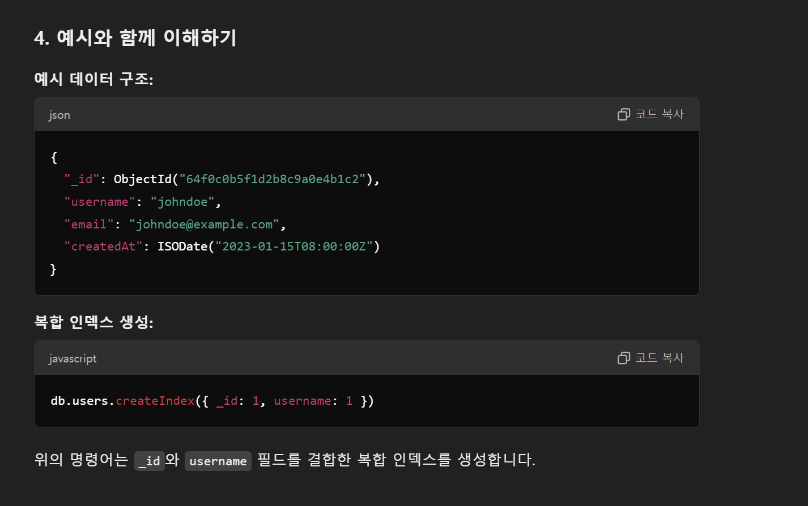
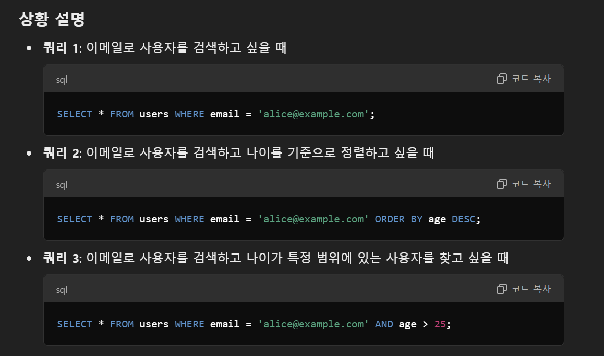

# 데이터베이스

## 인덱스

### 인덱스의 필요성

- 인덱스는 데이터를 빠르게 찾을 수 있는 하나의 장치
- 예를 들어 책의 마지막 장에 있는 찾아보기를 생각하면 된다..



- 책의 본문이 있고 그 본문 안에 내가 찾고자 하는 '항목'을 찾아보기를 통해 빠르게 찾을 수 있다
- 이와 마찬가지로 인덱스를 설정하면 테이블 안에 내가 찾고자 하는 데이터를 빠르게 찾을 수 있다 

### B-트리

- 인덱스는 보통 B-트리라는 자료 구조로 이루어져 있다
- 이는 루트 노드, 리프 노드, 그리고 루트 노르와 리프 노드 사이에 있는 브랜치 노드로 나뉜다..
- 먼저 루트 노드와 리프 노드를 기반으로 설명하면 다음과 같다 



- 예를 들어 E를 찾는다고 하면..
    - 전체 테이블을 탐색하는 것이 아니라 E가 있을 법한 리프 노드로 들어가서 E를 탐색하면 쉽게 찾을 수 있다
    - 이 자료 구조 없이 E를 탐색하고자 하면 A, B, C, D, E 다섯 번을 탐색해야 하지만, 이렇게 노드들로 나누면 두 번만에 리프 노드에서 찾을 수 있다 

- 인덱스가 효율적인 이유와 대수확장성
    1. 인덱스가 효율적인 이뉴는 효율적인 단계를 거쳐 모든 요소에 접근할 수 있는 균형 잡힌 트리 구조와 트리 깊이의 대수확장성 때문입니다
    2. 대수확장성이란 트리 깊이가 리프 노드 수에 비해 매우 느리게 성장하는 것을 의미합니다
    3. 기본적으로 인덱스가 한 깊이씩 증가할 때마다 최대 인덱스 항목의 수는 4배씩 증가합니다
    4. 트리 깊이는 10개까리로 100만개의 레코드를 검색할 수 있다는 의미를 가진다..

    


### 인덱스 만드는 방법

- 인덱스를 만드는 방법은 데이터베이스마다 다르며 MySQL과 MongoDB를 기준으로 설명한다

1. MySQL

- 클러스터형 인덱스와 세컨더리 인덱스가 있으며, 클러스터형 인덱스는 테이블당 하나를 설정할 수 있다
- primary key 옵선으로 기본키로 만들면 클러스터형 인덱스를 생성할 수 있고, 기본키로 만들지 않고 unique not null 옵션을 붙이면 클러스터형 인덱스로 만들 수 있다
- create index... 명령어를 기반으로 만들면 세컨더리 인덱스를 만들 수 있다
- 하나의 인덱스만 생성할 것이라면 클러스터형 인덱스를 만드는 것이 세컨더리 인덱스를 만드는 것보다 성능이 좋다
- 세컨더리 인덱스는 보조 인덱스로 여러 개의 필드 값을 기반으로 쿼리를 많이 보낼 때 생성해야 하는 인덱스이다
    - 예를 들어 age라는 하나의 필드만으로 쿼리를 보낸다면 클러스터형 인덱스만 필요하지만
    - age, name, email등 다양한 필드를 기반으로 쿼리를 보낼 때는 세컨더리 인덱스를 사용해야 한다

2. MongoDB

- MongoDB의 경우 도큐먼트를 만들면 자동으로 ObjectID가 형성되며, 해당 키가 기본키로 설정된다
- 그리고 세컨더리키도 부가적으로 설정해서 기본키와 세컨더리키를 같이 쓰는 복합 인덱스를 설정할 수 있다(데이터 조회 성능을 향상시키는 데 매우 유용)




### 인덱스 최적화 기법

- 인덱스 최적화 기법은 데이터베이스마다 조금씩 자르지만 기본적인 골조는 똑같기 때문에 특정 데이터베이스를 기준으로 설명해도 무방합니다
- 이 책에서는 MongoDB를 기반으로 인덱스 최적화 기법을 설명하며, 이를 기반으로 다른 데이터베이스에 웬만큼 적용할 수 잇다

1. 인덱스는 비용이다

- 먼저 인덱스는 두 번 탐색하도록 강요한다
- 인덱스 리스트, 그 다음 컬렉션 순으로 탐색하기 때문에, 관련 읽기 비용이 들게 된다
- 또한, 컬렉션이 수정되었을 때 인덱스도 수정되어야 한다. 
- 마치 책의 본문이 수정되었을 때 목차나 찾아보기도 수정해야 하듯이..
- 이때 B-트리의 높이를 균형 있게 조절하는 비용도 들고, 데이터를 효율적으로 조회할 수 있도록 분산시키는 비용도 들게 된다
- 그렇기 때문에 쿼리에 있는 필드에 인덱스를 무작정 다 설정하는 것이 답이 아니다
- 또한, 컬렉션에서 가져와야 하는 양이 많을수록 인덱스를 사용하는 것은 비효율적이다

2. 항상 테스팅하라

- 인덱스 최적화 기법은 서비스 특징에 따라 달라진다
- 서비스에서 사용하는 객체의 깊이, 테이블의 양 등이 다르기 때문에 항상 테스팅하는 것이 중요하다
- explain() 함수를 통해 인덱스를 만들고 쿼리를 보낸 이후에 테스팅을 하며 걸리는 시간을 최소화해야 한다
- 참고로 MySQL에서는 다음과 같은 코드로 테스팅을 수행한다

``` MYSQL
EXPLAIN
SELECT * FROM t1
JOIN t2 ON t1.c1 = t2.c1
```

3. 복합 인덱스는 같음, 정렬, 다중 값, 카디널리티 순이다

- 보통 여러 필드를 기반으로 조회를 할 때 보학 인덱스를 생성하는데, 이 인덱스를 생성할 때는 순서가 있고 생성 순서에 따라 인덱스 성능이 달라진다(잘못된 순서로 인덱스를 생성하면 쿼리 성능이 떨어질 수 있습니다)
- 같음, 정렬, 다중 값, 카디널리티 순으로 생성해야 한다

    1. 어떠한 값을 같음을 비교하는 ==이나 equal이라는 쿼리가 있다면 제일 먼저 인덱스로 설정합니다
    2. 정렬에 쓰는 필드라면 그다음 인덱스로 설정합니다
    3. 다중 값을 출력해야 하는 필드, 즉 쿼리 자체가 >이거나 <등 많은 값을 출력해야 하는 쿼리에 쓰는 필드라면 나중에 인덱스를 설정합니다
    4. 유니크한 값의 정도를 카디널리티라고 합니다. 이 카디널리티가 높은 순서를 기반으로 인덱스를 생성해야 합니다. 예를 들어 age와 email이 있다고 했을 때 어떤 것이 더 높죠? 당연히 email입니다. 즉 email이라는 필드에 대한 인덱스를 먼저 생성해야 하는 것이다!!!( 예를 들어, email을 먼저 배치하면 특정 이메일을 가진 사용자만 빠르게 찾아낼 수 있으며, 그 후에 age로 추가적인 필터링이나 정렬을 수행할 수 있습니다.)

    ``` md
    인덱스 필드 순서의 기준

    1. 같음 (Equality) - = 또는 == 연산자
    설명: 쿼리에서 특정 필드의 값이 정확히 일치하는 경우를 말합니다.
    예시: WHERE email = 'alice@example.com'
    인덱스 순서: 가장 먼저 배치합니다.
    이유: = 연산자는 가장 제한적이어서 검색 범위를 크게 줄일 수 있기 때문에 인덱스의 첫 번째 필드로 설정하면 효율적입니다.

    2. 정렬 (Sorting) - ORDER BY 절
    설명: 쿼리 결과를 특정 필드의 순서대로 정렬할 때 사용됩니다.
    예시: ORDER BY age DESC
    인덱스 순서: 두 번째로 배치합니다.
    이유: 인덱스가 정렬된 상태로 데이터를 저장하기 때문에 정렬 작업을 빠르게 수행할 수 있습니다.

    3. 다중 값 (Range) - >, <, BETWEEN 연산자
    설명: 특정 범위 내의 값을 검색할 때 사용됩니다.
    예시: WHERE age > 25
    인덱스 순서: 세 번째로 배치합니다.
    이유: 범위 검색은 인덱스의 일부만을 사용할 수 있기 때문에, 이 필드를 인덱스의 마지막에 배치하여 다른 필드의 효율성을 최대화합니다.

    4. 카디널리티 (Cardinality) - 고유도
    설명: 필드의 고유한 값의 개수를 의미합니다. 카디널리티가 높을수록(즉, 고유한 값이 많을수록) 인덱스의 효율이 높아집니다.
    예시: email은 각 사용자마다 고유한 값이지만, age는 여러 사용자가 같은 값을 가질 수 있습니다.
    인덱스 순서: 마지막에 배치합니다.
    이유: 카디널리티가 높은 필드는 데이터 검색 시 더 많은 정보를 제공하므로, 인덱스의 마지막에 배치하여 기존의 필드들과 함께 최적의 성능을 발휘할 수 있습니다.

    ```

    