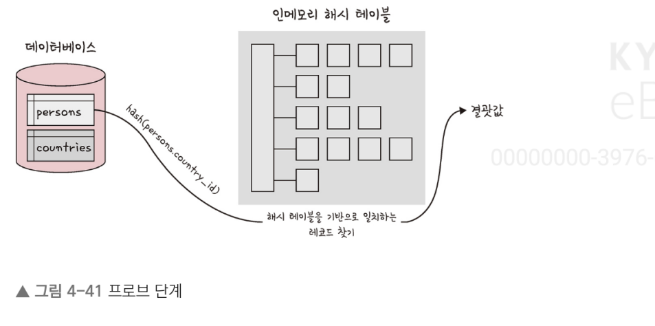

# 데이터베이스

## 조인의 원리

### 중첩 루프 조인

- 중첩 루프 조인은 중첩 for 문과 같은 원리로 조건에 맞는 조인을 하는 방법
- 랜덤 접근에 대한 비용이 많이 증가하므로 대용량의 테이블에서는 사용하지 않는다
- 예를 들어 "t1, t2 테이블을 조인한다." 라고 햇을 때 첫 번째 테이블에서 행을 한 번에 하나씩 읽고 그 다음 테이블에서도 행을 하나씩 읽어 조건에 맞는 레코드를 찾아 결괏값을 반환

``` sql
for each row in t1 matching reference key {
    for each row in t2 matching regerence key {
        if row satisfies join conditions, send to client
    }
}
```

### 정렬 병합 조인

- 정렬 병합 조인이란 각각의 테입르을 조인할 필드 기준으로 정렬하고 정렬이 끝난 이후에 조인 작업을 수행하는 조인
- 조인할 때 쓸 적절한 인덱스가 없고 대용량의 테이블들을 조인하고 조인 조건으로 <, >등 범위 비교 연산자가 있을 때 사요ㅕㅇ

### 해시 조인

- 해시 조인은 해시 테이블을 기반으로 조인하는 방법
- 두 개의 테이블을 조인한다고 했을 때 하나의 테이블이 메모리에 온전히 들어간다면 보통 중첩 루프 조인보다 더 효율적이다
- 메모리에 올릴 수 없을 정도로 크다면 디스크를 사요하는 비용이 발생한다
- MySQL의 경우 MySQL8.0.18 릴리스와 함께 이 기능을 사용할 수 있게 되었으며 이를 기반으로 해서 조인의 과정을 살펴봄
- MySQL의 해시 조인 단계는 빌드 단계, 프로브 단계로 나뉜다

1. 빌드 단계

- 입력 테이블 중 하나를 기반으로 메모리 내 해시 테이블을 빌드하는 단계
- 예를 들어 persons와 countries라는 테이블을 조인한다고 했을 때 둘 중 바이트가 더 작은 테이블을 기반으로 해서 테이블을 빌드한다
- 또한, 조인에 사용되는 필드가 해시 테이블의 키로 사용된다
- countries.country_id가 키로 사용되는 것을 볼 수 있다

2. 프로브 단계

- 프로브 단꼐 동안 레코드 읽기를 시작하며, 각 레코드에서 persons.country_id에 일치하는 레코드를 찾아서 결괏값으로 반환한다
- 이를 통해 각 테이블은 한 번씩만 읽게 되어 중첩해서 두 개의 테이블을 읽는 중첩 루프 조인보다 보통은 성능이 더 좋다

