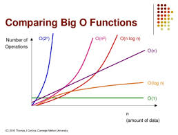
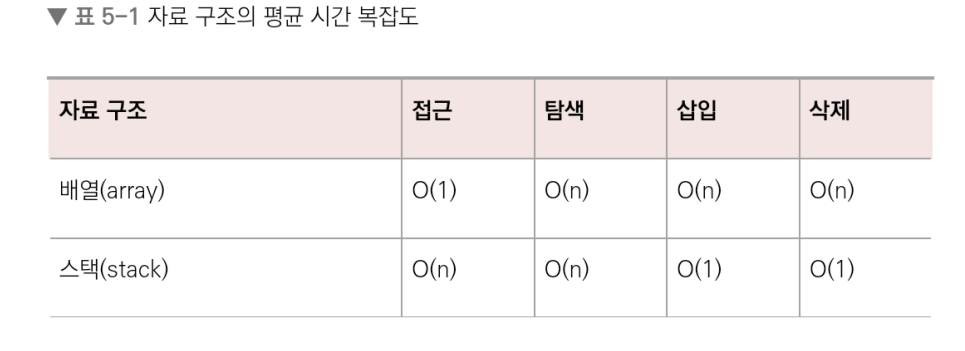
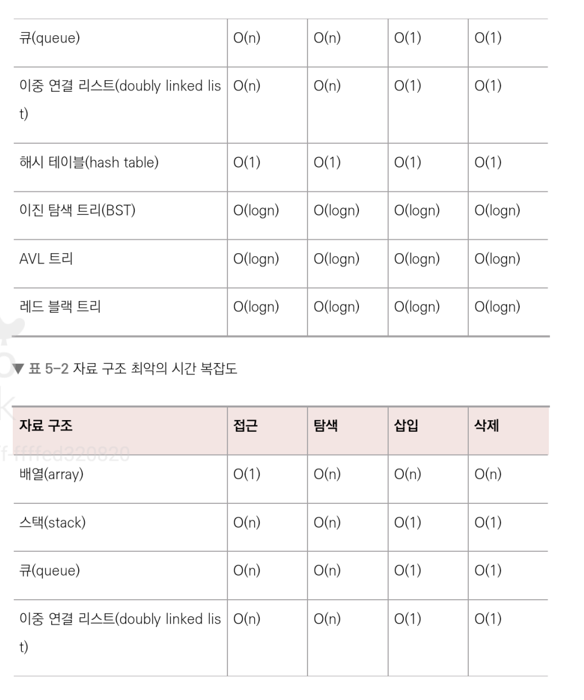
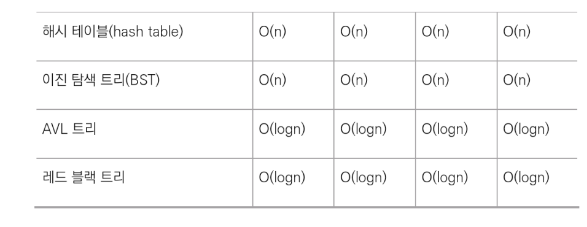

# 자료 구조

## 복잡도 

- 복잡도는 시간 복잡도와 공간 복잡도로 나뉜다..

### 시간 복잡도

1. C++의 기본

``` C
#include <bitts/stdc++.h>   // --- (1)
using namespace std;        // --- (2)
string a;                   // --- (3)
int main()
{
    cin >> a;               // --- (4)
    cout << a << "\n";      // --- (5)
    return 0;               // --- (6)
}

1. 헤더 파일입이다. STL 라이브러리를 import 됩니다. 이중 biy/stdc++.h는 모든 표준 라이브러리가 포함된 헤더입니다
2. std라는 네임스페이스를 사용한다는 뜻 cin이나 cout등을 사용할 때 원래는 std::cin처럼 네임스페이스를 달아서 호출해야 하는데, 이를 기준으로 설정한더는 뜻이다!! 참고로 네임스페이스는 같은 클래스 이름 구별, 모듈화에 쓰이는 이름을 말한다
3. 문자열을 선언했다. <타입> <변수명> 이렇게 선언한다. string이라는 타입을 가진 a라는 변수를 정의했다. 예를 들어 string a = "큰돌"이라고 해봅시다. 이때 a를 lvalue라고 하며 큰돌을 rvalue라고 합니다. lvalue는 추후 다시 사용될 수 있는 변수이며, rvalue는 한 번 쓰고 다시 사용되지 않는 변수를 말합니다
4. 입력입니다. 대표적으로 cin, scanf가 있습니다
5. 출력입니다. 대표적으로 cout와 printf가 있습니다.
6. return 0입니다. 프로세스가 정상적으로 마무리됨을 뜻합니다
```


- 이렇게 만들고 실행시킨 이후 wow라고 입력하면 wow가 출력된다
- C++은 main 함수를 중심으로 돌아가므로 main 함수 하나를 무조건 만들어야 한다
- 이후 컴파일이 시작되면 전역변수 초기화, 라이브러리 import 등의 작업이 일어나고, main 함수에 얽혀 있는 함수들이 작동된다
- 그리고 나서 main 함수가 0을 리턴하며 프로세스가 종료된다


2. 빅오 표기법

- 시간 복잡도란 '문제를 해결하는 데 걸리는 시간과 입력의 함수 관계'를 가리킨다
- 어떠한 알고리즘의 로직이 '얼마나 오랜 시간'이 걸리는지를 나타내는 데 쓰이며, 보통 빅오 표기법으로 나타낸다
- 예를 들어 '입력 크기 n'의 모든 입력에 대한 알고리즘에 필요한 시간이 10n의 제곱 + n이라고 하면 다음과 같은 코드를 상상할 수 잇다

``` C
for (int i = 0; i < 10; i+=) {
    for (int j = 0; j < n; j++) {
        for (int k = 0; k < n; k++) {
            if (true) cout << k << '\n';
        }
    }
}
for (int i = 0; i < n; i++) {
    if (true) cout << i << '\n';
}
```

- 빅오 표기법이란 입력 범위를 n을 기준으로 해서 로직어 몇 번 반복되는지 나타내는 것인데, 앞서 말한 코드의 시간 복잡도를 빅오 표기법으로 나타내면 O(n의 제곱)이 된다
- 가장 영향을 많이 끼치는 항의 상수 인자를 빼고 나머지 항을 없앤 것이다
- 다른 항들이 신경 쓰일 수도 있지만 증가 속도를 고려한다면 그렇지는 않다
- 입력 크기가 커질수록 연산량이 가장 많이 커지는 항은 n의 제곱항이고, 다른 것은 그에 비해 미미하기 때문에 이것만 신경 쓰면 된다는 이론!


3. 시간 복잡도의 존재 이유

- 효율적인 코드로 개선하는 데쓰이는 척도가 된다
- 버튼을 누르고 화면이 나타나는데 이 로직이 O(n의 제곱)의 시간 복잡도를 가지고 9초가 걸린다고 하면
- 이른 O(n의 제곱)의 시간 복잡도를 가지고 알고리즘으로 개선한다면 3초가 걸린다

4. 시간 복잡도의 속도 비교



- O(1)과 O(n)은 입력 크기가 커질수록 차이가 많이 나는 것을 볼 수 있다


### 공간 복잡도

- 공간 복잡도는 프로그램을 실행시켰을 때 필요로 하는 자원 공간의 양을 말한다
- 정적변수로 선언된 것 말고도 동적으로 재귀적인 함수로 인해 공간을 계속해서 필요로 할 경우도 포함한다

### 자료 구조에서의 시간 복잡도

 

 

 