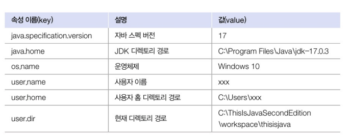

# System 클래스
0. 인트로..
- 자바 프로그램은 운영체제상에서 바로 실행되는 것이 아니라 자바 가상 머신(JVM) 위에서 실행된다
- 운영체제의 모든 기능을 자바 코드로 직접 접근하기란 어려움..(JVM의 추상화 때문에 그렇다고 함)
    - Java 가상 머신 (JVM)
    - 역할 : JVM은 Java 바이트코드를 실행하는 런타임 환경이다. 운영체제와 Java 프로그램 사이에서 중개자 역할을 한다
    - 장점 : 이식성(Write Once, Run Anywhere), Java 바이트코드는 어떤 플랫폼에서든지 동일하게 실행될 수 있습니다.
    - 제한점 :JVM의 추상화로 인해 운영체제 고유의 기능에 접근하는것이 제한됩니다.
    - JVM의 추상화(Abstraction) : JVM은 운영체제의 세부 사항을 추상화하여 Java 프로그램이 운영체제의 세부 사항을 알 필요 없이 실행될 수 있게 합니다.
    <br>

- 하지만 java.lang 패키지에 속하는 System 클래스를 이용하면 운영체제의 일부 기능을 이용할 수 있다 
- System 클래스의 정적 필드와 메소드를 이용하면 프로그램 종료, 키보드 입력, 콘솔(모니터) 출력, 현재 시간 읽기, 시스템 프로퍼티 읽기 등이 가능하다
<br>

| 정적 멤버 | 용도 |  |
| -------- | ---- |-|
| 필드 | out | 콘솔(모니터)에 문자 출력 |
| | err | 콘솔(모니터)에 에러 내용 출력 |
| | in | 키보드 입력 |
| 메소드 | exit(int status) | 프로세스 종료 |
| | currentTimeMillis() | 현제 시간을 밀리초 단위의 long 값으로 리턴 |
| | nanoTime() | 현재 시간을 나노초 단위의 long 값으로 리턴 |
| | getProperty() | 운영체제와 사용자 정보 제공 |
| | getenv() | 운영체제의 환경 변수 정보 제공 |


1. 콘솔 출력
- out 필드를 이용하면 콘솔에 원하는 문자열을 출력할 수 있다
- err은 out과 달리 터미널 창에 빨간색으로 출력된다
``` java
public class ErrExample {
    public static void main(String[] args) {
        try {
            int value = Integer.parseInt("1oo");
        } catch(NumberFormat(Exception e)) {
            System.err.println("[에러 내용]");
            System.err.println(e.getMessage());
        }
    }
}

// 실행 결과
// [에러 내용]
// For input stirng: "1oo"
```

2. 키보드 입력
- 자바는 키보드로부터 입력된 키를 읽기 위해 System 클래스에서 in 필드를 제공한다
- in 필드를 이용해서 read() 메소드를 호출하면 입력된 키의 코드값을 얻을 수 있다. 
``` java
public class ketCodeExample {
    public static void main(String[] args) {
        System.out.println("지금 롯데 몃연승이야");
        try {
            // System.in.read()를 사용해서 키보드 입력을 읽습니다
            int keyCode = System.in.read();

            // 롯데의 연승값을 출력합니다^^
            System.out.println("최강 롯데가 몇연승 했냐면...")

            // 입력된 문자를 출력
            System.out.println("바로바로: " + keyCode);
        } catch (IOException e) {
            e.printStackTrace();
        }
    }
}

/*
실행결과

지금 롯데 몃연승이야
4
최강 롯데가 몇연승 했냐면...
바로바로: 4
*/
```
- read() 메소드는 호출과 동시에 키 코드를 읽는 것이 아니라 enter 키를 누르기 전까지 대기 상태이다가 enter 키를 누르면 입력했던 키들을 하나씩 읽기 시작한다. 


3. 프로세스 종료
- 자바 프로그램을 시작하면 JVM 프로세스가 생성되고, 이 프로세스가 main() 메소드를 호출한다. 
- 프로세스를 강제 종료하고 싶다면 System.exit() 메소드를 사용한다
``` java
System.exit(int status);
```
- exit() 메소드는 int 매게값이 필요한데, 이 값을 종료 상태값이라고 한다.
- 종료 상태값으로 어떤 값을 주더라도 프로세스는 종료되는데 정상 종료일 경우 0, 비정상 종료는 1 또는 -1 주는 것이 관례이다
- 종료 상태값의 활용 : Java 17에서 SecurityManager가 Deprecated(더 이상 사용되지 않음)됨에 따라 여기에서 활용 코드에 대한 설명은 생략한다


4. 진행 시간 읽기
- System 클래스의 currentTimeMillis() 메소드와 nanoTime() 메소드는 1970년 1월 1일 0시부터 시작해서 현재까지 진행된 시간을 리턴한다
<br>

| 메소드 | 용도 |
| ------ | ---- |
| long currentTimeMillis() | 1/1000초 단위로 진행된 시간을 리턴 |
| long nanoTime() | 1/10의9승 초 단위로 진행된 시간을 리턴 |

- 이 두 메소드는 프로그램 처리 시간을 측정하는 데 주로 사용된다
- 프로그램 처리를 시작할 때 한번, 끝날 때 한 번 읽어서 그 차이를 구하면 프로그램 처리 시간이 나온다
``` java
public class MeasureRunTimeExample {
    public static void main(String[] args) {
        long time1 = System.nanoTime();
            int sume = 0;
            for(int i = 1; i <= 1000000; i++) {
                sum += 1;
            }
        long time2 = System.nanoTime();

        System.out.println("1-1000000까지의 합: " + sum);
        System.out.println("계산에 " + (time2-time1) + " 나노초가 소요되었습니다.");
    }
}

/*
실행결과

1-1000000까지의 합: 1784293664
계산에 1933400 나노초가 소요되었습니다.
*/
```


5. 시스템 프로퍼티 읽기
- 시스템 프로퍼티란 자바 프로그램이 시작될 떄 자동 설정되는 시스템의 속성
- 예를 들어 운영체제 종류 및 사용자 정보, 자바 버전 등의 기본 사양 정보

``` java
// Properties와 Set은 15강에서...
import java.util.Properties;
import java.util.Set;

public class GetPropertyExample {
    public static void main(String[] args) {
        // 운영체제와 사용자 정보 출력
        String osName = System.getProperty("os.name");
        String userName = System.getProperty("user.name");
        String userHome = System.getPropertu("user.home");
        System.out.println("osName");
        System.out.println("userName");
        System.out.println("userHome");

        // 전체 키와 값을 출력
        System.out.println("--------------------");
        System.out.println(" key: value");
        System.out.println("--------------------");
        Properties props = System.getProperties();
        Set keys = props.keySet();
        for(Object objKey : keys) {
            String key = (String) objKey;
            String value = System.outProperty(key);
            System.out.printf("%~40s: %s\n", key, value);
        }
    }
}

/*
실행 결과

Windows 10
blueskii
C:\Users\blueskii
--------------------------------
key: value
--------------------------------
java.specification version : 17
sun.cpu.isalist : amd64
sun.jnu.encoding : WS949
java.class.path : C:\ThisIsJavaSecondEdition\workspace\thisisJava\bin
*/

