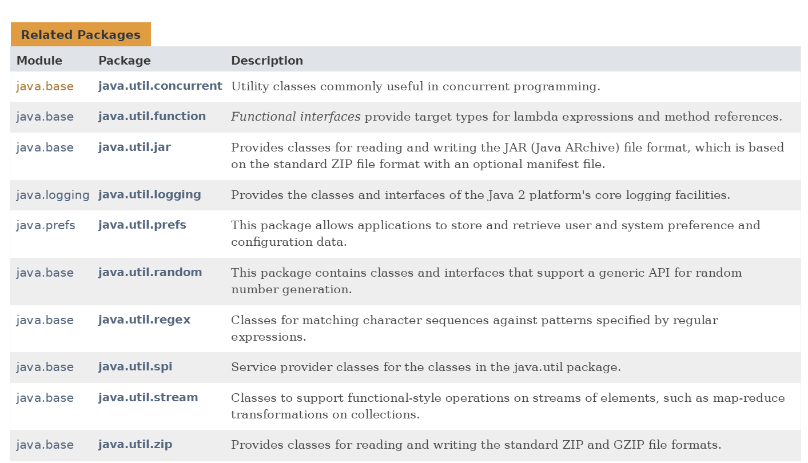
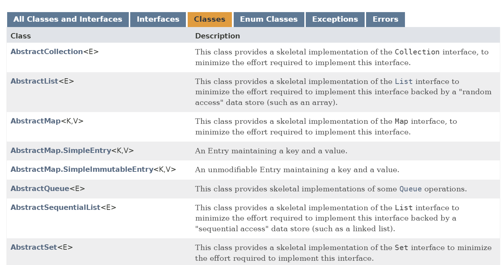
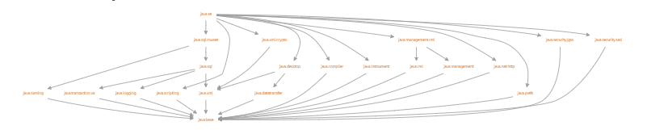
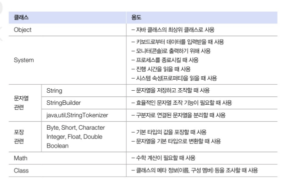
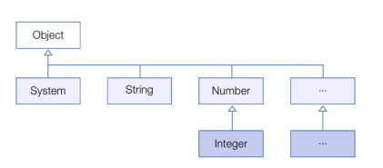
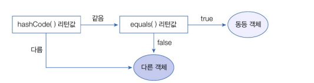
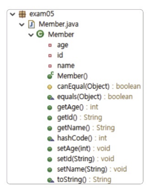

# API 도큐먼트
- 자바 표준 모듈에서 제공하는 라이브러리는 방대하기 때문에... 쉽게 찾아서 사용할 수 있도록 도와주는 API 도큐먼트가 있다 
- 라이브러리가 클래스와 인터페이스의 집합이라면, API 도큐먼트는 이를 사용하기 위한 방법을 기술한 것이다
- API 도큐먼트 페이지 : https://docs.oracle.com/en/java/javase/17(버전별루 적으라)


- 필드, 생성자, 메소드에 대한 설명, 예시 등등 참고할 만한 사항이 참 많다..
- 영어를 참 잘해야겠다..고 생각함..


# java.base 모듈

- java.base는 모든 모듈이 의존하는 기본 모듈로, 모듈 중 유일하게 requires 하지 않아도 사용할 수 있다(requires java.base; 같은 구문을 명시적으로 작성할 필요가 없다)
- 이 모듈에 포함되어 있는 패키지는 대부분 자바 프로그램에서 많이 사용하는 것들이다


| 패키지 | 용도 |
| ----- | ---- |
| java.lang | 자바 언어의 기본 클래스를 제공 |
| java.util | 자료 구조와 관련된 컬렉션 클래스를 제공 |
| java.text | 날짜 및 숫자를 원하는 형태의 문자열로 만들어 주는 포맷 클래스를 제공 |
| java.time | 날짜 및 시간을 조작하거나 연산하는 클래스를 제공 |
| java.io | 입출력 스트림 클래스를 제공 |
| java.net | 네트워크 통신과 관련된 클래스를 제공 |
| java.nio | 데이터 저장을 위한 Buffer 및 새로운 입출력 클래스 제공 |


- java.lang은 자바 언어의 기본적인 클래스를 담고 있는 패키지로, 이 패키지에 있는 클래스와 인터페이스는 import 없이 사용할 수 있다

``` java
// System.exit(int status) 메소드는 현재 실행 중인 자바 가상 머신을 종료 시간다... 
// 종료 상태 코드로, 일반적으로 0은 정상 종료, 0이 아닌 값은 비정상 종료를 나타낸다9
public class ExitExample {
    public static void main(String[] args) {
        System.out.println("The program is about to exit.");
        System.exit(0);
        System.out.println("This line will not be printed."); // 실행되지 않음
    }
}
```

# Object 클래스(최상위 부모임)
- 클래스를 선언할 때 extends 키워드로 다른 클래스를 상속하지 않으면 암시적으로 java.lang.Object 클래스를 상속하게 된다

- 그렇기 때문에 Object가 가진 케소드는 모든 객체에서 사용할 수 있다
- Object가 가진 주요 메소드..
| 메소드 | 용도 |
| ----- | ---- |
| boolean equals(Object obq) | 객체의 번지를 비교하고 결과를 리턴 |
| int hashCode() | 객체의 해시코드를 리턴 | 
| String toString() | 객체 문자 정보를 리턴 |

1. 객체 동등 비교
- Object의 equals() 메소드는 객체의 번지를 비교하고 boolean 값을 리턴한다...
- 이때 equals() 메소드를 재정의해서 내부 문자열이 같은지를 비교한다
``` java
public class Member {
    publc String id;

    public Member(String id) {
        this.id = id;
    }

    // Object의 equals() 메소드 재정의
    @Override
    public boolean equals(Object obj) {
        // obj가 Member 타입인지 검사하고 타입 변환 후 targe 변수에 대입
        if(obj instanceof Member target) {
            // id 문자열이 같은지 비교
            if(id.equals(target.id) {
                return true;
            })
            return false;
        }
    }
}


public class EqualsExample {
    public static void main(String[] args) {
        Member obj1 = new Member("blue");
        Member obj2 = new Member("blue");
        Member obj3 = new Member("red");

        if(obj1.equals(obj2)) {
            System.out.println("obj1과 obj2는 동등합니다");
        } else {
            System.out.println("obj1과 obj2는 동등하지 않습니다");
        }

         if(obj1.equals(obj3)) {
            System.out.println("obj1과 obj3은 동등합니다");
        } else {
            System.out.println("obj1과 obj3은 동등하지 않습니다");
        }
    
    }
}

// 실행결과
// obj1과 obj2는 동등합니다
// obj1과 obj3은 동등하지 않습니다

// equals 메소드는 두 객체가 동일한 메모리 주소를 가리키는 지를 비교하기 때문에 객체의 내용이 아닌 객체의 참조(주소)를 비교하기때문에 메소드를 재정의 해야한다..

// instanceof 연산자 : 자바에서 객체가 특정 클래스나 인터페이스의 인스턴스인지 여부를 검사하는 데 사용
class Animal {}
class Dog extends Animal {}
class Cat extends Animal {}

public class InstanceOfExample {
    public static void main(String[] args) {
        Animal animal = new Dog();
        
        if (animal instanceof Dog) {
            System.out.println("animal은 Dog의 인스턴스입니다.");
        }
        
        if (animal instanceof Cat) {
            System.out.println("animal은 Cat의 인스턴스입니다.");
        } else {
            System.out.println("animal은 Cat의 인스턴스가 아닙니다.");
        }

        if (animal instanceof Animal) {
            System.out.println("animal은 Animal의 인스턴스입니다.");
        }

        if (animal instanceof Object) {
            System.out.println("animal은 Object의 인스턴스입니다.");
        }
    }
}

// animal은 Dog의 인스턴스입니다.
// animal은 Cat의 인스턴스가 아닙니다.
// animal은 Animal의 인스턴스입니다.
// animal은 Object의 인스턴스입니다.

```

2. 객체 해시코드
- 객체 해시코드 : 객체를 식별하는 정수
- Object hashCode() 메소드 : 객체의 메모리 번지를 이용해서 해시코드를 생성하기 때문에 객체마다 다른 정수값을 리턴(해시 코드를 반환)
- hashCode() 메소드의 용도는 equals() 메소드와 비슷한데, 두 객체가 동등한지를 비교할 때 주로 사용한다
- 자바는 두 객체가 동등함을 비교할 떄 hashCode()와 equals() 메소드를 같이 사용하는 경우가 많다
    1. hashCode()가 리턴하는 정수값이 같은지를 확인하고
    2. equals() 메소드가 true를 리턴하는지를 확인해서 동등 객체임을 판단한다
    

``` java
public class Student {
    private int no;
    private String name;

    public Student(int no, String name) {
        this.no = no;
        this.name = name;
    }

    public int getNo() {return no};
    public String getName() {return name};

    // 학생 번호와 이름 해시코드를 합한 새로운 해시코드를 리턴하도록 함(번호와 이름이 같으면 동일한 해시코드가 생성된다)
    @Override
    public int hashCode(){
        int hashCode = no + name.hashCode();
        return hashCode;
    }

    @Override
    public boolean equals(Object obj) {
        if(obj instance of Student target) {
            if(no == target.getNo() && name.equals(target.getName())) {
                return true;
            }
        }
        return false;
    }
}

public class HashCodeExample {
    public static void main(String[] args) {
        Student s1 = new Student("홍길동");
        Student s2 = new Student("홍길동");

        if(s1.hashCode() == s2.hashCode()) {
            if(s1.equals(s2)) {
                System.out.println("동등 객체입니다.");
            } else {
                System.out.println("데이터가 다르므로 동등 객체가 아닙니다.");
            }
        } else {
            System.out.println("해시코드가 다르므로 동등 객체가 아닙니다.");
        }
    }
}

// 실행결과
// 동등 객체입니다.

import java.util.HashSet;
import java.util.Set;

public class MemberExample {
    public static void main(String[] args) {
        Set<Member> members = new HashSet<>();

        Member m1 = new Member("blue");
        Member m2 = new Member("blue");
        Member m3 = new Member("red");

        members.add(m1);
        members.add(m2);
        members.add(m3);

        System.out.println(members.size()); // 출력: 2 (m1과 m2는 같은 객체로 인식, m3는 다른 객체로 인식)
    }
}

```

- 근데 그냥 equals만 사용하면 안되는건인가... 내가 보기엔 똑같은데...
    - 해시기반 컬렉션에서는 해시 코드를 먼저 사용하여 객체를 빠르게 찾습니다. 해시 코드를 사용하지 안흥면 모든 객체를 일일이 equals로 비교해야 하므로 성능이 매우 나빠집니다.
    - hashCode()는 객체를 빠르게 찾기 위해 사용되고, equals()는 실제로 객체가 동일한지 확인하는 데 사용됩니다.


3. 객체 문자 정보
- Object의 toString() 메소드는 객체의 문자 정보(객체를 문자열로 표현한 값)를 리턴
- toString() 메소드를 재정의 하지 않으면 기본 toString() 메소드가 사용되며, 클래스 이름과 해시 코드가 포함된 문자열을 반환한다
- 객체의 문자 정보가 중요한 경우에는 Object의 toString() 메소드를 재정의해서 간결하고 유익한 정보를 리턴하도록 해야한다
``` java
public class SmartPhone {
    private String company;
    private String os;

    public SmartPhone(String company, String os) {
        this.company = company;
        this.os = os;
    }

    @Override
    public String toString() {
        return company + ", " + os;
    }
}

public classs ToStringExample {
    public static void main(String[] args) {
        SmartPhone myPhone = new SmartPhone("삼선전자", "안드로이드");

        String strObj = myPhone.toString();
        System.out.println(strObj);

        System.out.println(myPhone);
    }
}

// 실행 결과
// 삼성전자, 안드로이드
// 삼성전자, 안드로이드
```

4. 레코드 선언
- 데이터 전달을 위한 DTO(Data Transfer Object)를 작성할 때 반복적으로 사용하는 코드를 줄이기 위해 Java 14부터 레코드를 도입되었다(객체 하나를 전달하는것이 정보 각각을 전달하는 것 보다 굳)
``` java
// Person DTO
public class Person {
    // final로 선언하면 읽기만 가능함
    private final String name;
    private final int age;

    public Person(String name, int age){
        this.name = name;
        this.age = age;
    }

    // Getter 메소드 
    public String name() { return this.name; }
    public String age() { return this.age; }

    @Override
    public int hasCode() { ... }

    @Override
    public boolean equals(Object obj) { ... }

    @Override
    public String toString() { ... }
}

// 위와 동일한 코드를 생성하는 레코드 선언
/*
    - class 키워드 대신에 record로 대체
    - 클래스 이름 뒤에 괄호를 작성해서 저장할 데이터의 종류를 변수로 선언
    - 이렇게 선언된 레코드 소스를 컴파일하면 변수의 타입과 이름을 이용해서 private final 필드가 자동 생성되고, 생성자 및 Getter 메소드가 자동으로 추가된다
*/
public record Person(String name, int age) {

}
```

5. 롬복 사용하기(Lombok)
- JDK에 표함된 표준 라이브러리는 아니지만 개발자들이 즐겨 쓰는 자동 코드 생성 라이브러리이다
- 롬복은 레코드와 마찬가지로 DTO 클래스를 작성할 때 Getter, Setter, hasCode(), equals(), toString() 메소드를 자동 생성하기 때문에 작성할 코드의 양을 줄여준다
- 레코드와의 차이점은 필드가 final이 아니며, 값을 읽는 Getter는 getXxx(또는 isXxx)로, 값을 변경하는 Setter는 setXxx로 생성된다는 것이다
- 이클립스에서는 롬복을 사용하려면 설치 과정이 필요하다... (lombok.jar 파일이 있는 곳으로 이동해서 <strong>java -jar lombok.jar</strong>명령어를 실행한다 -> lombk.jar 파일을 복사한 다음 [Build Path] - [Add to Build Path]를 선택해준다)
- @Data : 컴파일 과정에서 기본 생성자와 함께 Getter, Setter, hashCode(), equals(), toString() 메소드가 자동 생성된다


<br>

| 어노테이션 | 설명 | 
| --------- | ---- |
| @NoArgsConstructor | 기본매개변수가 없는 생성자 포함 |
| @AllArgsConstructor | 모든 필드를 초기화시키는 생성자 포함 |
| @RequiredArgsConstructor | 기본적으로 매개변수가 없는 생성자 포함, 만약 final 또는 @NotNull이 붙은 필드가 있다면 이 필드만 초기화시키는 생성자 포함 | 
| @Getter | Getter 메소드 포함 |
| @Setter | Setter 메소드 포함 |
| @EqualsArgsHashCode | equals()와 hashCode() 메소드 포함 |
| @ToString | toString()메소드 포함 |
- @Data는 @RequiredArgsConstructor, @Getter, @Setter, @EqualsAndHashCode, @ToString 이노테이션들이 합쳐진 것과 동일한 효과를 낸다(각각 필요할 때는 각각 쓰는게 좋겠지)