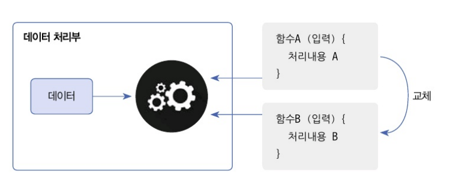

# 람다식

## 람다식이란?

1. 설명..

- 함수형 프로그래밍에서 사용하는 식으로, 함수를 정의하고 이 함수를 데이터 처리부로 보내 데이터를 처리하는 기법
<br>



- 람다식의 기본구조
``` java
{ 매개변수, ... } -> { 처리 내용 }
{x, y} -> { return x + y; }
```

2. 함수형 인터페이스

- 함수형 인터페이스는 하나의 추상 메소드를 가지는 인터페이스
- 밑의 인터페이스를 사용하여 람다식을 정의하고 사용할 수 있다

``` java
@FunctionalIntergace
public interface Calculate {
    void calculate(int x, int y); // 추상 메소드
}
```

3. 익명클래스와 람다식 비교

``` java

// 익명 클래스
Calculable calc = new Calculable() {
    @Override
    public void calculate(int x, int y) {
        System.out.println(x + y);       
    }
}

// 람다식
Calculable calc = (x, y) -> System.out.println(x + y);
```

- 익명 클래스 : 복잡한 로직을 구현하거나 여러 메소드를 가진 클래스가 필요할 때 유용
- 람다식 : 간단한 구현과 함수형 프로그래밍 스타일을 사용할 때 유리(특히, 단일 추상 메소드만 가진 인터페이스를 구현할 때 매우 유용)


## 매개변수가 없는 람다식

1. 매개변수가 없는 람다식의 형태..

``` java

// 1. 실행문이 여러 개일 경우..
() -> {
    수현 바보;
    수현 천재;
}

// 2. 실행문이 하나일 경우...(중괄호 생략 가능)
() -> 실행해; 
```

2. 버튼 클릭 이벤트 예제

``` java
// Butter 클래스
public class Button {
    @FunctionalInterface 
    public static interface clickListener {
        void onClick();
    }

    private ClickListener clickListener;

    public void setClickListener(ClickListener clickListener) {
        this.clickListener = clickListener;
    }

    public void click() {
        this.clickListener.onClick();
    }
}

// ButtonExample 클래스
public class ButtonExample {
    public static void main(String[] args) {
        // OK 버튼 객체 생성
        Button btnOk = new Button();
        btnOk.setClickListener(() -> {
            System.out.println("OK 버튼을 클릭했습니다.");
        });
        // OK 버튼 클릭하기
        btnOk.click();

        // Cancel 버튼 객체 생성
        Button btnCancel = new Button();
        btnCancel.setClickListener(() -> {
            System.out.println("Cancel 버튼을 클릭했습니다.");
        });
        // Cancel 버튼 클릭하기
        btnCancel.click();
    }
}
/*
OK 버튼을 클릭했습니다.
Cancel 버튼을 클릭했습니다.
*/
```