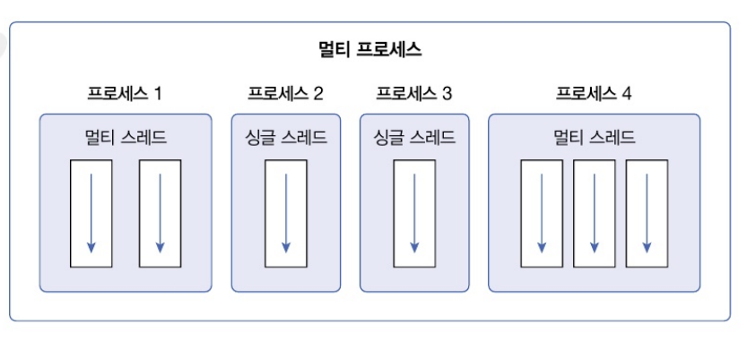
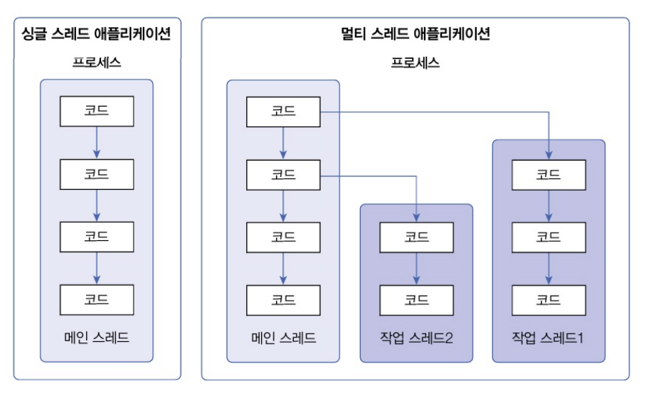
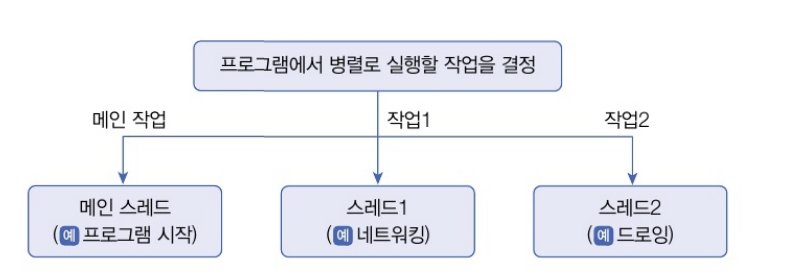

# 멀티 스레드 개념
- 운영체제는 실행 중인 프로그램을 프로세스로 관리한다
- 하나의 프로세스가 두 가지 이상의 작업을 처리할 수 있는 이뉴는 멀티 스레드가 있게 때문!! 멀티 스레드가 뭔디??
- 스레드(thread)는 코드의 실행 흐름(스레드가 두 개라면 두개의 코드 실행 흐름이 생긴다는거지)
- 멀티 프로세스가 프로그램 단위의 멀티 태스킹이라면 멀티 스레드는 프로그램 내부에서늬 멀티 태스킹이다!!
<br>


- 멀티 프로세스들은 서로 독립적이므로 하나의 프로세스에서 오류가 발생해도 다른 프로세스에게 영향을 미치지 않는다...
- 하지만 멀티 스레드는 프로세스 내부에서 생성되기 때문에 하나의 스레드가 예외를 발생시키면 프로세스가 종료되므로 다른 스레드에게 영향을 미침
- 간단히 예를 들면.. 워드와 엑셀을 동시에 사용하는 도중에 워드에 오류가 생겨 먹통이라도 엑셀은 여전히 사용 가능.. 근데 멀티 스레드로 동작하는 메신저는 파일을 전송하는 스레드에서 예외가 발생하면 메신저 프로세스 자체가 종료되기 때문에 채팅 스레드도 같이 종료된다...
- 그래서 멀티 스레드를 사용할 경우에는 예외 처리에 만전을 기해야 한다고 다 종료해버릴 수는 없자네
- ex : 데이터를 분할해서 병렬로 처리하는 곳에서 사용하기도 하고, 안드로이드 앱에서 네트워크 통신을 하기 위해 사용하기도 한다.. 또한 다수의 클라이언트 요청을 처리하는 서버를 개발할 때에도 사용된다


# 메인 스레드
- 모든 자바 프로그램은 메인 스레드(main thread)가 <strong>main() 메소드</strong>를 실행하면서 시작!
- 메인 스레드는 main() 메소드의 첫 코드부터 순차적으로 실행하고
- main() 메소드의 마지막 코드를 실행하거나 return 문을 만나면 실행을 종료 한다...
``` java
public static void main(String[] args) {
    String data = "망글공 팝업";
    if(...) {
    }
    while(...) {
    }
    System.out.println("가고싶다");
}
```
- 메인 스레드는 필요에 따라 추가 작업 스레드들을 만들어서 실행시킬 수 있다
<br>


- 위 멀티 스레드를 보면,,, 메인 스레드가 작업 스레드1을 생성하고 실행시킨 다음, 곧이어 작업 스레드2를 생성하고 실행시키는 것을 볼 수 있다
- 메인 스레드가 작업 스레드보다 먼저 종료되더라도 작업 스레드가 계속 실행 중이라면 프로세스는 종료되지 않는다!


# 작업 스레드 생성과 실행
- 멀티 스레드로 실행하는 프로그램을 개발하려면 먼저 개발하려면 먼저 몇개의 작업을 병렬로 실행할지 결정하고 각 작업별로 스레드를 생성해야 한다...
<br>


``` java
/* 그래서 병령이 뭔데 ^^;
- 컴퓨터 과학에서 동시에 여러 작업을 수행하는 것을 의미
- 병렬 처리는 여러 작업을 동시에 실행하여 프로그램의 실행 속도를 높이고 효율성을 극대화하는 방법
*/

// 병렬 처리 예시
public class Main {
    public static void main(String[] args) {
        // 스레드1: 네트워킹 작업을 수행
        Thread 스레드1 = new Thread(new Runnable() {
            @Override
            public void run() {
                System.out.println("스레드1: 네트워킹 작업 수행 중...");
                // 네트워킹 작업 코드
            }
        });

        // 스레드2: 드로잉 작업을 수행
        Thread 스레드2 = new Thread(new Runnable() {
            @Override
            public void run() {
                System.out.println("스레드2: 드로잉 작업 수행 중...");
                // 드로잉 작업 코드
            }
        });

        // 스레드 시작
        스레드1.start();
        스레드2.start();

        // 메인 스레드는 다른 작업을 수행
        System.out.println("메인 스레드: 다른 작업 수행 중...");
    }
}
// 이 코드에서 스레드 1과 스레드2가 각각 네트워크 작업과 드로잉 작업을 병렬로 수행하게 되는디... 메인 스레드는 이 두 스레드가 실행되는 동안 다른 작업을 수행할 수 있습니다.
```

- 자바 프로그램은 메인 스레드가 반드시 존재하기 때문에 메인 작업 이외에 추가적인 작업 수만큼 스레드를 생성하면 된다
- 자바는 작업 스레드도 객체로 관리하므로 클래스가 필요하다
- Thread 클래스로 직접 객체를 생성해도 되지만, 하위 클래스를 만들어서 생성할 수도 있다(2가지 방법이 있구만..)
    1. Thread 클래스와 Runnable 인터페이스로 직접 객체 생성...
    - Thread 객체 생성..
        - 'Thread' 클래스를 사용하여 새로운 스레드를 생성
        - 생성자의 매개변수로 'Runnable' 객체를 전달하여 스레드를 생성한다...
        ``` java
        Thread thread = new Thread(Runnable target);
        ```
        <br>

    - Runnable 인터페이스
        - 'Runnable'은 스레드가 실행할 작업을 정의하는 인터페이스
        - Runnable 인터페이스를 구현하고 'run' 메서드를 오버라이드하여 작업 내용을 정의
        ``` java
        class Task implements Runnable {
            @Override
            public void run() {
                // 스레드가 실행할 코드
            }
        }
        ```
        <br>
    
    - 스레드 실행
        - 'Runnable' 구현 객체를 생성한 후, 이른 'Thread' 생성자의 매개변수로 전달하여 스레드 객체를 생성
        - 스레드 객체의 'start' 메서드를 호출하여 스레드를 실행
        ``` java
        Runnable task = new Task();
        Thread thread = new Thread(task);
        thread.start();
        ```
        <br>
    
    - 익명 클래스 사용(클래스를 따로 정의하지 않음, 간단한 스레드 작업을 구현할 때 많이 사용)
        - 명시적인 'Runnable' 구현 클래스를 작성하지 않고, 'Thread' 생성자를 호출할 때 'Runnable' 익명 구현 객체를 매개변수로 사용하는 방법도 많이 사용된다..
        ``` java
        Thread thread = new Thread(new Runnable() {
            @Override
            public void run() {
                // 스레드가 실행할 코드
            }
        });
        thread.start();
        ```
        <br>

    - 예제 : 비프음과 프린팅 작업 병렬 처리
        ``` java
        // 순차적으로 작업하는 코드.. (병렬 아님)
        // 비프음을 모두 발생한 다음에 프린팅을 시작
        public class BeepPrintEx {
            public static void main (String[] args) {
                Toolkit toolkit = Toolkit.getDefaultToolkit();
                for(int i = 0; i < 5; i++) {
                    toolkit.beep();
                    try { Thread.sleep(500);} catch (Exception e) {}
                }
                for(int i = 0; i < 5; i++) {
                    System.out.println("딩딩딩딩딩");
                    try{ Thread.sleep(500);} catch (Exception e) {}
                }
            }
        }

        // 병렬 처리로 수행할 경우..
        // 0.5초 주기로 비프음을 발생시키면서 동시에 프린팅을 하는 경우.. 프린팅을 메인 스레드가 담당, 비프음을 작업 스레드가 담당하도록 코드 수정
        public class BeepPrintEx2 {
            public static void main(String[] args) {
                // 비프음을 발생시키는 작업 스레드 생성
                Thread thread = new Thread(new Runnable() {
                    @Override
                    public void run() {
                        Toolkit toolkit = Toolkit.getDefaultToolkit();
                        for(int i = 0; i < 5; i++) {
                            toolkit.beep();
                            try { Thread.sleep(500); } catch (Exception e) {}
                        }
                    }
                });

                // 작업 스레드 시작
                thread.start();

                // 적업 스레드는 프린팅 작업을 수행
                for(int i = 0; i < 5; i++) {
                    System.out.println("딩딩딩딩딩");
                    try { Thread.sleep(500); } catch(Exception e) {}
                }
            }
        }
        ```
        <br>

    2. Thread 자식 클래스로 생성
    - Thread 자식 클래스 생성
        - 'Thread' 클래스를 상속받아 새로운 스레드를 생성하는 방법
        - 'Thread' 클래스를 상속한 후 'run()' 메서드를 오버라이드하여 스레드가 실행할 코드를 작성
        ``` java
        public class WorkerThread extends Thread {
            @Override 
            public void run() {
                // 스레드가 실행할 코드
            }
        }

        // 스레드 객체 생성
        Thread thread = new WorkerThread();
        ```
        <br>
    
    - 스레드 실행
        - 생성된 'WorkerThread' 객체의 'start()' 메서드를 호출하여 스레드를 실행합니다..
        ``` java
        thread.start();
        ```
    
    - 작업 스레드 실행 순서
        - 'WorkerThread' 객체 생성 -> 'start()' 메서드 호출 -> 'run()' 메서드 실행
        - 그림에서 메인 스레드가 'WorkerThread' 객체를 생성하고 'start()' 메서드를 호출하면 'WorkerThread'의 run() 메서드가 실행되는 과정을 보여줍니다
    
    - 익명 클래스로 Thread 자식 객체 생성
        - 명시적인 자식 클래스를 정의하지 않고 익명 클래스로 'Thread' 자식 객체를 생성할 수도 있습니다
        ``` java
        Thread thread = new Thread() {
            @Override
            public void run() {
                // 스레드가 실행할 코드
            }
        }
        thread.start();
        ```
        <br>
    
    - 예제.. Thread 자식 객체로 비프음을 발생시키고 출력 작업 병렬 처리..
    ``` java
    public static BeepPrintEx3 {
        public static void main(String[] args) {
            // Thread 자식 객체 생성
            Thread thread = new Thread() {
                @Override
                public void run() {
                    Toolkit toolkit = Toolkit.getDefaultToolkit();
                    for(int i = 0; i < 5; i++) {
                        toolkit.beep();
                        try { Thread.sleep(500); } catch(Exception e) {}
                    }
                }
            };

            // 작업 스레드 시작
            thread.start();

            // 메인 스레드는 출력 작업을 수행
            for (int i = 0; i < 5; i++) {
                System.out.println("딩딩딩딩딩");
                try { Thread.sleep(500); } catch(Exception e) {}
            }
        }
    }

    // 뭘 사용하는게 좋을지 몰라서 gpt한테 물어봤습니다(각각 방법의 장단점, 메모리 & 부하)
    /*
    1. Thread 자식 클래스를 만드는 방법..
    장점
    간편함:
    Thread 클래스를 상속받으면, run() 메서드를 바로 오버라이드하여 구현할 수 있어 간단합니다.
    명확한 스레드 작업:
    스레드 클래스 내부에 스레드 작업 코드가 있어 코드의 가독성이 높습니다.

    단점
    상속의 한계:
    자바는 단일 상속만 지원하기 때문에, 이미 다른 클래스를 상속받고 있는 경우 이 방법을 사용할 수 없습니다.
    재사용성 부족:
    Runnable 인터페이스를 구현하는 방식보다 재사용성이 떨어집니다. 하나의 작업만 처리하기 위해 Thread 클래스를 상속받은 경우, 다른 작업에 사용할 수 없습니다.

    2. Runnable 인터페이스를 구현하는 방법
    장점
    상속의 유연성:
    이미 다른 클래스를 상속받고 있어도 Runnable 인터페이스를 구현할 수 있습니다.
    재사용성:
    Runnable 객체는 여러 스레드에서 재사용될 수 있습니다. 이는 코드의 재사용성과 유지보수성을 높입니다.
    명확한 역할 분리:
    Runnable 인터페이스를 구현하면, 스레드와 작업이 분리되어 코드가 더 모듈화되고 유지보수가 용이합니다.

    단점
    조금 더 복잡한 코드:
    Thread 객체를 생성할 때 Runnable 객체를 매개변수로 전달해야 하므로 코드가 약간 더 복잡해질 수 있습니다.

    3. 메모리 및 부하
    메모리 사용:
    두 방법 모두 거의 동일한 메모리 사용량을 가집니다. 하지만 Thread 클래스를 상속받는 경우, 클래스 자체가 스레드이므로 스레드 객체의 메모리 사용량이 조금 더 클 수 있습니다.

    성능:
    두 방법 모두 성능 차이는 거의 없습니다. 다만, Runnable 인터페이스를 구현하는 방식은 작업과 스레드를 분리할 수 있어 더 나은 설계와 유지보수가 가능하여 간접적으로 성능 향상에 기여할 수 있습니다.

    <결론 및 추천>
    저는 Runnable 인터페이스를 구현하는 방법을 더 추천합니다. 이유는 다음과 같습니다:

    유연성: 이미 다른 클래스를 상속받고 있는 경우에도 사용할 수 있습니다.
    재사용성: Runnable 객체는 여러 스레드에서 재사용될 수 있습니다.
    유지보수성: 작업과 스레드를 분리하여 코드가 더 모듈화되고 유지보수가 용이합니다.
    */
    ```
