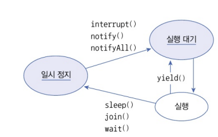

# 스레드 이름

1. 기본 스레드 이름
- 메인 스레드는 기본적으로 'main' 이라는 이름을 가집니다
- 작업 스레드는 'Thread-n' 이라는 이름을 자동으로 가집니다(n은 숫자)

2. 스레드 이름 변경
- 'Thread' 클래스의 'setName()' 메서드를 사용하여 스레드의 이름을 변경할 수 있습니다.
``` java
thread.setName("suread");
```
<br>

3. 스레드 이름 사용 예제
- 현재 실행 중인 스레드 이름 가져오기
    - 'Thread.currentThread()' 메서드를 사용하여 현재 실행 중인 스레드의 참조를 얻는다
    - 'getName()' 메서드를 사용하여 스레드의 이름을 가져온다
    ``` java
    Thread thread = Thread.currentThread();
    System.out.println(thread.getName());
    ```

``` java
// 위에 나온 메서드들을 이용한 예제
public class ThreadNameEx {
    public static void main(String[] args) {
        // 현재 실행 중인 스레드(main tmfpem)의 참조를 얻고 이름을 출력
        Thread mainThread = Thread.currentThread();
        System.out.println(mainThread.getName() + " 실행");

        // 3개의 작업 스레드를 생성하고 이름을 출력
        for(int i = 0; i < 3; i++) {
             Thread threadA = new Thread() {
                @Override
                public void run() {
                    System.out.println(getName() + " 실행");
                }
             };
             threadA.start();
        }

        // 새로운 작업 스레드를 생성하고 이름을 "chat-thread"로 설정
        Thread chatThread = new Thread() {
            @Override 
            public void run() {
                System.out.println(getName() + " 실행");
            }
        };
        chatThread.setName("chat-thread");
        chatThread.start();
    }
}

/*
main 실행
Thread-0 실행
Thread-1 실행
Thread-2 실행
chat-thread 실행
*/
```

# 스레드 상태

- 스레드 상태..
<br>


1. NEW(스레드 객체 생성)
    - 스레드 객체가 생성된 상태지만 아직 'start()' 메서드가 호출되지 않은 상태입니다.

2. RUNNABLE(실행 대기)
    - 'start()' 메서드가 호출된 후 스레드가 실행 준비 상태에 있는 상태 입니다
    - CPU 자원을 받을 때까지 대기합니다

3. RUNNING(실행 중)
    - 스레드가 CPU 자원을 얻어 'run()' 메서드를 실행하고 있는 상태입니다.

4. BLOCKED/WAITING/TIMED_WAITING(일시 정지)
    - 스레드가 일시적으로 실행을 멈추고 기다리는 상태입니다
    - sleep(), wait(), join()등의 메서드에 의해 상태가 변경됩니다

5. TERMINATED(종료)
    - run() 메서드가 종료되어 스레드의 실행이 완료된 상태입니다

- 주요 메서드 설명..


<br>

1. SleepExample.java
    - 스레드가 'sleep()' 메서드를 사용하여 일시 정지 상태로 들어가는 예제
    ``` java
    public class SleepEx {
        public static void main(String[] args) {
            Toolkit toolkit = Toolkit.getDefaultToolkit();
            for(int i = 0; i < 10; i++) {
                toolkit.sleep();
                try {
                    Thread.sleep(1000); // 3초 동안 일시 정지
                } catch (InterruptedException e) {
                    // interrupt() 메서드가 호출되면 실행
                }
            }
        }
    }
    ```

2. JoinExample.java
    - 하나의 스레드가 다른 스레드가 종료될 때까지 기다리는 예제, join() 메소드 사용
    <br>
    
    ``` java
    public class Joinex {
        public static void main(String[] args) {
            SumThread sumThread = new SumThread();
            sumThread.start();
            try {
                sumThread.join(); // sumThread가 종료될 떄까지 대기
            } catch (InterruptedException e) {
                // 예외 처리
            }
            System.out.println("1~100 합: " + sumThread.getSum());
        }
    }

    class SumThread extends Thread {
        private long suml

        public long getSum() {
            return sum;
        }

        public void setSum(long sum) {
            this.sum = sum;
        }

        @Override
        public void run() {
            for(int i = 1; i <= 100; i++) {
                sum += i;
            }
        }
    }

    // 1~100 합: 5050
    ```

3. YieldExample.java
    - 스레드가 실행을 다른 스레드에게 양보하는 예제
    - 무의미한 반복을 실행하지 않고 다른 스레드에게 양보하고 자신은 실행 대기로 가는 너낌.. -> 프로그램 성능에 도움이 된다고 함
    - yield() 메소드를 제공한다
    <br>
    

    ``` java
    public class YieldEx {
        public static void main(String[] args) {
            WorkThread workThreadA = new WorkThread("workThreadA");
            WorkThread workThreadB = new WorkThread('workThreadB');
            workThreadA.start();
            workThreadB.start();

            try {
                Thread.sleep(5000);
            } catch (InterruptedException e) {
                // 예외 처리
            }

            workThreadA.work = false; // workThreadA를 일시 정지 상태로 만듭니다

            try {
                Thread.sleep(10000);
            } catch (InterruptedException e) {
                // 예외처리
            }

            workThreadA.work = true; // workThreafA를 실행 대기 상태로 만듭니다
        }
    }

    class WorkThread extends Thread {
        public boolean work = true;

        public WorkThread(String name) {
            setName(name);
        }

        @Override
        public void run() {
            while (true) {
                if (work) {
                    System.out.println(getNAme() + " 작업 처리");
                } else { 
                    Thread.yield(); // 다른 스레드에게 실행을 양보
                }
            }
        }
    }
    ```
    <br>
    


# 스레드 동기화

- 스레드 동기화는 여러 스레드가 동시에 공유 자원에 접근할 때, 데이터의 일관성을 유지하고 충돌을 방지하기 위해 필요하다
- 자바에서는 'synchronized' 키워드를 사용하여 동기화된 메서드와 블록을 만들 수 있다
<br>

<br>

- 동기화 메서드와 블록 선언
    - 동기화 메서드 : 메서드 선언에 'synchronized' 키워드를 붙여 메서드 전체를 동기화할 수 있습니다
    ``` java
    public synchronized void method() {
        // 단 하나의 스레드만 실행할 수 잇는 영역
    }
    ```

    - 동기화 블록 : 메서드 내부에 동기화 블록을 선언하고 특정 코드 부분만 동기화할 수 있습니다(메소드 전체가 아닌 일부 영역을 실행할 때만 객체 잠금을 걸고 싶다면 동기화 블록!!)
    ``` java
    public void method() {
        synchronized(this) {
            // 단 하나의 스레드만 실행할 수 있는 영역
        }
    }
    ```

- 예제 코드
    1. Calculator 클래스
    - 'Calculator' 클래스는 공유 자원인 'memory' 필드를 가지고 있으며, 'setMemory1'과 'setMemoty2' 메서드를 통해 이 값을 설정
    ``` java
    public class Calculator {
        private int memory;

        public int getMemory() {
            return memory;
        }

        // 동기화 메소드
        public synchronized void setMemoty1(int memory){
            this.memory = memory;
            try {
                Thread.sleep(1000); // 1초간 일시 정지
            } catch (InterruptedException e) {
            }
            System.out.println(Thread.currentThread().getName() + ": " + this.memory);
        }

        // 동기화 블록
        public void setMemory2(int memory) {
            synchronized(this) {
                this.memory = memory;
                try {
                    Thread.sleep(2000); // 2초간 일시 정지
                } catch (InterruptedException e) {
                }
                System.out.println(Thread.currentThread().getName() + ": " + this.memory);
            }
        }
    }
    ```

    2. User1Thread와 User2Thread 클래스 
        - 'User1Thread'와 'User2Thread'는 각각 'Calculator' 객체를 공유하여 'setMemoty1'과 'setMemory2' 메서드를 호출
        ``` java
        public class User1Thread extends Thread {
            private Calculator calculator;

            public User1Thread() {
                setName("User1Thread");
            }

            public void setCalculator(Calculator calculator) {
                this.calculator = calculator;
            }

            @Override
            public void run() {
                calculator.setMemoty1(100);
            }
        }


        public class User2Thread extends Thread {
            private Calculator calculator;

            public User2Thread() {
                setName("User2Thread");
            }

            public void setCalculator(Calculator calculator) {
                this.calculator = calculator;
            }

            @Override
            public void run() {
                calculator.setMemory2(50);
            }
        }
        ```
    
    3. SynchronizedExample 클래스..
        - 'SynchronizedEx' 클래스는 'Calculator' 객체를 생성사고 'User1Thread'와 'User2Thread' 에서 이를 공유하도록 설정합니다
        - 두 스레드는 각각 'setMemory1'과 setMemory2' 메서드를 호출합니다.
        ``` java
        public class SynchronizedExample {
            public static void main(String[] args) {
                Calculator calculator = new Calculator();

                User1Thread user1Thread = new User1Thread();
                user1Thread.setCalculator(calculator);
                user1Thread.start();

                User2Thread user2Thread = new User2Thread();
                user2Thread.setCalculator(calculator);
                user2Thread.start();
            }
        }
        /*
        실행결과
        User1Thread: 100
        UserThread: 50
        */

        ```

    4. 동기화 결과 설명
    - User1Thread가 setMemory1(100) 메서드를 실행하면 Calculator 객체의 memory 필드에 100을 저장하고 2초간 일시 정지합니다.
    - 이 동안 User2Thread가 setMemory2(50) 메서드를 호출하려고 해도 Calculator 객체가 동기화되어 있어 User1Thread의 작업이 끝날 때까지 대기합니다.
    - User1Thread가 작업을 마치면 User2Thread가 실행되어 memory 필드에 50을 저장하고 2초간 일시 정지합니다.

    5. wait()와 notify()를 이용한 스레드 제어
    - 개요
        - 두 개의 스레드를 교대로 번갈아 가며 실행할 때 'wait()'와 'notify()'메소드를 사용하여 스레드 제어 가능..
        - 스레드 A가 작업을 마친 후, 스레드 B를 깨워 작업을 시작하게 하고, 스레드A는 일시 정지 상태로 전환
        - 이 과정이 반복되면서 두 스레드는 서로 교대로 작업을 수행
        <br>
        
    
    - 주요 개념

        1. 공유 객체(Shared Object)
        - 두 스레드가 공통으로 사용하는 객체
        - 동기화 메소드를 정의하여 스레드 간의 작업을 조정

        2. 동기화 메소드(Synchronized Method)
        - 'synchronized' 키워드를 사용하여 메소드를 동기화
        - 동기화 메소드는 한 번에 하나의 스레드만 접근 가능

        3. wait()와 notify() 메소드
        - 'wait()' : 스레드를 일시 정지 상태로 만든다. 이 때 해당 스레드는 공유 객체의 대기 풀(waiting pool)에 들어감!!!

        - 'notify()' : 공유 객체의 대기 풀에 있는 스레드 중 하나를 깨워 실행 대기 상태로 만든다
        
        - 'notifyAll()' : 대기 풀에 있는 모든 스레드는 깨운다..
    
    - 구현 예제...
    ``` java
    // 1. WorkObject 클래스
    public class WorkObject {
        public synchronized void methodA() {
            System.out.println("ThreadA: methodA 작업 실행");
            notify(); // 다른 스레드를 깨웁니다.
            try {
                wait(); // 자신을 일시 정지 상태로 전환
            } catch (InterruptedException e) {}
        }

        public synchronized void methodB() {
            System.out.println("ThreadB: methodB 작업 실행");
            notify();
            try {
                wait(); //  자신은 일시 정지 상태로 전환
            } catch (InterruptedException e) {}
        }
    }

    // 2. ThreadA 클래스
    public class ThreadA extends Thread {
        private WorkObject workObject;

        public ThreadA(WorkObject workObject) {
            this.workObject = workObject;
        }

        @Override
        public void run() {
            for (int i = 0; i < 10; i++) {
                workObject.methodA();  // methodA 호출
            }
        }
    }

    // ThreadB 클래스
    public class ThreadB extends Thread {
        private WorkObject workObject;

        public ThreadB(WorkObject workObject) {
            this.workObject = workObject;
        }

        @Override
        public void run() {
            for (int i = 0; i < 10; i++) {
                workObject.methodB();  // methodB 호출
            }
        }
    }

    // WaitNotifyExample 클래스
    public class WaitNotifyExample {
        public static void main(String[] args) {
            WorkObject sharedObject = new WorkObject();

            ThreadA threadA = new ThreadA(sharedObject);
            ThreadB threadB = new ThreadB(sharedObject);

            threadA.start();
            threadB.start();
        }
    }
    ```

    - 실행 결과
    - 'ThreadA'와 'ThreadB'는 각각 'methodA()'와 'methodB()'를 교대로 실행
    - 'ThreadA'가 'methodA()'를 실행하고 'wait()'를 호출하면, 'ThreadB'가 깨어나 'methodB()'를 실행합니다
    - 이 과정이 반복되면서 두 스레드는 서로 교대로 작업을 수행한다
