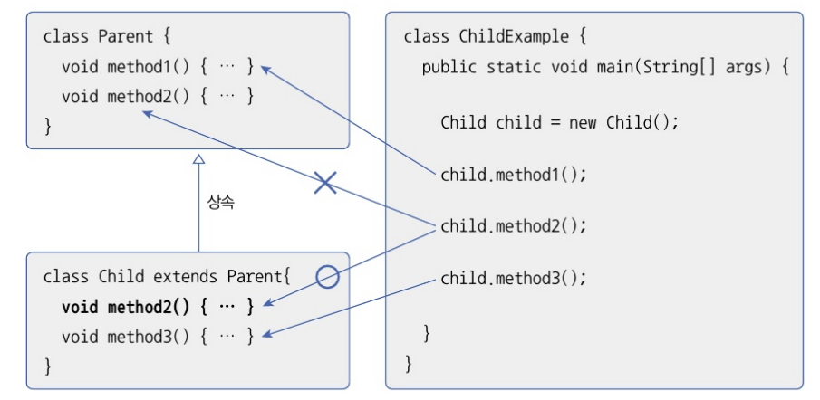
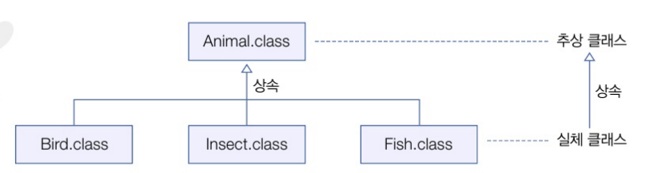

# 매소드 재정의(메소드 오버라이딩)
:상속된 메소드를 자식 클래스에서 재정의 하는 것(부모 메소드는 숨겨지고, 자식 메소드가 우선적으로 사용된다)

- 메소드 오버라이딩 시 주의해야할 사랑
1. 부모 메소드의 선언부(리턴 타입, 메소드 이름, 매개변수)와 동일해야 한다
2. 접근 제한을 더 강하게 오버라이딩할 수 없다(public -> private 불가)
3. 새로운 예외를 throws 할 수 없음

예시...

``` java
// 부모 클래스
public class Calculator {
    // 메소드 선언
    public double areaCircle(double r) {
        System.out.prinln("Calculator 객체의 areaCircle() 실행");
        return 3.14159 * r * r;
    }
}


// 자식 클래스
public class Computer extends Calculator {
    // 메소드 오버라이딩
    @Overriding // 컴파일 정확시 오버라이딩이 되었는지 체크해줌(생략 가능)
    public double areaCircle(double r) {
        System.out.println("Computer 객체의 areaCilecle() 실행");
        return Math.PI * r * r;
    }
}

// 실행 예시..
public class ComputerExample {
    public static void main(String[] args) {
        int r = 10;
        Calculator calculator = new Calculator();
        System.out.println("원 면적: " + calculator.areaCircle(r));         // 원 면적: 314.159
        System.out.println();

        Computer computer = new Computer();
        System.out.println("원 면적: " + computer.areaCircle(r));                   // 원 면적: 314.159265...
    }
}
```

# 부모 메소드 호출
- 메소드를 재정의하면, 부모 메소드는 숩겨지고 자식 메소드만 사용되기 때문에 부모 메소드의 일부만 변경되더라도 중복된 내용을 자식 메소드도 가지고 있어야 한다
-재작성 하기 힘드므로... 공동의 작업을 할때는 호출하면된다...
- super.method이름()


++ ) 메소드 이모저모..
1. final 메소드를 사용하면 상속 불가
2. protected 접근제한자는 같은 클래스이거나 자식 객체만 사용가능 / 이때 자식 객체가 다른 패키지여두 괜찮음


# 추상 클래스
- 실체 클래스 : 객체를 생성할 수 있는 클래스
- 추상 클래스 : 클래스들의 공통적인 필드나 메소드를 추출해서 선언한 클래스
- 추상 클래스는 실체 클래스의 부모 역할을 한다(실체 클래스는 추상 클래스를 상속해서 동통적인 필드나 메소드를 물려받을 수 O)

- 추상 클래스는 실체 클래스의 공통되는 메소드를 추출해서 만들었기 때문에 <strong>new 연산자를 사용해서 객체를 직접 생성할 수 없다</strong>
- 추상 클래스는 새로운 실체 클래스를 만들기 위한 부모 클래스로만 사용된다(extends 뒤에만 올 수 있다)
- 추상 클래스 선언 : 클래스 선언에 abstract 키워드를 붙임
``` java
public abstract class 클래스명 {
    // 필드
    // 생성자
    // 메소드
}
```
- 상속이랑 다른점... : 상속은 자식이 부모가 이미 있고 추가적인 코드만 더 지정해서 상속 받는 다는 느낌이고 / 추상 클래스는 a,b,c를 만들다 보니까 공통된 부분이 있어서 모아서 부모로 만든다... 


# 봉인된 클래스
- Java 15부터는 무분별한 자식 클래스 생성을 방지하기 위해 봉인된(sealed) 클래스가 도욉되었다
- 특정 클래스만 가능하도록 봉인할 수 있음...
``` java
// Employee, Manager 두 클래스만 자식 클래스가 되도록 선언
public sealed class Person permits Employee, Manager {...}
```
- 자식클래스 역시 봉인...
``` java
// final 또는 non-sealed 키워드로 다음과 같이 선언하거나
// sealed 키워드를 사용해서 또다른 클래스로 선언해야 한다
public final class Employee extends Person {...}
public non-sealed class Manager extends Person {...}
public sealed class Manager extends Person {...}
```
