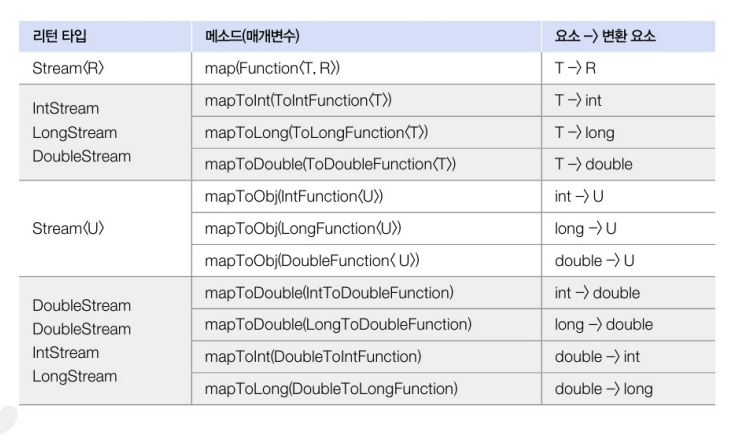
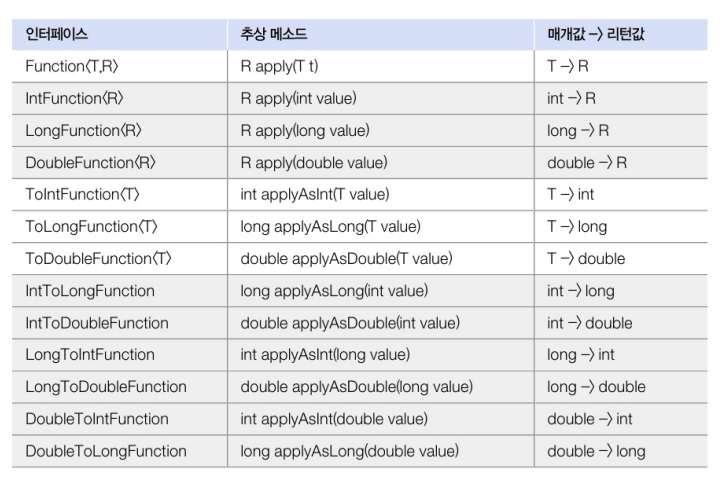
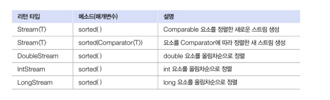

### 요소 변환(매핑)

1. 설명

- 스트림의 요소를 다른 요소로 변환하는 중간 처리 기능
- 주로 사용되는 메서드 : mapXXX() -> 스트림의 각 요소를 변환하여 새로운 스트림을 생성할 수 있다

2. 주요 매서드의 종류


3. Function 인터페이스

- Function은 하나의 입력을 받아 출력을 변환하는 함수형 인터페이스
- 다양한 변형으로 존재하며, 변환하는 요소의 타입에 따라 다름



4. 사용 예시...

``` java
// Student 객체 리스트를 생성하고, 각 학생의 점수만을 스트림으로 변환하여 출력하는 예제

// Student 클래스..
public class Student {
    private String name;
    private int score;

    public Student(String name, int score) {
        this.name = name;
        this.score = score;
    }

    public String getName() { return name; }
    public int getScore() { return score; }
}

public class MapExample {
    public static void main(String[] args) {
        List<Student> studentList = new ArrayList<>();
        studentList.add(new Student("홍길동", 85));
        studentList.add(new Student("김자바", 92));
        studentList.add(new Student("신용권", 87));

        // Student 객체의 score를 int로 변환하여 출력
        studentList.stream()
                   .mapToInt(s -> s.getScore())
                   .forEach(score -> System.out.println(score));
    }
}

```


### 요소 정렬

1. 설명 

- 스트림의 요소를 정렬하는 중간 처리 기능을 설명
- 요소를 정렬하는 메서드는 주로 sorted()를 사용

2. 주요 메서드..

- sorted() : 스트림의 요소를 자연 순서(Comparable 구현체를 기반으로) 로 정렬
- sorted(Comparator<T>) : 주어진 Comparator를 사용하여 스트림의 요소를 정렬
 

3. Comparable을 구현한 객체의 정렬

- Comparable 인터페이스를 구현한 객체는 sorted() 메서드를 사용
- 예를 들어... Student 클래스가 Comparable<Student>를 구현하면, 점수(score)를 기준으로 학생을 정렬할 수 있다

``` java

public class SortingExample {
    public static void main(String[] args) {
        List<Student> studentList = new ArrayList<>();
        studentList.add(new Student("홍길동", 30));
        studentList.add(new Student("김자바", 10));
        studentList.add(new Student("신용권", 20));

        // 기본 오름차순 정렬 (score 기준)
        studentList.stream()
                   .sorted()
                   .forEach(s -> System.out.println(s.getName() + ": " + s.getScore()));

        // 내림차순 정렬 (score 기준)
        studentList.stream()
                   .sorted(Comparator.reverseOrder())
                   .forEach(s -> System.out.println(s.getName() + ": " + s.getScore()));
    }
}
/*
Student 클래스는 Comparable<Student> 인터페이스를 구현하여 compareTo 메서드에서 점수를 기준으로 비교하고 있습니다. 이 구현 덕분에 sorted() 메서드를 사용해 손쉽게 정렬할 수 있습니다.
*/


public class SortingExample {
    public static void main(String[] args) {
        List<Student> studentList = new ArrayList<>();
        studentList.add(new Student("홍길동", 30));
        studentList.add(new Student("김자바", 10));
        studentList.add(new Student("신용권", 20));

        // 기본 오름차순 정렬 (score 기준)
        studentList.stream()
                   .sorted()
                   .forEach(s -> System.out.println(s.getName() + ": " + s.getScore()));

        // 내림차순 정렬 (score 기준)
        studentList.stream()
                   .sorted(Comparator.reverseOrder())
                   .forEach(s -> System.out.println(s.getName() + ": " + s.getScore()));
    }
}

```