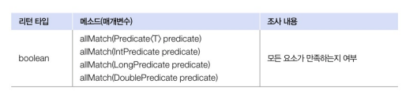
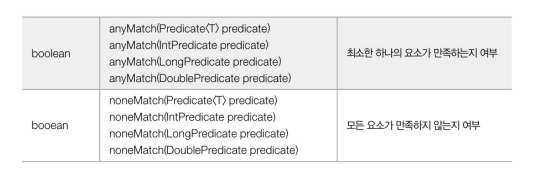

### 요소를 하나씩 처리 (루핑)

1. 설명

- 스트림의 요소를 하나씩 반복하면서 가공하거나 소비하는 방법
- 주로 peek()와 forEach() 메서드를 사용

2. peek()와 forEach() 메서드

- peek() : 스트림의 요소를 소비하지 않고 중간에서 특정 작업을 수행하는 데 사용, 최종 작업이 아닌 중간 작업으로 주로 사용
- forEach() : 스트림의 요소를 최종적으로 소비하면서 작업을 수행하는 메서드

3. 예시

``` java
public class LoopingExample {
    public static void main(String[] args) {
        int[] intArr = {1, 2, 3, 4, 5};

        // 중간 처리로서의 peek
        Arrays.stream(intArr)
            .filter(a -> a % 2 == 0) 
            .peek(n -> System.out.println(n)) // 중간에 요소를 출력
            .sum();
        
        System.out.println();

        // 최종 처리로서의 forEach
        Arrays.stream(intArr)
            .filter(a -> a % 2 == 0) 
            .forEach(n -> System.out.println(n)); // 필터링된 요소를 최종적으로 요소를 출력
    }
}
```

### 요소 조건 만족 여부 (매칭)

- 매칭 : 요소들이 특정 조건에 만족하는지 여부를 조사하는 최종 처리 기능

1. 메소드




- allMatch(Predicate<T> predicate) : 스트림의 모든 요소가 주어진 조건(Predicate)을 만족하는지 확인, 모든 요소가 조건을 만족하면 true를 하나라도 만족하지 않으면 false를 반환
- anyMatch 는 하나라도 만족하면 true
- noneMatch 는 하나도 만족하지 않으면 true

2. 예시

``` java
public class MatchingExample {
    public static void  main(String[] args) {
        int [] intArr = {2, 4, 6};

        // 모든 요소가 2의 배수인지 확인
        boolean result = Arrays.stream(intArr) 
                                .allmatch(a -> a % 2 == 0);
        System.out.println("모두 2의 배수인가? " + result); // true

        // 하나라도 3의 배수가 있는지 확인
        result = Arrays.stream(intArr) 
                                .anymatch(a -> a % 3 == 0);
        System.out.println("하나라도 3의 배수가 있는가? " + result); // true

        // 모든 요소가 3의 배수가 아닌지 확인
        result = Arrays.stream(intArr) 
                                .ㅜㅐㅜㄷmatch(a -> a % 3 == 0);
        System.out.println("모두 3의 배수가 있는가? " + result);  // false
    }
}