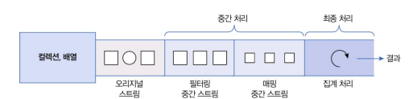

# 스트림

## 스트림이란?

1. 설명
- 스트림은 데이터를 처리하는 새로운 방법(for문을 이용하지 않고 사용한다니?)
- Java 8에서 추가되었고, 리스트나 셋 같은 컬렉션의 요소들을 간단하게 처리 가능
- 스트림 예제
``` java
// Set 컬렉션 생성
Set<Stream> set = new HashSet<>();
set.add("문수민");
set.add("조수현");
set.add("안유나");

// Stream을 이용한 요소 반복 처리
Stream<String> stream = set.stream();
strea.forEach(name ->System.out.println(name));

/*
문수민
조수현
안유나
*/
```

2. 스트림과 Iterator의 차이점

- 내부 반복자 사용 : 스트림은 내부 반복자를 사용하기 때문에 처리 속도가 더 빠르고 병렬 처리에 효율적입니다
- 람다식 사용 : 스트림을 사용하면 람다식을 통해 다양한 요소 처리를 쉽게 정의할 수 있습니다
- 파이프라인 처리 : 스트림은 중간 처리와 최종 처리를 연결하여 파이프라인 형태로 데이터를 처리할 수 있습니다. 
- 결론적으로... 스트림을 사용하면 코드가 간결해지고, 성능이 향상되며, 유지보수가 쉬워짐...


## 내부 반복자(Internal Iterator)

1. 외부 반복자 vs 내부 반복자

- 외부 반복자 : for 문이나 Iterator를 사용해서 컬렉션의 요소를 하나씩 가져와서 처리하는 방식, 개발자가 반복을 제어
- 내부 반복자 : 스트림과 같은 기능을 이용해 컬렉션 내부에서 요소를 반복 처리하는 방식, 개발자는 람다식을 사용해 처리할 코드만 작성하고, 실제 반복은 스트림 내부에서 처리
<br>


- 장점 : 내부 반복자는 멀티코어 CPU를 활용해 요소들을 병렬로 처리할 수 있어 효율적이다

2. 병렬 처리(Parallel Processing)

- parallelStream() 메서드를 사용해 병렬로 처리할 수 있는 스트림을 생성
- 병렬 스트림을 사용하면, 컬렉션의 요소를 여러 스레드에서 병렬로 처리할 수 있어 처리 속도가 향상된다

``` java
// 병렬 스트림 얻기
Stream<String> parallelStream = list.parallelStream();
parallelStream.forEach(name -> {
    // 람다식 요소 처리 방법
    System.out.println(name + ": " + Thread.currentThread().getName());
});
```

## 중간 처리와 최종 처리

1. 스트림 연결

- 스트림은 필터링 같은 중간 처리 스트림과 최종적으로 결과를 도출하는 최종 처리 스트림으로 구성된다
- 두 개 이상의 스트림이 연결된 구조를 스트림 파이프라인이라고 부른다...

2. 중간 처리와 최종 처리

- 중간 처리 : 중간 스트림은 원본 스트림의 데이터를 가공하거나 변환하는 역할을 한다, 이 작업에는 필터링, 매핑 등이 포함된다
- 최종 처리 : 중간 처리 후 최종 처리에서는 모든 작업에 완료된 데이터를 바탕으로 결과를 생성, 이 단계에서 데이터의 반복, 집계, 합계, 평균 등이 수행된다



``` java
/* Student 객체 리스트를 스트림으로 변환한 후, 중간 처리 단계에서 Student 객체의 score를 추출하고, 최종 처리 단계에서 이 평균을 계산하는 과정을 보여주는 예시....*/

// 스트림 생성 : Student 객ㅊ테가 들어있는 리스트를 스트림으로 변환 / 이 스트림은 이후의 중간 처리와 최종 처리에 사용...
Stream<Student> studentStream = list.stream();

// 중간 처리 : mapToInt 메소드를 사용하여 Student 객테에서 점수를 추출.. & IntStream으로 변환
Instream scoreStream = studentStream.mapToInt(student -> student.getScore());

// 최종 처리 : average() 메소드는 IntStream의 요소들의 평균을 계산
double arg = scoreStream.average().getAsDouble();

// 위의 ㄱ과정을 간결하게 나타낸 코드...
double arg = list.stream()
    .mapToInt(studet -> student.getScore())
    .average()
    .getAsDouble();


```