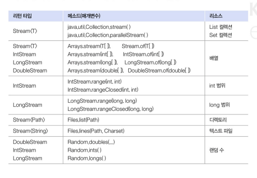
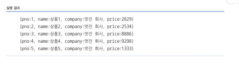
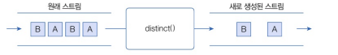
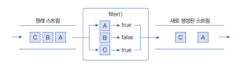
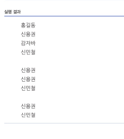

## 리소스로부터 스트림 얻기

1. 설명

- 스트림(Stream)은 Java의 java.util.stream 패키지에 포함되어 있으며, 데이터를 처리하는 강력한 기능을 제공


- BaseStream: 모든 스트림의 최상위 인터페이스로, 스트림에서 사용할 수 있는 공통 메서드들이 정의
- Stream: 객체 요소를 처리하는 스트림으로, 컬렉션, 배열 등의 데이터 소스로부터 생성,  Stream<T>는 일반적인 객체 타입을 처리하는 스트림
- IntStream, LongStream, DoubleStream: 각각 기본 타입인 int, long, double 요소를 처리하는 스트림, 숫자 데이터를 효과적으로 처리할 수 있는 메서드를 제공



2. 컬렉션으로부터 스트림 얻기

``` java
// 제품의 정보를 나타내는 Product 클래스
public class Product {
    private int pno;
    private String name;
    private String company;
    private int price;

    // 생성자..
    public Product(int pno, String name, String company, int price) {
        this.pno = pno;
        this.name = name;
        this.company = company;
        this.price = price;
    }
    
    // Getter 메서드
    public int getPno() { return pno; }
    public String getName() { return name; }
    public String getCompany() { return company; }
    public int getPrice() { return price; }

    // toString 메서드
    @Override
    public String toString() {
        return new StringBuilder()
            .append("(pno:").append(pno)
            .append(", name:").append(name)
            .append(", company:").append(company)
            .append(", price:").append(price)
            .append(")").toString();
    }
}

// 사용 예제 클래스 
public class StreamExample {
    public static void main(String[] args) {

        // List 컬렉션 생성
        List<Product> list = new ArrayList<>();

        // 5개의 Product 객체 저장
        for(int i=1; i<=5; i++) {
            Product product = new Product(i, "상품" + i, "멋진 회사", (int)(1000*Math.random()));
            list.add(product);
        }

        // 객체 스트림 얻기
        Stream<Product> stream = list.stream();
        stream.forEach(p -> System.out.println(p));
    }
}

```




## 요소 걸러내기(필터링)

1. 설명

- 스트림의 필터링 : 데이터를 걸러내어 원하는 조건에 맞는 요소들만 남기는 작업
- distinct()와 filter() 메서드를 사용

2. distinct() 메서드

- 중복된 요소를 제거
- 객체 스트림의 경우 equals() 메서드를 사용해 동일한 객체인지 판단하여, 같은 객체로 간주되면 중복으로 처리되어 제거


3. Filter() 메서드

- 스트림에서 주어진 조건(Predicate)을 만족하는 요소만을 남김..
- 이 조건은 Predicate<T> 함수형 인터페이스로 표현되며, 이 인터페이스는 bollean test(T t) 메서드를 가지는데 이 메서드는 주어진 요소가 조건을 만족하면 true, 만족하지 않으면 false를 반환



4. Filtering 에시 코드..

``` java
public class FilteringExample {
    public static void main(String[] args) {
        // List 컬렉션 생성
        List<String> list = new ArrayList<>();
        list.add("홍길동");
        list.add("신용권");
        list.add("김자바");
        list.add("신민철");
        list.add("신용권");

        // 중복 요소 제거
        list.stream()
            .distinct()
            .forEach(System.out::println); // 남은 요소 출력 
        System.out.println();

        // "신"으로 시작하는 요소만 필터링
        list.stream()
            .filter(n -> n.startsWith("신"))
            .forEach(System.out::println);
        System.out.println();

        // 중복 요소 제거 후, "신"으로 시작하는 요소만 필터링
        list.stream()
            .distinct()
            .filter(n -> n.startsWith("신"))
            .forEach(System.out::println);
    }
}

```

