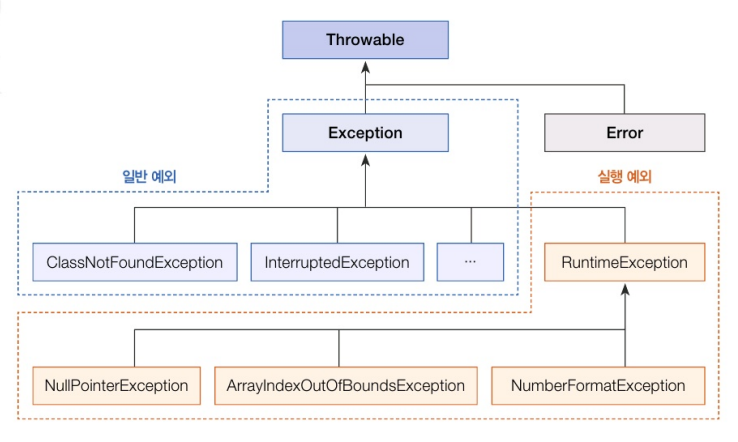
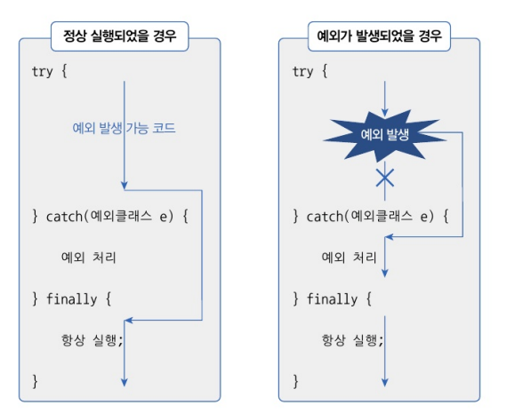
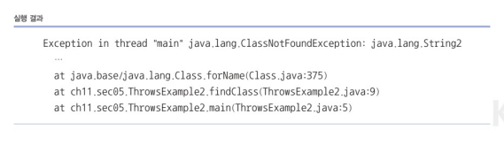

# 예외와 예외 클래스

1. 에러와 예외
- 에러 : 컴퓨터 하드웨어의 고장으로 인해 응용프로그램 실행 오류가 발생하는 것
- 프로그램을 아무리 견고하게 만들어도 개발자는 이런 에러에 대처할 방법이 없다
- 예외 : 잘못된 사용 또는 코딩으로 인한 오류
- 예외가 발생하면 프로그램은 곧바로 종료된다는 점에서는 에러와 동일하지만, 예외 처리를 통해 계속 실행 상태를 유지할 수 있다

2. 예외의 2종류
- 일반 예외(Exception) : 컴파일러가 예외 처리 코드 여부를 검사하는 예외를 말한다
- 실행 예외(Runtime Exception) : 컴파일러가 예외 처리 코드 여부를 검사하지 않는 예외를 말한다

3. 예외는 어디 클래스에서 상속 받아 만들어 질까..
- 자바는 예외가 발생하면 예외 클래스로부터 객체를 생성한다
- 이 객체는 예외 처리 시 사용된다


- 자바의 모든 에러와 예외 클래스는 Throwable을 상속받아 만들어지고, 추가적으로 예외 클래스는 java.lang.Exception 클래스를 상속받는다


# 예외 처리 코드
- try-catch-finally 블록으로 구성

- try 블록에서 작성한 코드가 예외 없이 정상 실행되면 catch 블록은 실행되지 않고 finally 블록이 실행된다
- try 불록에서 예외가 발생하면 catch 블록이 실행되고 연이어 finally 블록이 실행된다
- 예외 발생 여부와 상과없이 finally 블록은 항상 실행된다
``` java
public class ExceptionHandlingExample {
    public static void printLength(String data) {
        try {
            int result = data.length();
            System.out.println("문자 수: " + result);
        } catch(NullPointerException e) {
            System.out.println(e.getMessage());
            // System.out.println(e.toString());
            // e.printStackTrace();
        } finally {
            System.out.println("[마무리 실행]\n");
        }
    }

    public static void main(String[] args) {
        System.out.println("[프로그램 시작]\n");
        printLength("ThisIsJava");
        printLength(null);
        System.out.println("[프로그램 종료]\n")
    }
}

// 실행결과
// [프로그램 시작]
// 문자 수: 10
// [마무리 실행]
// Cannot invoke "String.length()" bacame "data" is null
// [마무리 실행]
// [프로그램 종료]
```

# 예외 종류에 따른 처리
- try 블록에는 다양한 종류의 예외가 발생할 수 있다
- 다중 catch를 사용하면 발생하는 예외에 따른 예외 처리 코드를 다르게 작성할 수 있다
``` java
public class ExceptionHandlingExample {
    public static void main(Strings[] args) {
        String[] array = {"100", "100"};

        for(int i = 0; i <= array.length; i++) {
            try {
                int value = Integer.parseInt(array[i]);
                System.out.println("array[" + i + "]" + value);
                // 배열의 인덱스가 초과했을 경우
            } catch(ArrayIndexOutOfBoundsException e) {
                System.out.println("배열 인덱스가 초과됨: " + e.getMessage()); 
                // 숫자 타입이 아닌 경우
            } catch(NumberFormatException e) {
                System.out.println("숫자로 변환할 수 없음: " + e.getMessage());
            }
        }
    }
}
```

# 예외 떠넘기기
- 메소드 내부에서 예외가 발생할 떄 try-catch 블록으로 예외를 처리하는 것이 기본이자만, 메소드를 호출한 곳으로 예외를 떠넘길 수도 있다
``` java
public class ThrowExample {
    public static void main(String[] args) throws Exception{
        findClass();
    }

    public static void findClass() throws ClassNotFoundException {
        Class.forName("Java.lang.String2");
    }
}
```



# 사용자 정의 예외
- 은행의 랭킹 프로그램에서 잔고보디 더 많은 출금 요청이 들어온 경우에는 잔고 부족 예외를 발생시킬 필요가 있다.
- 그렇지만 잔고 부족 예외는 표준 라이브러리에 존재하지 않기 째문에 직접 예외클래스를 정의해서 만들어 줘야 한다
- 사용자 정의 예외
``` java
public class InsufficientException extends Exception {
    public InsufficientException() {

    }

    public InsuffientException(String message) {

    }
}
```

- 예외 발생시키기
``` java
public class Account {
    private long balance;
    public Account() {}
    public long getBalance() {
        return balance;
    }

    public void deposit(int money) {
        balance += money;
    }
    
    public void withdraw(int money) throws IndufficientException {
        if(balance < money) {
            throw new InsufficientExcep("잔고 부족: " + {money-balance}+ "모자람");
        }
        balance -= money;
    }
}


public class AccountExample {
    public static void main(String[] args) {
        Account account = new Account();
        // 예금하기
        account.deposit(10000);
        System.out.println("예금액: " + account.getBalance());
        
        // 출금하기
        try {
            account withdraw(30000);
        } catch(InsufficientException e) {
            String message = getMessage();
            System.out.println(message);
        }
    }
}

// 실행 결과
// 예금액: 10000
// 잔고부족: 20000 모자람
```