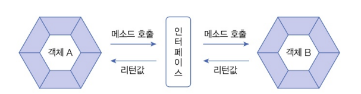
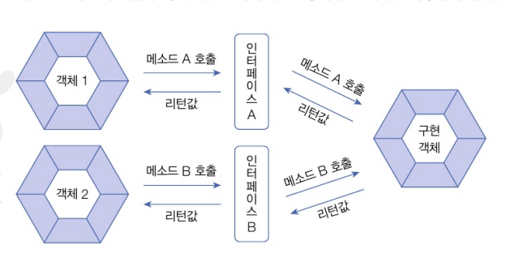

# 인터페이스 역할
- 두 객체를 연결하는 역할

- 객체 A가 인터페이스의 메소드를 호출하면, 인터페이스는 객체 B의 메소드를 호출하고 그 결과를 받아 객체 A로 전달(왜 굳이 중간에 쓰냐?) => 인터페이스를 이용해서 다형성을 구현하기 위해서...


# 인터페이스와 구현 클래스 선언
- 인터페이스 선언 : interface 키워드를 사용(class 대신)
- 패키지 내에서만 사용 가능한 default, 패키지와 상관없이 사용하는 public을 붙일 수 있다
- 인터페이스가 가지는 메소드의 종류
``` java
public interface 인터페이스명 {
    // public 상수 필드
    // public 추상 메소드(선언부만 있고 실행부인 중괄호가 없는 메소드) public void turnOn();
    // public 디폴트 메소드
    // public 정적 메소드
    // private 메소드
    // private 정적 메소드
}
```
- 구현 클래스 선언 : implements 키워드는 해당 클래스가 인터페이스를 통해 사용할 수 있다는 표시!
``` java
public class B implements 인터페이스명 {...}
```

# 인터페이스 상속
- 인터페이스도 다른 인터페이스를 상속할 수 있으며, 클래스와는 달리 다중 상속을 허용한다
``` java
public interface 자식인터페이스 extends 부모인터페이스1, 부모인터페이스2 {...}
```

# 다중 인터페이스 구현
- 구현 객체는 여러 개의 인터페이스를 implements 할 수 있다
- 구현 객체가 인터페이스 A와 인터페이스 B를 구현하고 있다면 각각의 인터페이스를 통해 구현 객체를 사용할 수 있다
 
- 추상 메소드 정의
``` java
public class 구현클래스명 implements 인터페이스A, 인터페이스B { 
    // 모든 추상 메소드 재정의
}
```

# 인터페이스 상속
- 인터페이스도 다른 인터페이스를 상속할 수 있으며, 클래스와 달리 다중 상속을 허용한다
``` java
public interface 자식인터페이스 extends 부모인터페이스1, 부모인터페이스2 {...}
```