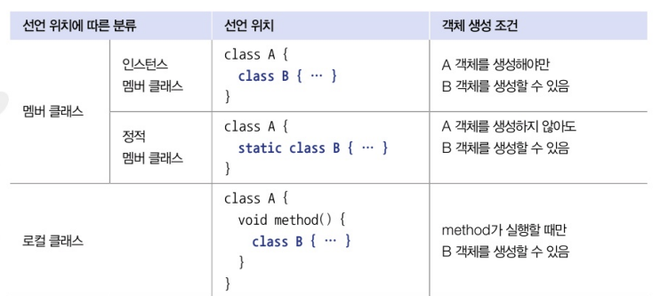

# 중첩 클래스
- 클래스가 여러 클래스와 관계를 맺는 경우에는 독립적으로 선언하는 것이 좋으나, 특정 클래스만 관계를 맺을 경우에는 중첩 클래스로 선언하는 것이 유지보수에 도움이 되는 경우가 많다
- 중첩 클래스란...? 
    - 클래스 내부에 선언한 클래스를 말하는데
    - 중첩 클래스를 사용하면 클래스의 멤버를 쉽게 사용할 수 있고 
    - 외부에는 중첩 관계 클래스는 감춤으로써 코드의 복잡성을 줄일 수 있다
    - 선언하는 위치에 따라 두가지로 분류된다
    - 클래스 멤버로서 선언되는 중첩 클래스를 멤버 클래스 / 메소드 내부에서 선언되는 중첩 클래스를 로컬클래스
    

# 익명 객체
- 이름이 없는 객체
- 명시적으로 클래스를 선언하지 않기 때문에 쉽게 객체를 생성할 수 있다는 장점이 있다
- 필드값, 로컬 변수값, 매게변수값으로 주소 사용된다

``` java
// 익명 객체를 사용한 간단한 구현 만들어보기..
interface Greeting {
    void greet();
}

public class Main {
    public static void main(String[] args) {
        // 익명 객체 생성
        Greeting greeting = new Greeting() {
            @Override
            public void greet() {
                System.out.println("Hello, World!");
            }
        };

        // 익명 객체의 메서드 호출
        greeting.greet(); // "Hello, World!" 출력
    }
}
```
