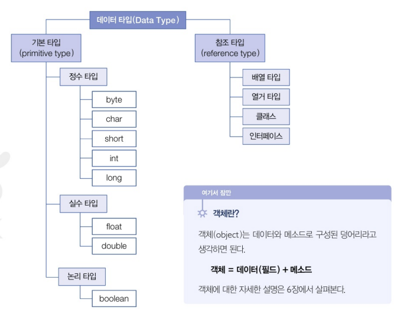
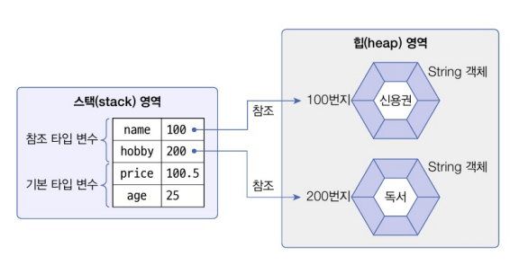
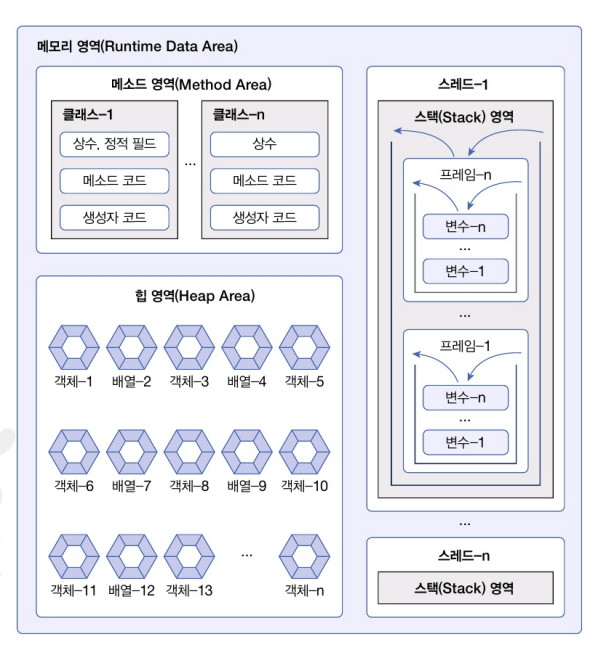

# **데이터 타입 분류**

\- 자바의 데이터 타입은 크게 기본 타입과 참조 타입으로 분류된다

\- 참조 타입 : 객체의 번지를 참조하는 타입으로 배열, 열거, 클래스 인터페이스 타입이 있다

\- 기본 타입으로 선언된 변수는 값 자체를 저장하고 있지만, 참조 타입으로 선언된 변수는 객체가 생성된 메모리 번지를 저장한다..

\- 변수들은 모두 스택이라는 메모리 영역에 생성

\- 기본 타입 변수인 age와 price는 직접 값을 저장

\- 참조 타입 변수인 name과 hobby는 힙 메모리 영역의 String 객체 번지를 저장하고 이 번지를 통해 String 객체를 참조4

 

# 메모리 사용 영역

