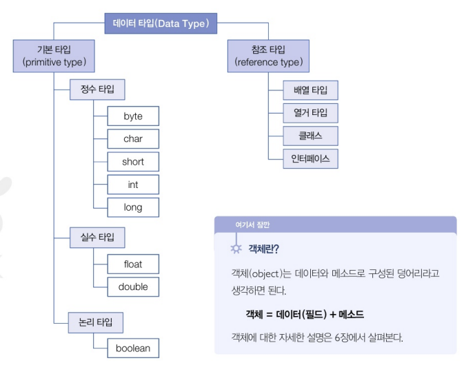
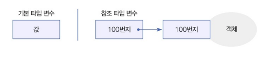
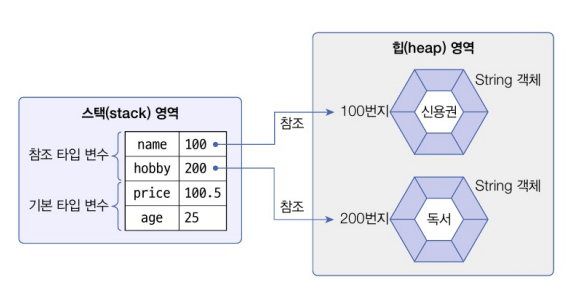
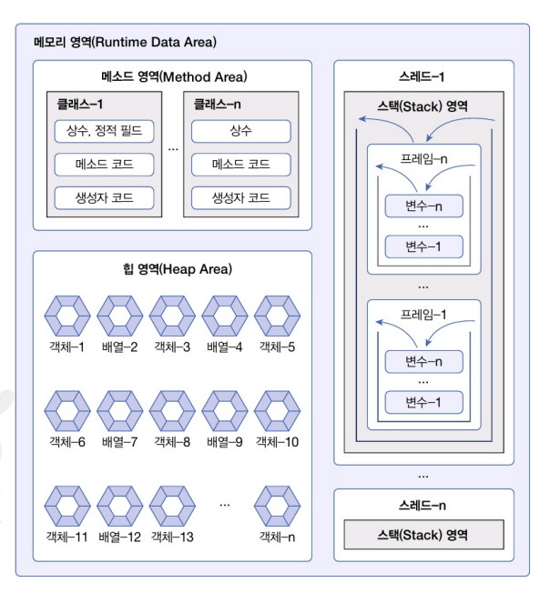
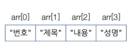

# **데이터 타입 분류**

\- 자바의 데이터 타입은 크게 기본 타입과 참조 타입으로 분류된다

\- 참조 타입 : 객체의 번지를 참조하는 타입으로 배열, 열거, 클래스 인터페이스 타입이 있다

\- 기본 타입으로 선언된 변수는 값 자체를 저장하고 있지만, 참조 타입으로 선언된 변수는 객체가 생성된 메모리 번지를 저장한다..

\- 변수들은 모두 스택이라는 메모리 영역에 생성

\- 기본 타입 변수인 age와 price는 직접 값을 저장

\- 참조 타입 변수인 name과 hobby는 힙 메모리 영역의 String 객체 번지를 저장하고 이 번지를 통해 String 객체를 참조4

 

# **메모리 사용 영역**

1. 메소드 영역
\- 바이트 코드 파일을 읽은 내용이 저장되는 영역으로 클래스별로 상수, 정적 필드, 메소드 코드, 생성자 코드 등이 저장된다(자바 코드가 저장되는 부분)

2. 힙 영역
\- 객체가 생성되는 영역으로 객체의 번지는 메소드 영역과 스택 영역의 상수와 변수에서 참조할 수 있다
(객체가 저장되는 부분)
3. 스택 영역
\- 메소드를 호출할 때마다 생성되는 프레임이 저장되는 영역(변수는 스택에 생성)

# 문자열

1. 문자 추출 :  charAt()
String subject = "자바 프로그래밍";
char charValue = subkect.charAt(3); // 프

2. 문자열 대체 : replace()
String newStr = subject.replace("자바", JAVA); // JAVA 프로그래밍

3. 문자열 잘라내기 : substring()
substring(int beingIdx) : beginIdx부터 끝까지
substring(int beginIdx, int endIdx) : beginIdx부터 endIdx 앞까지
String newstr = newStr.substring(0, 5);  JAVA

4. 문자열 분리 : split()
String board = "번호, 제목, 내용, 성명";
Strin[] arr = board.split(",");

5. 문자열 찾기(위치) : indexOf()
String subject = "자바 프로그래밍"
int index = subject.indexOf("프로그래밍") // 

