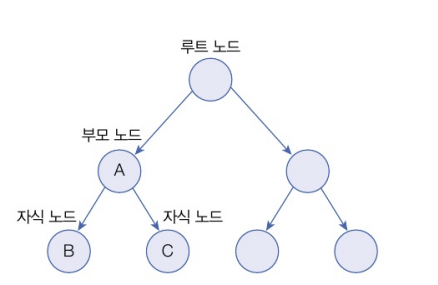
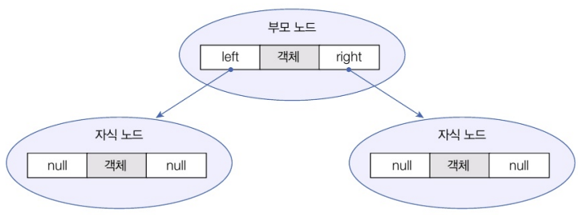
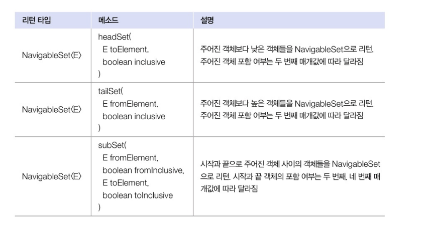

# 검색 기능을 강화시킨 컬렉션

## TreeSet

1. 설명

- 이진 트리(binary tree)를 기반으로 한 'Set' 컬렉션
- 루트 노드라고 불리는 하나의 노드에서 시작해 각 노드에 최대 2개의 노드를 연결할 수 있는 구조
<br>



2. 구조

- 트리에 객체를 저장하면 자동으로 정렬된다!!
- 부모 노드의 객체와 비교해서 낮은 것은 왼쪽 자식 노드에, 높은 것은 오른쪽 자식 노드에 저장<br>



``` md
# TreeSet 생성 방법
TreeSet<E> treeSet = new TreeSet<E>();
TreeSet<E> treeSet = new TreeSet<>();

# TreeSet 타입으로 대입하는 이유..는....
검색 관련 메소드가 TreeSet에만 정의되어 있기 때문이라고 합니다...
```

3. TreeSet이 가지고 있는 검색 관련 메소드
<br>

| 리턴 타입 | 메소드 | 설명 |
| -------- | ------ | ---- |
|   E   | first() | 제일 낮은 객체를 리턴 |
|   E   | last() | 제일 높은 객체를 리턴 |
|   E   | lower(e e) | 주어진 객체보다 바로 아래 객체를 리턴 |
|   E   | highest(E e) | 주어진 객체보다 바로 위 객체를 리턴 |
|   E   | floor(E e) | 주어진 객체와 동등한 객체가 있으면 리턴, 만약 없다면 주어진 객체의 바로 아래 객체를 리턴 | 
|   E   | ceiling(E e) | 주어진 객체와 동등한 객체가 있으면 리턴, 만약 없다면 주어진 객체의 바로 위 객체를 리턴 |
|   E   | pollFirst() | 제일 낮은 객체를 꺼내오고 컬렉션에서 제거함 |
|   E   | pollLast() | 제일 높은 객체를 꺼내오고 컬렉션에서 제거함 |
| Iterator<E> | descendingIterator() | 내림차순으로 정렬된 Iterator를 리턴 |
| NavigableSet<E> | descendingSet() | 내림차순으로 정렬된 NavigableSet을 리턴 | 

<br>



``` java

public class TreeSetEx {
    public static void main(String[] args) {
        // TreeSet 컬렉션 생성
        TreeSet<Integer> scores = new TreeSet<>();

        // Integer 객체 저장
        scores.add(87);
        scores.add(98);
        scores.add(75);
        scores.add(95);
        scores.add(89);
        
        // 정렬된 Integer 객체를 하나씩 가져오기
        for(Integer s : scores) {
            System.out.print(s + " "); // 75 80 87 95 98
        }
        System.out.println("\n");

        // 특정 Integer 객체를 가져오기
        System.out.println("가장 낮은 정수: " + scores.first()); // 75
        System.out.println("가장 높은 정수: " + scores.last()); // 98
        System.out.println("95점 아래 정수: " + scores.lower(95)); // 87
        System.out.println("95점 위의 정수: " + scores.higher(95)); // 98
        System.out.println("95점 이거나 바로 아래 정수: " + scores.floor(95)); // 95
        System.out.println("85점이거나 바로 위의 정수: " + scores.ceiling(85) + "\n"); // 87

        // 내림차순으로 정렬하기
        NavigableSet<Integer> descendingScores = scores.descendingSet();
        for(Integer s : descendingScores) {
            System.out.print(s + " "); // 98 95 87 80 75
        }
        System.out.println("\n");

        // 범위 검색 (80 <= )
        NavigableSet<Integer> rangeSet = scores.tallSet(80, true);
        for(Integer s : rangeSet) {
            System.out.rpintln(s + " "); // 80 87 95 98
        }
        System.out.println("\n");

        // 범위 검색 ( 80 <= score < 90 )
        rangeSet = scores.subSet.subSet(80, true, 90, false);
        for(Integer s : rangeSet) {
            System.out.rpintln(s + " "); // 80 87 
        }        
    }
}
```

## 수정할 수 없는 컬렉션

1. 설명..

- 요소를 추가, 삭제할 수 없는 컬렉션..
- 생성 시 저장된 요소를 변경하고 싶지 않을 떄 유용

2. 첫번째 방법 

- List, Set, Map 인터페이스의 정적 메소드인 of()로 생성할 수 있다

``` java
List<E> immutableList = List.of(E... elements);
Set<E> immutableSet = Set.of(E... elements);
Map<K, V> immutableMap = Map.of(K k1, V v1, K k2, V v2, ...);


List<String> immutableList1 = List.of("A", "B", "C");
// immutableList1.add("D"); (x)  // UnsupportedOperationException 발생

Set<String> immutableSet1 = Set.of("A", "B", "C");
// immutableSet1.remove("A"); (x)  // UnsupportedOperationException 발생

Map<Integer, String> immutableMap1 = Map.of(
    1, "A",
    2, "B",
    3, "C"
);
// immutableMap1.put(4, "D"); (x)  // UnsupportedOperationException 발생

```

3. 두번쨰 방법

- 정적 메소드 'copyOf()' 사용
- 기존 컬렉션을 복사하여 수정할 수 없는 컬렉션을 만드는 방법

``` java
List<E> immutableList = List.copyOf(Collection<E> coll);
Set<E> immutableSet = Set.copyOf(Collection<E> coll);
Map<K, V> immutableMap = MAp.copyOf(Map<K, V> m);

List<String> list = new ArrayList<>();
list.add("A");
list.add("B");
list.add("C");
List<String> immutableList2 = List.copyOf(list);

Set<String> set = new HashSet<>();
set.add("A");
set.add("B");
set.add("C");
Set<String> immutableSet2 = Set.copyOf(set);

Map<Integer, String> map = new HashMap<>();
map.put(1, "A");
map.put(2, "B");
map.put(3, "C");
Map<Integer, String> immutableMap2 = Map.copyOf(map);
```

4. 세번쨰 방법 

- 배열로부터 List 생성
- 배열로부터 List를 생성하여 수정할 수 없는 컬렉션을 만드는 방법

``` java
String[] arr = {"A", "B", "C"};
List<String> immutableList3 = Arrays.asList(arr);
```