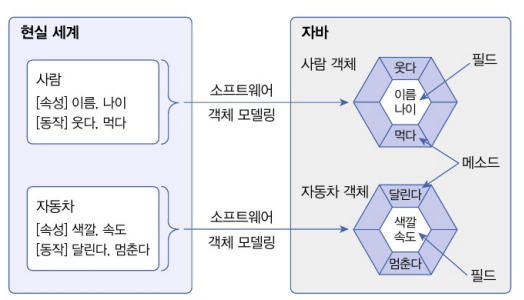
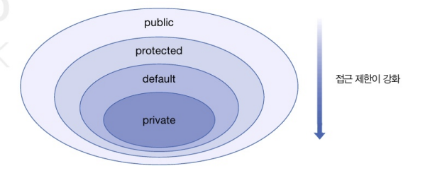
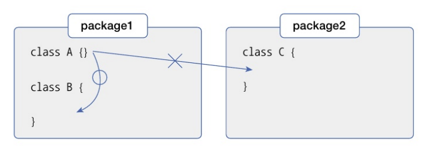
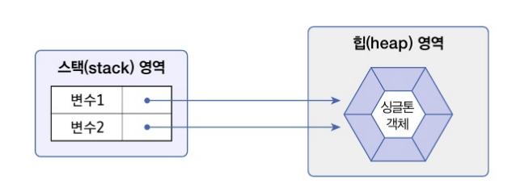

# 객체 지향 프로그래밍(OOP)

: 소프트웨어를 개발할 떄 부품이 해당하는 객체들을 먼저 만들고, 이 객체들을 하나씩 조립해서 완성된 프로그램을 만드는 기법


\- 객체란?
1. 물리적으로 존재하거나 개념적인 것 중에서 다른 것과 식별 가능한 것 ex) 자동차, 자전기, 책...
2. 객체는 속성과 동작으로 구성된다(이름 나이등의 속성과 웃다 걷다 등의 동작이 있다) / 자바는 이러한 속성과 동작을 각각 필드와 메소드라고 부른다


3. 현실 세계의 객체를 소프트웨어 객체로 설계하는 것을 객체 모델링이라 함


<br>

\- <strong>객체 지향 프로그래밍의 특징</strong>
1. 캡슐화 : 객체의 데이터, 동작을 하나로 묶고 실제 구현 내용을외부에 감추는 것을 말함(외부 객체는 객체 내부의 구조를 알지 못하며 객체가 노출해서 제공하는 필드와 메소드만 이용할 수 있다)
++ 자바 언어는 캡슐화된 멤버를 노출시킬 것인지 숨길 것인지를 결정하기 위해 접근 제한자를 사용한다!!

2. 상속 : 부모 역할의 상위 객체와 자식 역할의 하위 객체가 있다. 부모 객체는 자기가 가지고 있는 필드와 메소드를 자식 객체에게 물러주어 자식 객체가 사용할 수 있도록 한다
(코드의 재사용성을 높여줌 / 유지 보수 시간을 최소화시켜 준다)

3. 다형성 : <strong>사용 방법은 동일하지만</strong> 실행 결과가 다양하게 나오는 성질


#  접근 제한자

: 객체의 필드를 외부에서 변경하거나 메소드를 호출할 수 없도록 막아야 할 필요가 있다!!

=> 중요한 필드와 메소드가 외부로 노출되지 않도록 해 객체의 무결성(결함이 없는 성질)을 유지하기 위해서이다...

==> 자바는 이러한 기능을 구현하기 위해 접근 제한자를 사용한다


| 접근 제한자 | 제한 대상 | 제한 범위 |
|-|-|-|
| public | 클래스, 필드, 생성자, 메소드 | 없음 | 
| protected | 필드 생성자, 메소드 | 같은 패키지이거나 자식 객체만 사용 가능 |
|(default)| 클래스, 필드, 생성자, 메소드 |
| private | 필드, 생성자, 메소드 | 객체 내부 |


1. 클래스의 접근 제한 (public, default)

: 클래스는 public이 붙으면 어디에서나 클래스를 불러와서 사용할 수 있지만 public 접근 제한자를 생략했다는 default 접근 제한자를 가지게 되고 다른 패키지에서는 이를 사용할 수 없습니다..



2. 생성자의 접근 제한 (public, default, private)

- public : 모든 패키지에서 생성자를 호출
- default : 같은 패키지 내에서만 생성자 호출
- private :같은 클ㄹ래스 내부에서만 생성자 호출

3. 필드와 메소드의 접근 제한 (public, default, private) => 생성자와 같다!

- public : 모든 패키지에서 필드를 읽고 변경할 수 있다 / 모든 패키지에서 메소드를 호출할 수 있다
- default : 같은 패키지에서만 필드를 읽고 변경할 수 있다 / 같은 패키지에서만 메소드를 호출할 수 있다
- private : 클래스 내부에서만 필드를 읽고 변경할 수 있다 / 클래스 내부에서만 메소드를 호출할 수 있다


# 싱글톤 패턴(객체 하나를 만드는 패턴)
1. 프라이빗 생성자 :  생성자를 private 접근 제한해서 외부에서 new 연산자로 생성자를 호출할 수 없도록 한다
2. 스태틱 변수 : 클래스의 유일한 인스턴스를 저장
3. 스태틱 메서드 : 클래스의 유일한 생성자 반환...

``` java
public class Singleton {
    // 유일한 인스턴스를 저장할 private static 변수 ...2
    private static Singleton instance;

    // 외부에서 인스턴스를 생성하지 못하도록 private 생성자 ...1
    private Singleton() {}

    // 유일한 인스턴스를 반환하는 public static 메서드 ...3
    public static Singleton getInstance() {
        if (instance == null) {
            instance = new Singleton();
        }
        return instance;
    }
}
```

클래스 변수 1 = 클래스.getInstance();
클래스 변수 2 = 클래스.getInstance();

위 아래 값 동일...


- 싱글톤 패턴의 사용 예시
    - 로깅 클래스 : 애플리케이션 내에서 로그를 기록하는 클래스는 하나의 인스턴스만 필요합니다
    - 설정 클래스 : 애플리케이션 설정을 저장하는 클래스는 하나의 인스턴스만 있어야 한다


=> 싱글톤 패턴을 사용하면 전역적인 접근이 필요하면서도, 객체가 하나만 존재해야 하는 상황에서 유용합니다. 다만, 싱글톤 패턴을 과용하면 객체 지향 설계의 원칙을 위반할 수 있으므로 신중하게 사용해야 한다.


