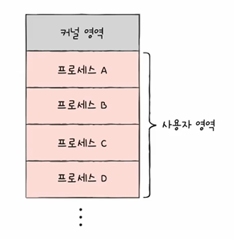
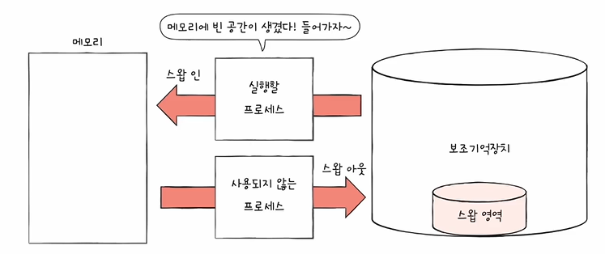
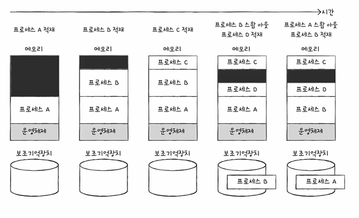
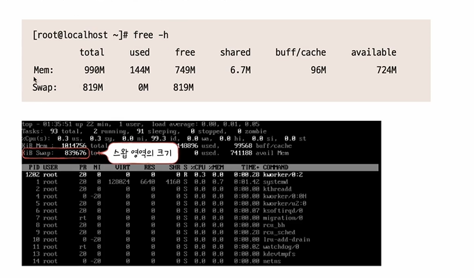
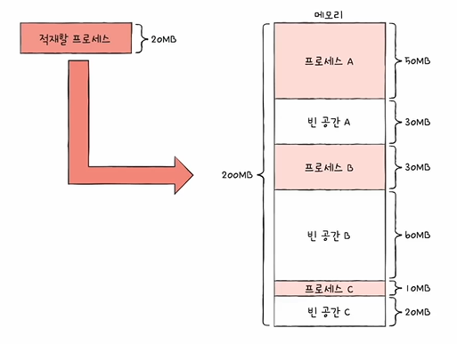
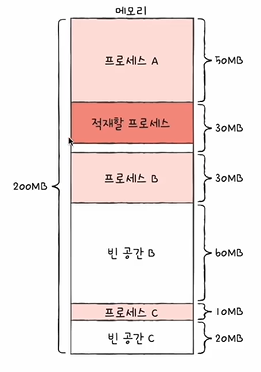
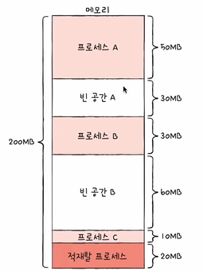
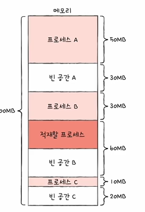
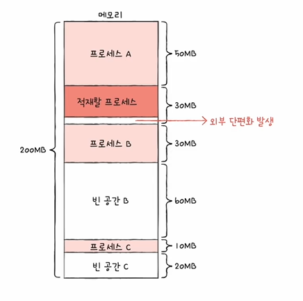
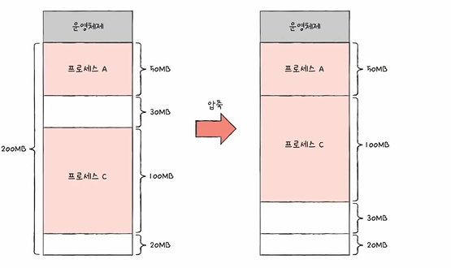

# 들어가며...
- 연속 메모리 할당 :  프로세스에 연속적인 메모리 공간을 할당
- 지금까지 상정했던 메모리 관리 방식 그대로...
- 연속 메모리 할당이 어떠한 문제를 야기하는지에 대해서 알아보고 그거를 해결하기 위한 방식인 페이징이라는 개념을 다음 시간에 배울 예정

# 스와핑(Swapping)
- 운영체제의 기본적인 메모리 관리 기능
- 현재 사용되지 않는 프로세스들을 보조기억장치의 일부 영역으로 쫓아내고 
- 그렇게 생긴 빈 공간에 새 프로세스 적재
 

- Swap Out : 현재 사용되지 않는 프로세스를 보조기억 장치의 일부영역(=Swap)으로 쫓아내는 과정
- Swap In : Swap 영역에 있었던 프로세스가 다시 메모리로 적재되는 것
- 프로세스들이 요구하는 메모리 공간 크기 >  실제 메모리 크기(이 경우에도 프로세스 동시 실행 가능)
 

- 스왑 영역 크기 확인하기: free, top 명령어(Linux, MaxOS 같은 운영체제에서... Infra 했을 때 생각이 남)
 

# 메모리 할당
- 프로세스는 메모리의 빈 공간에 할당되어야 한다.. 빈 공간이 여러 개 있다면?
- 최초 적합, 최적 적합, 최악 적합
 

    
- 메모리 할당의 종류 
    1. 최초 적합(first-fit)
    - 운영체제가 메모리 내의 빈 공간을 순서대로 검색하다 적재할 수 있는 공간을 발견하면 그 공간에 프로세스를 배치하는 방식
    - 검색 최소화, 빠른 할당
     

    

    2. 최적 적합(best-fit)
    - 운영체제가 빈 공간을 모두 검색해본 뒤, 적재 가능한 가장 작은 공간에 할당
     

    

    3. 최악 적합(worst-fit)
    - 운영체제가 빈 공간을 모두 검색해본 뒤, 적재 가능한 가장 큰 공간에 할당
     

    

# 외부 단편화
- 사실, 프로세스를 연속적으로 메모리에 할당하는 방식은 메모리를 효율적으로 사용하는 방법이 아니다
- 외부 단편화(external fragmentation)이라는 문제가 발생하기 때문
- 프로세스들이 실행되고 종료되길 반복하며 메모리 사이에 빈 공간 발생
- 외부 단편화
    - 프로세스를 할당하기 어려울 만큼 작은 메모리 공간들로 인해 메모리가 낭비되는 현상
     

    

- 외부 단편화 해결
    1. 메모리 합출(compaction)
    - 여기저기 흩어져 있는 빈 공간들을 하나로 모으는 방식
    - 프로세스를 적당히 재배치시켜 흩어져 있는 작은 빈 공간들을 하나의 큰 빈 공간으로 만드는 방법
     

    
    - 하지만 부작용이 있음.. 여기저기 흩어져 있는 빈 공간을 합치는 과정에서 많은 오버헤드를 야기하고 프로세스들은 자기가 해야 될 일을 제대로 못함..

    2. 가상 메모리 기법, 페이징(다음 시간~)
