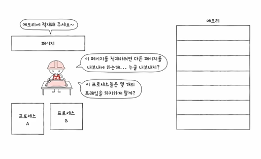
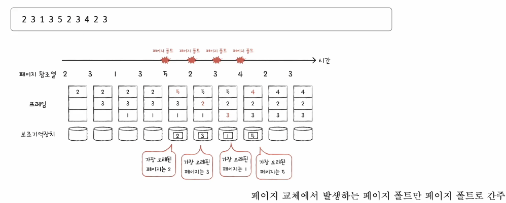
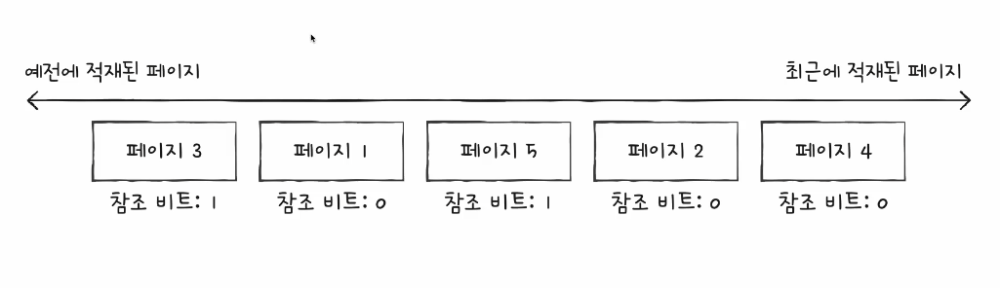
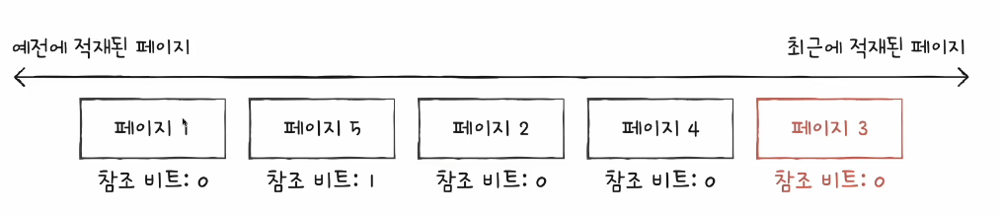
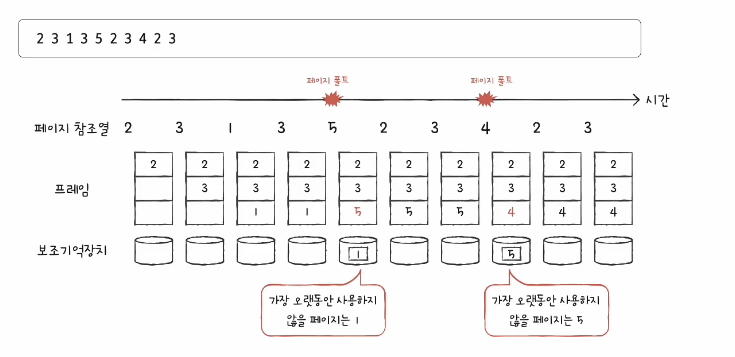
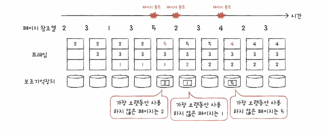
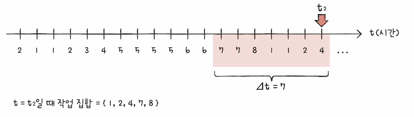

# 들어가며...
- 물리 메모리보다 큰 프로세스를 실행할 수 있지만,
- 그럼에도 물리 메모리의 크기는 한정되어 있다

- 기존에 적재된 불필요한 페이지를 선별해 보조기억장치로 내보내고
- 프로세스들에게 적절한 수의 프레임을 할당해야한다
 

# 요구 페이징

- 처음부터 모든 페이지를 적재하지 않고 필요한 페이지만을 메모리에 적재하는 기법

- 요구되는 페이지만 적재하는 기법

1. CPU가 특정 페이지에 접근하는 명령어를 실행한다
2. 해당 페이지가 현재 메모리에 있을 경우(유효 비트가 1일 경우) CPU는 페이지가 적재된 프레임에 접근한다
3. 해당 페이지가 현재 메모리에 없을 경우(유효 비트가 0일 경우) 페이지 폴트가 발생한다
4. 페이지 폴트 처리 루틴은 해당 페이지를 메모리로 적재하고 유효 비트를 1로 설정한다
5. 다시 1번을 수행한다

- 순수 요구 페이징 : 아무런 페이지도 메모리에 적재하지 않은 채 일단 무작정 실행부터 해버리는 방법

- 이러한 요구 페이징 시스템이 안정적으로 작동하려면 해결해야 할 문제?
    - 페이지 교체
    - 프레임 할당

# 페이지 교체 알고리즘
- 요구 페이징 기법으로 페이지들을 적재하다보면 언젠간 메모리가 가득 차게 된다
- 당장 실행에 필요한 페이지를 적재하려면 적재된 페이지를 보조기억장치로 내보내야
- 이때, 어떤 페이지를 내보낼까?
- 이를 결정하는 방법(알고리즘)이 페이지 교체 알고리즘
 

- 무엇이 좋은 페이지 교체 알고리즘일까?
- 페이지 폴트가 적은 알고리즘!
    - 페이지 폴트가 발생하면 보조기억장치에 접급해야 해서 성능 저하
 

- 그럼 페이지 폴트 횟수는 어떻게 알 수 있을까?
- 페이지 참조열(page reference string)
    - CPU가 참조하는 페이지들 중 연속된 페이지를 생략한 페이지열
    - ex: 2 2 2 3 5 5 5 3 3 7 -> 2 3 5 3 7

# 페이지 교체 알고리즘의 종류

1. FIFO 페이지 교체 알고리즘(First In First Out)
    - 가장 단순한 방식
    - 메모리에 가장 먼저 올라온 페이지부터 내쫓는 방식
    - "오래 머물렀다면 나가라"
    - 프로그램 실행 초기에 잠깐 실행될 페이지
    - 프로그램 실행 내내 사용될 페이지 <- 먼저 적재되엇다고 내쫓아선 안된다
     
    

2. FIFO 페이지 교체 알고리즘 - 보완책
    - 2차 기획(second-chance) 페이지 교체 알고리즘
    - 참조 비트 1 : CPU가 한 번 참조한 적이 있는 페이지, 한 번 더 기회를 주기 (참조 비트 0으로 초기화 후 적재 시간을 현재 시간으로 설정)
    - 참조 비트 0 : CPU가 참조한 적이 없는 페이지, 내쫓기
     
    
    

3. 최적 페이지 교체 알고리즘
    - CPU에 의해 참조하는 횟수를 고려
    - 메모리에 오래 남아야 할 페이지는 자주 사용될 페이지
    - 메모리에 없어도 될 페이지는 오랫동안 사용되지 않을 페이지
    - 앞으로의 사용 빈도가 낮은 페이지를 교체하는 알고리즘
     
     

    - 가장 낮은 페이지 폴트율을 보장하는 페이지 교체 알고리즘이지만...
    - 실제 구현이 어렵다
    - "앞으로 오랫동안 사용되지 않은 페이지? 어떻게 예측하지?"
    - 다른 페이지 교체 알고리즘 성능을 평가하기 위한 하한선으로 간주

4. LRU(Least-Recently-Used) 페이지 교체 알고리즘
    - 최적 페이지 교체 알고리즘 : 가장 오래 사용되지 않을 페이지 교체
    - LRU 페이지 교체 알고리즘 : 가장 오래 사용되지 않은 페이지 교체
        - "최근에 사용되지 않은 페이지는 앞으로도 사용되지 않지 않을까"
     
    

# 스래싱과 프레임 할당

- 페이지 폴트가 자주 발생하는 이유
    - 나쁜 페이지 교체 알고리즘을 사용해서
    - 프로세스가 사용할 수 있는 프레임 자체가 적어서
     
    

- 스레싱
    - 프로세스가 실행되는 시간보다 페이징에 더 많은 시간을 소요하여 성능(CPU 이용률)이 저해되는 문제
     
    

    - 동시 실행되는 프로세스의 수를 늘린다고 CPU 이용률이 높아지는 것이 아니다
     
    

    - 각 프로세스가 필요로 하는 최소한의 프레임 수가 보장되지 않았기 때문
    - 각 프로세스가 필요로 하는 최소한의 프레임 수를 파악하고 프로세스들에게 적절한 프레임을 할당해주어야 한다

- 프레임 할당 방식...
    1. 균등 할당(equal allocation)
    - 가장 단순한 할당 방식
    - 모든 프로세스들에게 균등하게 프레임을 할당하는 방식
    - 권장할 만한 방식은 아님..(실행되는 프로세스들의 크기는 각기 다른데 동일하게 프레임을 할당하는 것은 비합리적..)

    2. 비례 할당(propertional allocation)
        - 프로세스의 크기를 고려하자
        - 프로세스 크기에 비례하여 프레임 할당
        - 균등 할당, 비례 할당 : 정적 할당 방식
         
        - 크기가 큰 프로세스인데 막상 실행해보니 많은 프레임을 필요로 하지 않으면?
        - 크기가 작은 프로세스인데 막상 실행해보니 많은 프레임을 필요로 하면?
        - 결국 프로세스가 필요로 하는 프레임 수는 실행해봐야 안다

    3. 작업 집합 모델
        - 프로세스가 실행하는 과정에서 배분할 프레임 결정
        - 스레싱이 발생하는 이유는 빈번한 페이지 교체 때문
            - 그렇다면 CPU가 특정 시간 동안 주로 참조한 페이지 개수만큼만 프레임을 할당하면 된다
        - '프로세스가 일정 기간 동안 참조한 페이지 집합'을 기억하면 빈번한 페이지 교체를 방지
            - 작업 집합이란 "실행 중인 프로세스가 일정 시간 동안 참조한 페이지의 집합"
         
        - 작업 집합 모델
            - 작업 집합을 구하려면
            1. 프로세스가 참조한 페이지
            2. 시간 간격이 필요
             
            
    
    4. 페이지 폴트 빈도
        - 프로세스가 실행하는 과정에서 배분할 프레임 결정
        - 두 개의 가정에서 생겨난 아이디어
        - 1. 페이지 폴트율이 너무 높으면 그 프로세스는 너무 적은 프레임을 갖고 있다
        - 2. 페이지 폴트율이 너무 낮으면 그 프로세스가 너무 많은 프레임을 갖고 있다