# 들어가며...
- 연속 메모리 할당의 두가지 문제점
    - 외부 단편화
    - 물리 메모리보다 큰 프로세스 실행 불가
     

    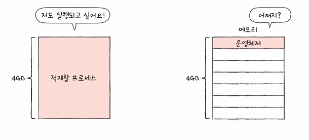

- 가상 메모리
    - 실행하고자 하는 프로그램을 일부만 메모리에 적재하여 실제 물리 메모리 크기보다 더 큰 프로세스를 실행할 수 있게 하는 기술
    - 페이징, 세그멘테이션

# 페이징이란?
- 외부 단편화가 발생했던 근본적인 문제?
- 각기 다른 크기의 프로세스가 메모리에 연속적으로 할당되었기 때문
 

- 페이징(paging)
    - 프로세스의 논리 주소 공간을 페이지(page)라는 일정 단위로 자르고
    - 메모리의 물리 주소 공간을 프레임(frame)이라는 페이지와 동일한 일정한 단위로 자른 뒤
    - 페이지를 프레임에 할당하는 가상 메모리 관리 기법

- 페이징에서의 스와핑
    - 프로세스 단위의 스왑 인, 스왑 아웃이 아닌 페이지 단위의 스왑인(페이지 인), 스왑 아웃(페이지 아웃)
    - 메모리에 적재될 필요가 없는 페이지들을 보조기억장치로 스왑 아웃
    - 실행에 필요한 페이지들을 메모리로 스왑 인
     

    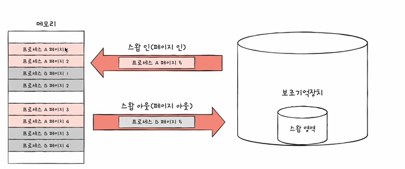

    - 프로세스를 실행하기 위해 모든 페이지가 적재될 필요 없다
    - 달리 말해 물리 메모리보다 큰 프로세스도 실행될 수 있다
     

    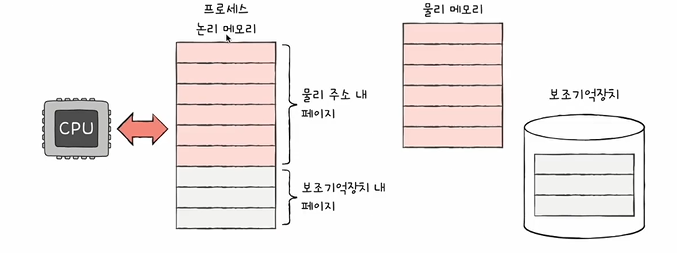

# 페이지 테이블
- 그런데 여기서 문제가 있슴..
    - 프로세스를 이루는 페이지가 어느 프레임에 적재되어 있는지 CPU가 일일이 알기란 어렵다
    - 프로세스가 메모리에 불연속적으로 배치되어 있다면 CPU 입장에서 이를 순차적으로 실행할 수가 없음
    - CPU 입장에서 다음에 실행할 명령어 위치를 찾기가 어려워짐 

- 페이지 테이블(위의 문제를 해결하기 위해서 사용되는 개념)
    - (실제 메모리 내의 주소인) 물리 주소에 불연속적으로 배치되더라도
    - (CPU가 바라보는 주소인) 논리 주소에는 연속적으로 배치되도록 하는 방법
    - 페이지 번호와 프레임 번호를 짝지어 주는 일종의 이정표
    - 프로세스마다 페이지 테이블이 있다
     

    

    - 물리적으로 분산되어 저장되어 있더라도 CPU 입장에서 바라본 논리 주소는 연속적으로 보임
    - CPU는 그저 논리 주소를 순차적으로 실행하면 될 뿐
     

    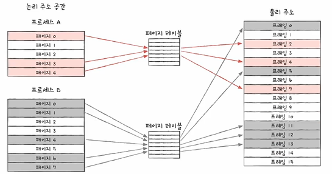

- 내부 단편화
    - 하나의 예시..
    - 페이지 크기가 10KB, 프로세스 크기가 108KB?
    - 2KB : 내부 단편화
    - 하나의 페이지 크기보다 작은 크기로 발생
    - 보편적으로 메모리 낭비의 크기가 외부 단편화보다 작은 경우가 많음...
     

    

# PTBR
- 프로세스마다 페이지 테이블이 있고,
- 각 페이지 테이블은 CPU 내의 프로세스 테이블 베이스 레지스터(PTBR)가 가리킨다
 

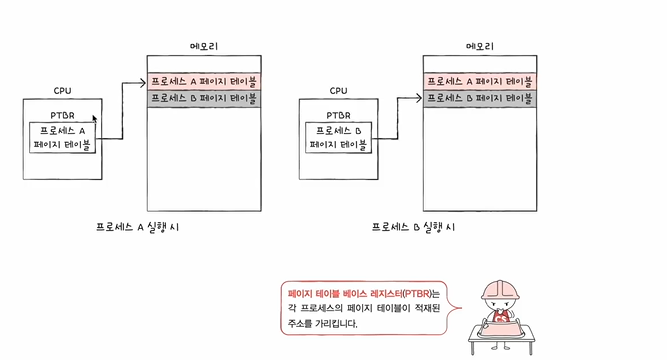

- 그런데, 페이지 테이블이 메모리에 있으면? 메모리 접근 시간이 두 배로..
- 페이지 테이블 참조하기 위해 한 번
- 페이지 참조하기 위해 한번
 

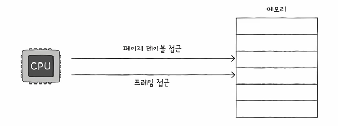

# TLB
- TLB : CPU 곁에 페이지 테이블의 캐시 메소리
- 페이지 테이블의 일부를 가져와 저장
 

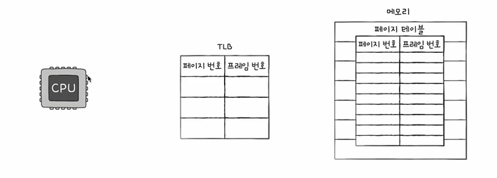

- CPU가 접근하려는 논리 주소가 TLB에 있다면? TLB 히트(메모리 접근 한 번)
- CPU가 접근하려는 논리 주소가 TLB에 없다면? TLB 미스
(메모리 접근 두 번)
 

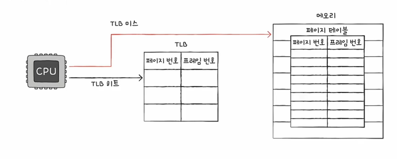

# 페이징에서의 주소 변환
- 특정 주소에 접근하고자 한다면 어떤 정보가 필요할까?
    - 어떤 페이지/프레임에 접근하고 싶은지
    - 접근하려는 주소가 그 페이지 혹은 프레임으로부터 얼마나 떨어져 있는지?
     

    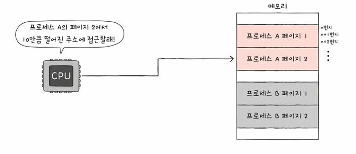

- 페이징 시스템에서의 논리 주소
    - 페이지 번호(page number)와 변위(offset)
     
    

- <페이지 번호, 변위> 로 이루어진 논리 주소는
- 페이지 테이블을 통해
- <프레임 번호, 변위> 로 변환된다
 

# 페이지 테이블 엔트리
- 페이지 테이블의 각각의 행 : 페이지 테이블 엔트리(PTE)
    - 현재까지 설명한 PTE: 페이지 번호, 프레임 번호
    - 이외에 담기는 정보?
     

    

    1. 유효 비트 
    - 현재 해당 페이지에 접근 가능한지 여부
     

    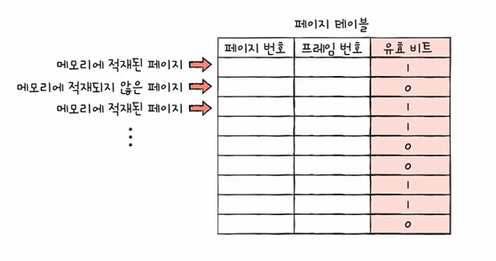

    - 유효비트가 0인 페이지에 접근하려고 하면?
        - 페이지 폴트(page fault)라는 인터럽트 발생
        1. CPU는 기존의 작업 내역을 백업합니다
        2. 페이지 폴트 처리 루틴을 실행합니다
        3. 페이지 처리 루틴은 원하는 페이지를 메모리로 가져온 뒤유효 비트를 1로 변경해 줍니다.
        4. 페이지 폴트를 처리했다면 이제 CPU는 해당 페이지에 접근할 수 있게 됩니다.

    2. 보호 비트
    - 페이지 보호 기능을 위해 존재하는 비트
     

    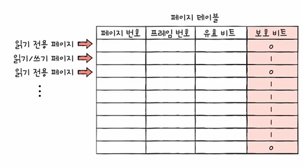
    - 읽기, 쓰기, 실행을 나누어서 실행하는 경우도 있다

    3. 참조 비트
    - CPU가 이 페이지에 접근한 적이 있는지 여부
     

    

    4. 수정 비트
    - CPU가 이 페이지에 데이터를 쓴 적이 있는지 여부
     

    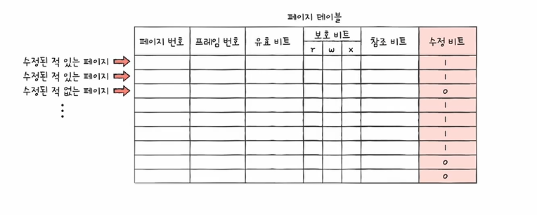
    
    - 수정된 페이지는 스왑 아웃될 떄 보조기억장치에도 쓰기 작업을 거쳐야 한다
     

    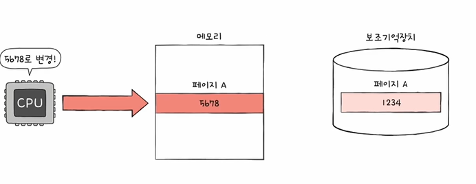