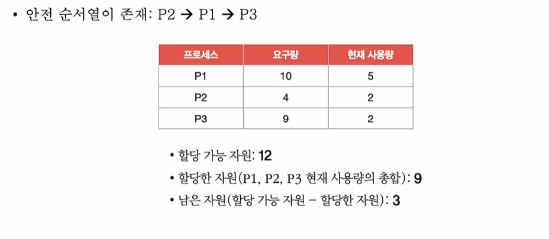

# 들어가며...
- 교착 상태 해결 : 예방, 회피, 검출 후 회복
 

# 교착 상태 예방
- 애초에 교착 상태가 발생하지 않도록
- 교착 상태 발생 조건(상호 배제, 점유와 대기, 비선점, 원형 대기) 중 하나를 없애버리기
    1. 상호 배제를 없애면?
    - 모든 자원을 공유 가능하게 만든다?(현실적으로 불가능) 뭐람;;

    2. 점유와 대기를 없애면?
    - 특정 프로세스에 자원을 모두 할당하거나, 아예 할당하지 않는 방식으로 배분 -> 자원의 활용률을 낮출 수 있는 방식

    - 하지만 단점, 부작용이 많음(당장 자원이 필요하지만 할당 받지 못하여 오랫동안 대기해야 하는 프로세스가 생길 수 있고 프로세스한테 모든 자원을 다 할당 했는데 어떤 자원은 사용하지 않는 불상사가 생길 수 있다..) 이것도 안된단 말이자나..

    3. 비선점 조건을 없애면?
    - 선점이 가능한 자원(e.g. CPU)에 한해 효과적 -> 모든 자원이 선점 가능한 것은 아니다... (한번에 하나의 프로세스만 사용할 수 있는 프린터기라던지... 뭐 억저라고..)

    4. 원형 대기 조건을 없애면?
    - 자원에 번호를 붙이고 <strong>오름차순</strong>으로 할당하면 원형 대기는 발생하지 않음(요개 정답인가 부다했는데 )
     
    

    - 하지만... 자원에 번호를 붙이는 것은 어려운 작업.. 어떤 자원에 어떤 번호를 붙이느냐에 따라 활용률이 달라진다... 어렵다 어려워 

- 교착 상태가 발생하지 않음은 보장할 수 있으나 부작용이 따르는 방식

# 교착 상태 회피
- 교착 상태를 <strong>무분별한 자원 할당으로 인해 발생</strong> 했다고 간주
- 교착 상태가 발생하지 않을 만큼 <strong>조김 조심 할당</strong>하기
- 배분할 수 있는 자원의 양을 고려하여 교착 상태가 발생하지 않을 만큼만 자원 배분
 

- 교착 상태 회피에 관현 3가지 용어
- 안전 순서열 : 교착 상태 없이 안전하게 프로세스들에 자원을 할당할 수 있는 순서
- 안전 상태 : 교착 상태 없이 모든 프로세스가 자원을 할당 받고 종료될 수 있는 상태 / 안전 순서열이 있는 상태
- 불안전 상태 : 교착 상태가 발생할 수도 있는 상태 / 안전 순서열이 없는 상태
 

- 안전 상태에서 안전 상태로 움직이는 경우에만 자원을 할당하는 방식
- 항시 안전 상태를 유지하도록 자원을 할당하는 방식
- c.f. 은행원 알고리즘

# 교착 상태 검출 후 회복
- 교착 상태의 발생을 인정하고 사후에 조치하는 방식
- 프로세스가 자원을 요구하면 일단 할당, 교착 상태가 검출되면 회복
- 선점을 통한 회복, 프로세스 강제 종료를 통한 회복
    1. 선점을 통한 회복
    - 교착 상태가 해결될 떄까지 한 프로세스씩 자원을 몰아주는 방식

    2. 프로세스 강제 종료를 통한 회복
    - 교착 상태에 놓인 프로세스 모두 강제 종료(-> 작업 내역을 잃을 위험)
    - 교착 상태가 해결될 때까지 한 프로세스씩 강제 종료(-> 오버헤드)