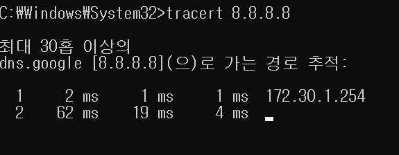
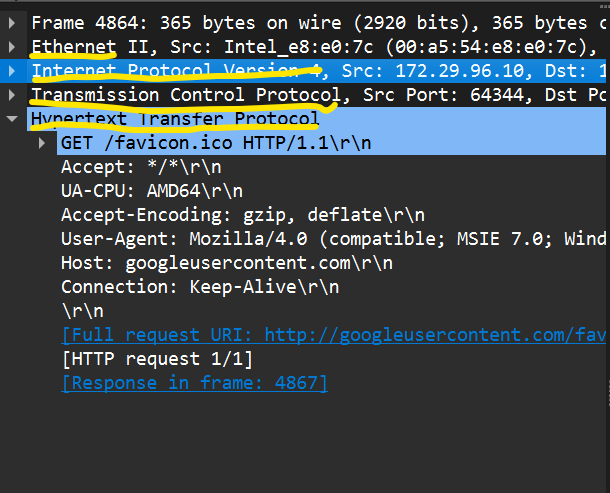

# INDEX


# 네트워크란 무엇인가?

- 네트워크란?
    - 노드들이 데이터를 공유할 수 있게 하는 디지털 전기통신망의 하나이다.
    - 즉, 분산되어 있는 컴퓨터를 통신망으로 연결한 것을 말한다
    - 네트워크에서 여러 장치들은 노드 간 연결을 사용하여 서로에게 데이터를 교환한다
    - *노드 : 네트워크에 속한 컴퓨터 또는 통신 장비를 뜻하는 말
    <br>
    

- 인터넷이란?
    - 문서, 그림 영상과 같은 여러가지 데이터를 공유하도록 구성된 세상에서 가장 큰 전세계를 연결하는 네트워크(네트워크 안에 인터넷이 포함되어있다!! 인터넷은 네트워크 통신망 중에서 제일 큰것이라고 생각하면된다!!)
    - 흔히 www를 인터넷으로 착각하는 경우가 많은데 www는 인터넷을 통해 웹과 관련된 데이터를 공유하는 것(인터넷 통신망에 있는 것들중 제일 많이 사용하는 웹 서비스 : www)


# 네트워크의 분휴

- 크기에 따른 분류
<br>


- 여기서 LAN과 WAN만 알고있으면 된다!!!

    1. LAN(Local Area Network) : LAN은 가까운 지역을 하나로 묶은 네트워크
    <br>
    

    2. WAN(Wide Area Network) : WAN은 멀리 있는 지역을 한데 묶은 네트워크, 가까운 지역끼리 묶인 LAN과 LAN을 다시 하나로 묶은 것
    - ex: 네이버 인터넷에 접속(LAN과 LAN을 연결한다는 느낌..)


- 연결 형태에 따른 분류
<br>


- 여기서 Star형과 Mesh형만 알고있으면 된다!!!

    1. Star형 : 중앙 장비에 모든 노드가 연결..
    - 일반적으로 가정집에서는 공유기를 통해서 핸드폰, 컴퓨터, TV 등등이 연결된다(하나의 장비에 여러가지가 연결되어있다...)
    - 이때 만약 공유기가 고장난다면?? OMG
    <br>
    

    2. Mesh형 : 여러 노드들이 서로 그물처럼 연결..
    <br>
    

    3. 혼합형 : 실제 인터넷은 여러 형태의 혼합한 형태..
    - 다른 나라랑 연결할 때는 정말 굵은 해저 케이블로 연결된다고 합니다... 신기방기
    <br>
    


# 네트워크의 통신방식

- 네트워크에서 데이터는 어떻게 주고 받는가?
<br>


# 네트워크 프로토콜

- 프로토콜이란?
    - 프로토콜은 일종의 약속, 양식
    - 네트워크에서 노드와 노드가 통신할 때 어떤 노드가 어느 노드에게 어떤 데이터를 어떻게 보내는지 작성하기 위한 양식
    - 택배는 택배만의 양식, 편지는 편지만의 양식, 전화는 전화만의 양식
    <br>
    
    - 각 프로토콜들도 해당, 프로토콜만의 양식

- 여러가지 프로토콜
<br>


- 실습 미리보기..
    1. 구글과 나는 어떻게 연결되어 잇는지 확인해보기
    - 구글의 서버와 여러분의 컴퓨터가 어떻게 연결되어 있는지 확인해보기

    2. Wireshark 설치
    - 프로토몰이 어떻게 생겼는지 직접 보기 위해 사용할 프로그램을 설치

    3. 프로토콜 직접 확인해보기
    - 설치한 Wireshark를 이용해서 현재 컴퓨터에엇 인터넷을 통해 주고받고 잇는 모든 내용을 직접 확인해보기
<hr>

# 실습 1. 구글과 나는 어떻게 연결되어 있는지 확인해보기

- 시작 메뉴 -> cmd 검색 -> cmd 실행
- cmd에서 tracert 8.8.8.8로 확인
``` md
tracert 명령어는 네트워크 경로를 추적하는 데 사용되는 도구이다!!
'tracert 8.8.8.8' 명령어는 구글의 DNS 서버(8.8.8.8)까지의 네트워크 경로를 추적하는 것으로 이 명령어는 목적지 서버에 도달하기까지의 각 네트워크 홉(hop)을 통해 패킷이 경우하는 경로와 각 경유지의 응답 시간을 보여줍니다

1. 목적지 IP주소 : '8.8.8.8'은 구글의 공용 DNS 서버입니다. 따라서 이 명령어는 사용자의 컴퓨터에서 구글의 DNS 서버까지의 경로를 추적합니다.

2. 경로 추적 : 'tracert' 명령어는 목적지 서버에 도달할 때까지 거치는 각 네트워크 장치(라우터, 스위치 등)를 추적합니다. 이를 통해 패킷이 목적지에 도달하기까지 경유하는 네트워크 경로를 확인할 수 있습니다.

3. 응답 시간 : 각 경유지마다 왕복 시간(RTT, Round Trip Time)이 표시됩니다. 이는 각 네트워크 장치까지의 응답 시간을 나타내며, 네트워크의 어느 부분에서 지연이 발생하는지 파악할 수 있습니다.
```
<br>



# 실습 2. Wireshark 설치

- wireshark 설치 프로그램을 이용해서 설치
- 설치 후 실행
- 실행했을 때 인터페이스가 안보이면 winpcap 설치(npcap말고 winpcap설치.. 뭐 호환이 안된다고 합니다..)


# 실습 3. 프로토콜 직접 확인해보기

- wireshark를 이용해서 프로토콜 캡쳐 후 확인해보기
