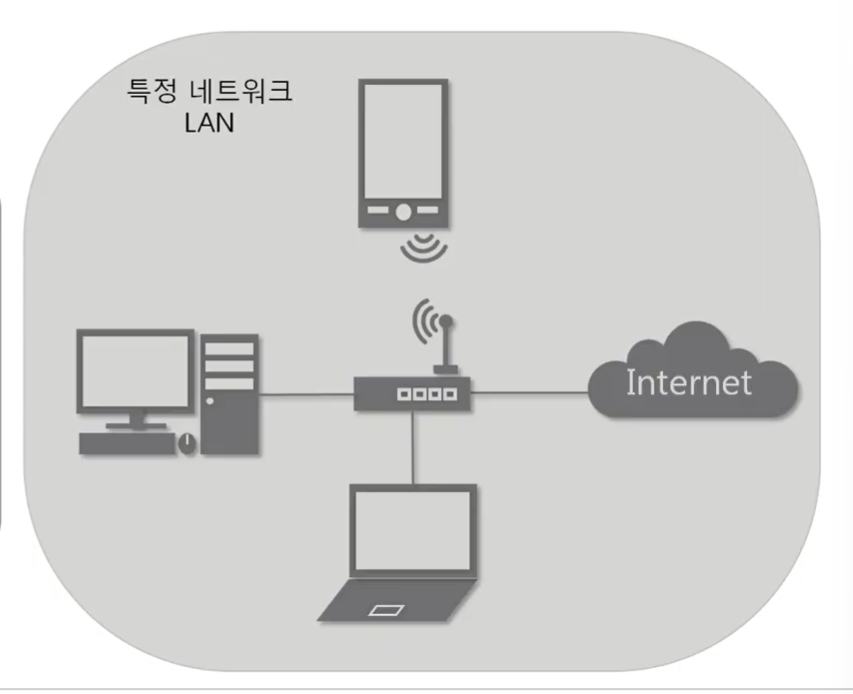
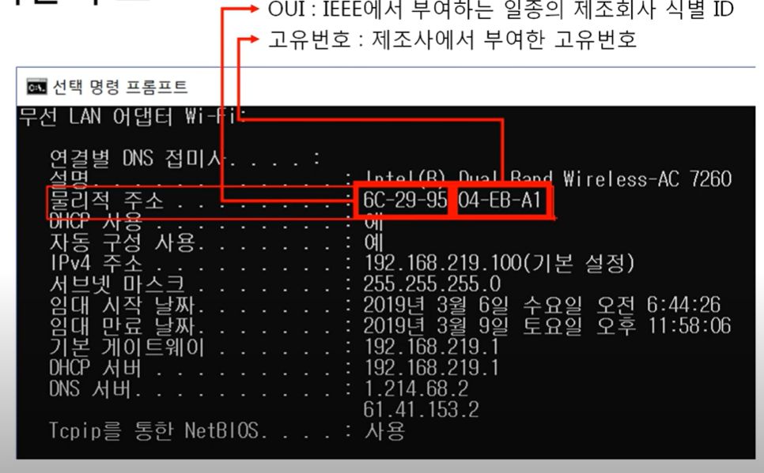
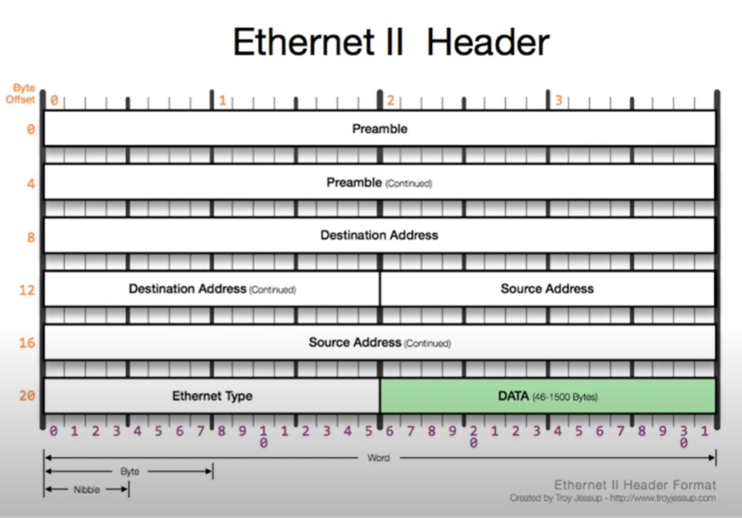

<h2>가까이 있는 컴퓨터끼리는 이렇게 데이터를 주고 받는다</h2>

# INDEX..

1. 2계층에서 하는 일 : 2계층의 기능, 2계층의 네트워크 크기
2. 2계층에서 사용하는 주소 : 물리적인 주소, MAC 주소
3. 2계층 프로토콜 : Ethernet 프로토콜
4. 따라학IT : 내 MAC 주소 알아보기, Ethernet 프로토콜 캡쳐, Ethernet 프로토콜 분석

# 2계층에서 하는 일

1. 2계층의 기능
- 2계층은 하나의 네트워크 대역
- 즉, 같은 네트워크 상에 존재하는 여러 장비들 중에서 어떤 장비가 어떤 장비에게 보내는 데이터를 전달
- 추가적으로 오류 제어, 흐름제어 수행
 

2. 2계층의 네트워크 크기
- 2계층은 하나의 네트워크 대역 LAN에서만 통신할 때 사용한다
- 다른 네트워크와 통신할 때는 항상 3계층이 도와주어야 한다
- 3계층의 주소인 3계층의 프로토콜을 이용하여야만 다른 네트워크와 동신이 가능하다

# 2계층에서 사용하는 주소

1. 물리적인 주소
- LAN에서 통신할 떄 사용하는 MAC 주소(다른 말로 물리적인 주소, 고유한 주소값)
- 16진수 두개로 나눠서 씀.., 대쉬나 콜론으로 구분한다
- 앞의 16진수 : 회사의 고유 번호(OUI)
- 뒤의 16진수 : 그 회사에서 부여한 고유번호..
- 하드웨어 장치에 부여되는 값이기에 쉽게 바뀔 수 없고 고유한 값을 가진다
 

# 2계층의 프로토콜

1. Ethernet 프로토콜
- LAN에서 통신할 때 사용하는 프로토콜..
- 이더넷 프로토콜에 보낼 주소와 받는 주소를 써 넣는다
 

