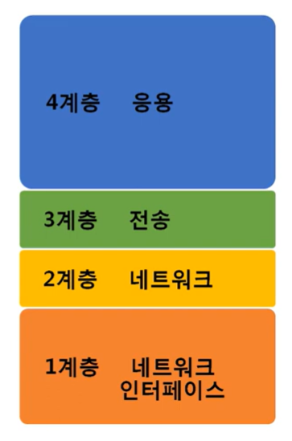
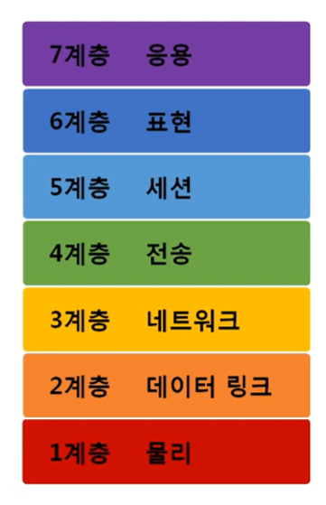
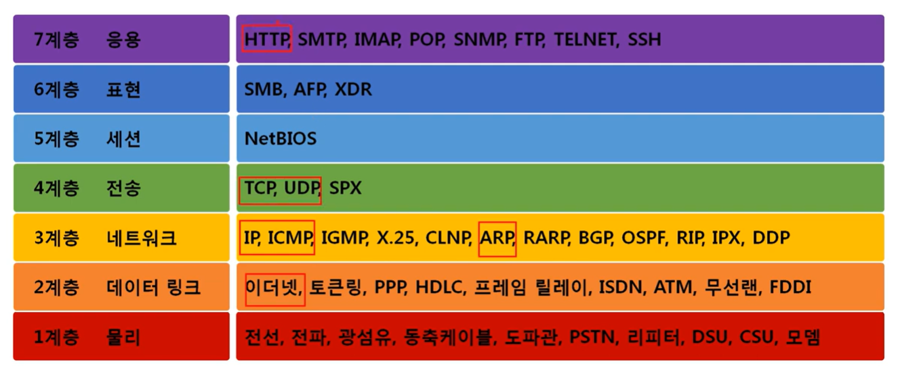
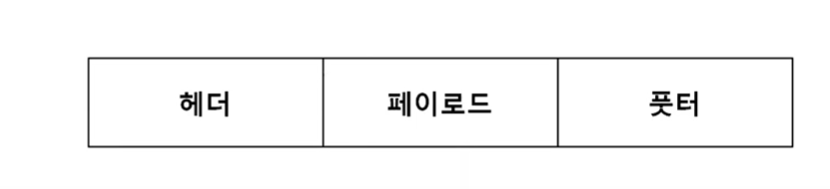
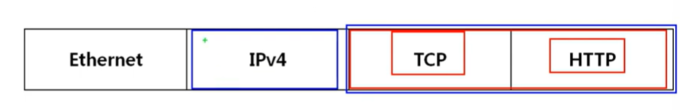
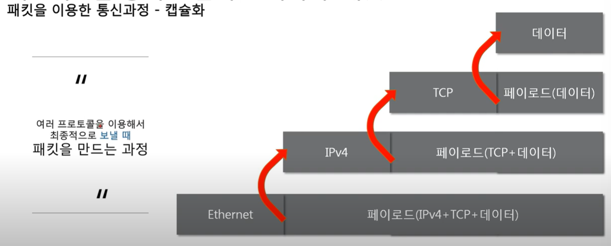
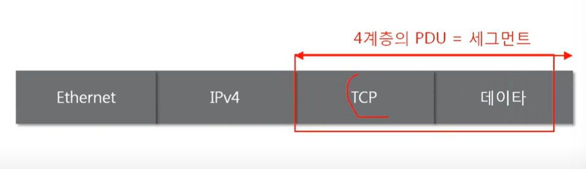
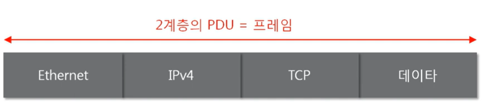

# Index..

1. 네트워크 모델의 종류 : TCP/IP모델 / OSI 7계층 모델
2. 두 모델 비교 : 공통점과 차이점
3. 네트워크를 통해 전달되는 데이터, 패킷 : 패킷이란? 패킷을 이용한 통신과정, 계층별 패킷의 이름 PDU
4. 따라학IT : 공통점과 차이점


# 네트워크 계층 모델

1. TCP/IP 모델
<br>



- 1960년대 말 미국방성의 연구에서 시작되어 1980년 대 초 프로토콜 모델로 공개
- 현재의 인터넷에서 컴퓨터들이 서로 정보를 주고받는데 쓰이는 통신 규약(프로토콜)의 모음이다


2. OSI 7계층
<br>



- 1984년 네트워크 통신을 체계적으로 다루는 ISO에서 표준으로 지정한 모델
- 데이터를 주고받을 때 데이터 자체의 흐름을 각 구간별로 나눠 놓은 것
- OSI 7계층 모델의 계층별 프로토콜(체크한것들은 프로토콜 구조까지도 알고 있어야 한다)
<br>




3. 두 모델의 비교
- 공통점
    - 계층적 네트워크 모델
    - 계층간 역할 정의
- 차이점
    - 계층의 수 차이
    - OSI는 역할 기반(논리적으로 기능들을 상세하게 구분 / 우리나라의 웬만한 시험에서, 면접에서 많이 물어봄), TCP/IP는 프로토콜 기반
    - OSI는 통신 전반에 대한 표준
    - TCP/IP는 데이터 전송 기술 특화


# 네트워크를 통헤 전달되는 데이터, 패킷

1. 패킷이란?
- 패킷이란 네트워크 상에서 전달되는 데이터를 통칭하는 말로 네트워크에서 전달하는 데이터의 형식화된 <strong>블록</strong>이다.
- 패킷은 제어 정보와 사용자 데이터로 이루어지켜 사용자 데이터는 페이로드라고도 한다
<br>


``` md
- 페이로드 : 내가 보내려고 하는 데이터
- 앞에 헤더가 붙을수도 있고, 뒤에 풋터라는 친구가 붙을 수도 있다
- 근데 일반적으로 풋터는 잘 사용을 안함 대부분 헤더 사용
- 페이로드에 프로토콜을 헤더로 붙이는 과정(인캡슐네이션), 내가 누군가에게 패킷을 보낼때 사용함..(네이버 웹툰을 보려고 네이버한테 요청을 해야 네이버가 보내줌.)
- ex : http프로토콜을 페이로드로 해서 tcp 헤더로 붚이고 이것을 페이로드로 해서 IPv4를 붙이고 이것을 헤더로 해서 Ethernet을 헤더로 붙임
```







2. 계층별 패킷의 이름 PDU

- 4계층의 PDU : 세그먼트


- 3계층의 PDU : 패킷


- 2계층의 PDU : 프레임(2계층까지 인캡슐네이션 된 상태)

