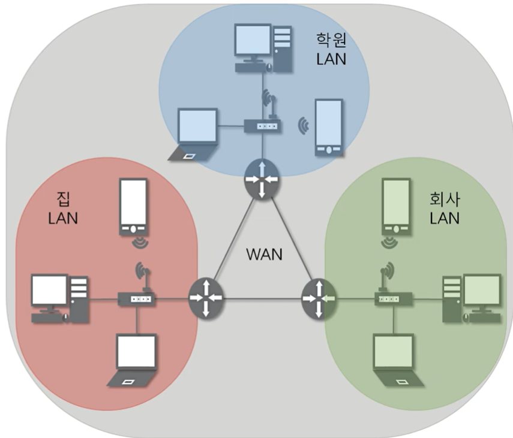
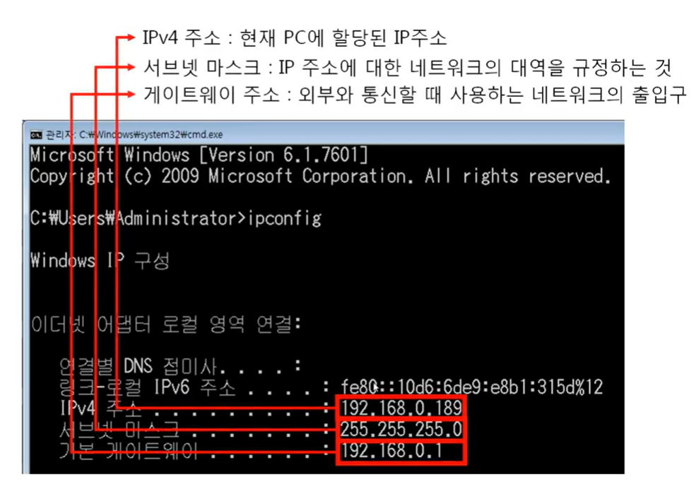
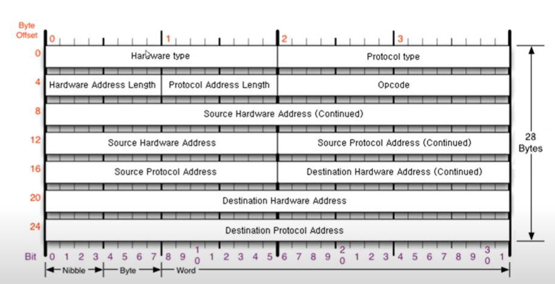
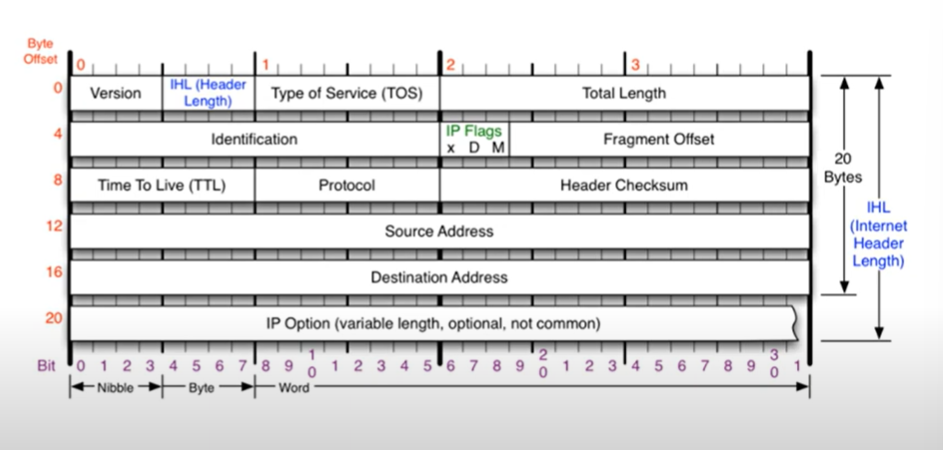
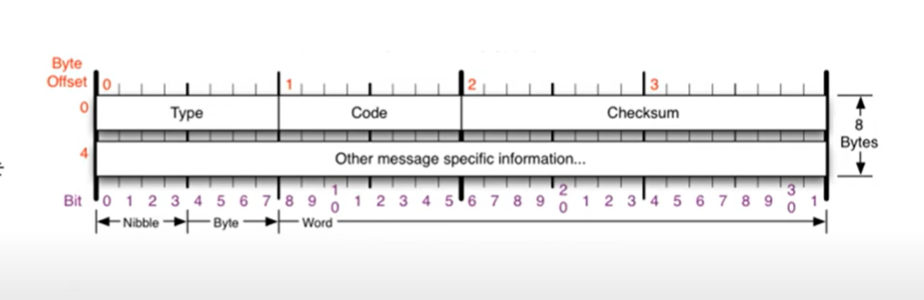
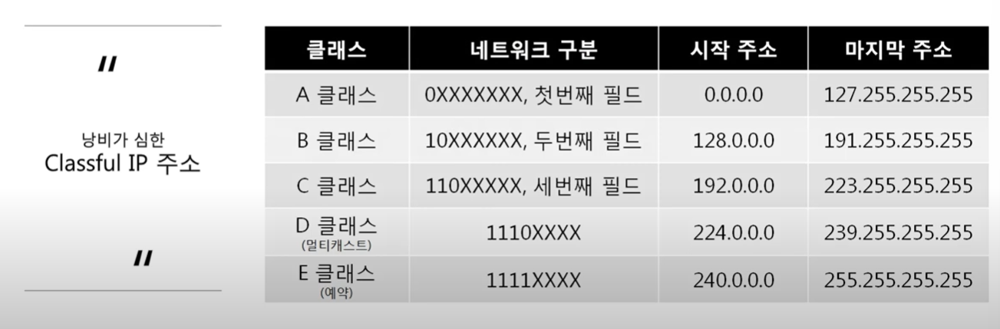
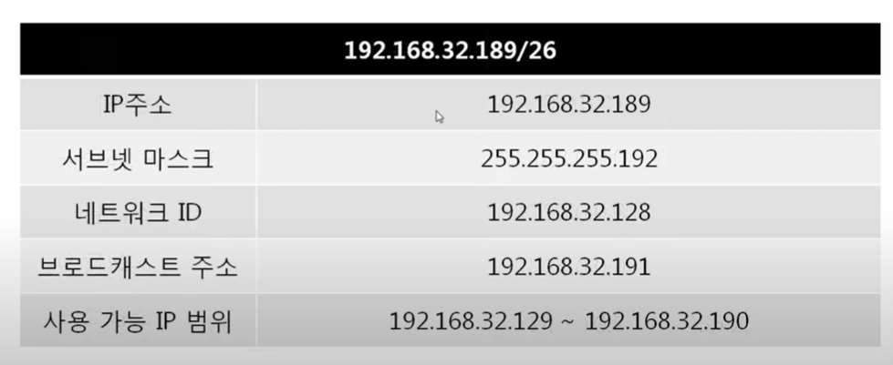
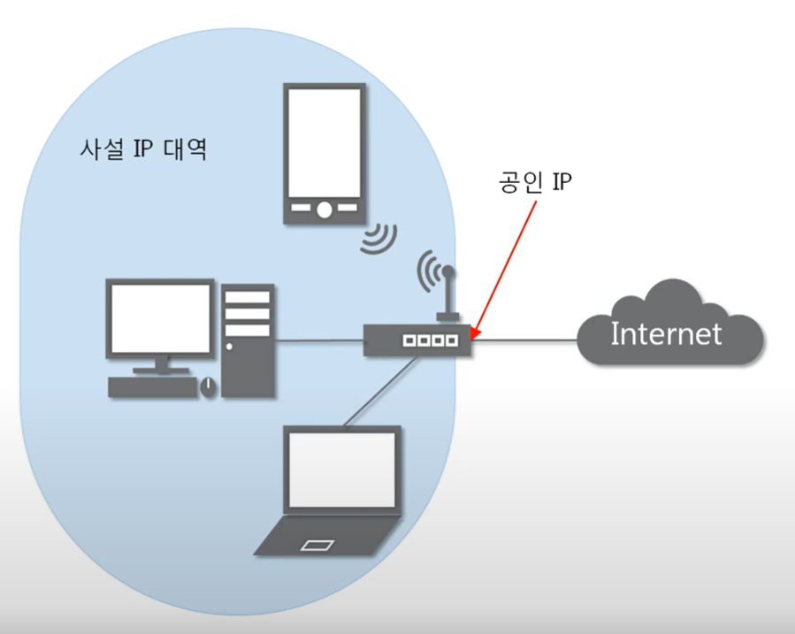
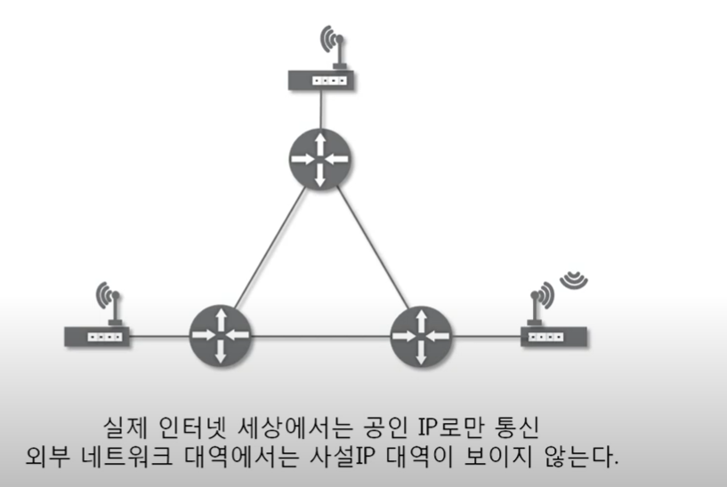

<h2>실제로 컴퓨터끼리는 IP주소를 사용해 데이터를 주고 받는다</h2>


# Index

1. 3계층의 기능 : 3계층에서 하는 일, 3계층에서 쓰는 주소, 3계층 프로토콜
2. 일반적인 IP 주소 : Classful, Classless, 사설 IP와 공인 IP
3. 특수한 IP 주소 : 0.0.0.0, 127.X.X.X
4. 따라학 IT : 내 PC의 IP주소 알아보기, 네이버가 보는 내 IP주소 알아보기


# 3계층의 기능

1. 3계층에서 하는 일
- 3계층은 다른 네트워크 대역, 멀리 떨어진 곳에 존재하는 네트워크까지 어떻게 데이터를 전달할지 제어하는 일을 담당
- LAN과 LAN을 연결시켜주는 것이 3계층의 역할이라고 보면 된다..
- 잘신에서 착신까지의 패킥의 경로를 제어
- 3계층의 대표적인 장비 : 라우터(서로다른 네트워크를 연결하라면 라우터와 같은 장비가 필요함, 스위치와 같은 2계층 장비만으로는 서로 다른 네트워크 대역으로 갈 수는 없음)
<br>




2. 3계층에서 쓰는 주소

- IP 주소 : WAN에서 통신할 때 사용
- IPv4같은 경우에는 멀리 있는 곳이랑 통신을 할 때, IP주소만 있는 것이 아니라 서브넷 마스크, 게이트웨이 라는것이 추가적으로 필요하다
``` md
- 서브넷 마스크
    - 클래스풀한 네트워크 대역을 나눠주는데 사용하는 값
    - 어디까지가 네트워크 대역을 구분하는데 사용하고 어디서부터 호스트를 구분하는데 사용하는지 지정
    - 32 bit 4바잍....
    - 255.255.255.192 -> 11111111.11111111.11111111.11000000
    - 2진수로 표기했을 때 1로 시작, 1과 1사이에는 0이 올 수 없다는 규칙을 가지고 있다
```
<br>



3. 3걔층의 프로토콜(종류만 알아보고 넘어가신다고..)

- ARP 프로토콜 : IP 주소를 이요해 MAX 주소를 알아옴
<br>



- IPv4 프로토콜 : WAN에서 통신할 때 사용
<br>



- ICMP 프로토콜 : 서로가 통신되는지 확인할 때 사용



# 일반적인 IP 주소(일반적인 주소라고 하면 IPv4를 말함)

1. Classful IP 주소 : 클래스 별로 IP주소를 구분함(IP주소가 처음 나왔을 때, 알필요 없다는데 이거 정처기 나옴 ㅎ)
- A ~ C : 일반적으로 우리가 사용하는 컴퓨터의 클래스(A클래스의 경우 대규모로 필요한 경우에 사용한다)
- D : 멀티캐스트를 위해서 남겨둔 주소
- E : 연구를 위해서 남겨둔 주소
- 클래스를 맞춰서 네트워크 대역을 하다보니... 문제가 생겼는데
- 남는 IP주소가 너무 많이 남음....  ip주소가 낭비가 되성 낭비를 해서 써도 남았지만 지금은 세상이 너무 빨리 발전해서 부족해지기 시작... 딱 맞지 않게 쓰면 되자나?? classless하게 쓰자~~ 
<br>




2. Classfulless IP 주소 : 낭비되지 않도록 아껴쓰자
<br>



3. 사설 IP와 공인 IP : 공인 IP 1개당 2의 32승 갱의 사설 IP(현재는 이것과 Classfulless IP를 같이 사용중에 있다)

<br>


- 공인 IP : 실제 네트워크 통신망이랑 통신할 때 사용하는 IP 주소
- 사설 IP : 같은 네트워크 대역에서 사용하는 IP 주소

- cmd에서 ip주소를 치면 각자의 걸로 나오지만 네이버에서 IP 주소는 모든 컴퓨터든 동일하게 나옴(외부랑 통신할 때는 공인 IP로 바껴서 이용되기 때문)
- 그래서 네이버가 우리가 요청한 웹투을 보여줄때는 같은데 어떻게 보내주냐? 공유기가 찾아줌 ㅎㅎ
- NAT(Network Address Transration) : 네트워크 주소를 사설 IP에서 공인 IP로 바꾸는 것
- ex: 3만원주고 인터넷 연결한것이 공인 IP하나를 산것과 같은 의미(같은 네트워크 대역에 있는것은 사설 IP를 쓴다..)
- 실제 인터넷 세상에서는 공인 IP로만 통신이 되므로 외부 네트워크 대역에서는 사설 IP 대역이 보이지 않는다

<br>




# 특수한 IP 주소

1. 0.0.0.0/0 : 가장 첫번째 IP

- 쉽게 생각했을때 나머지 모든 IP.. 뭔말이냐..
- 컴퓨터에 사용하는 친구가 아님..

2. 127.0.0.1 : 나 자신을 나타내는 주소(내 컴퓨터)

- 네트워크 진단시 사용..

3. 게이트웨이 주소 : 어딘가로 가려면 일단 여기로..