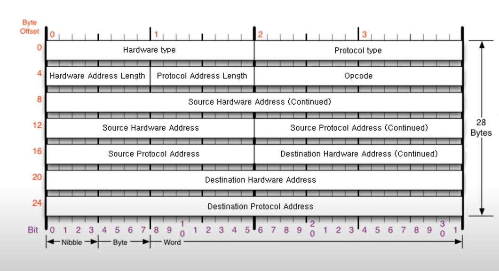
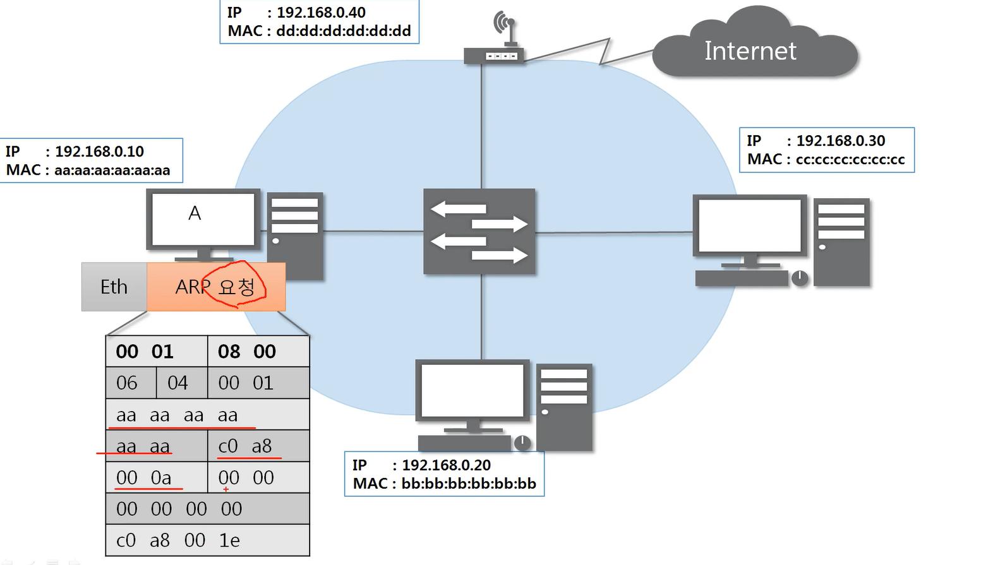
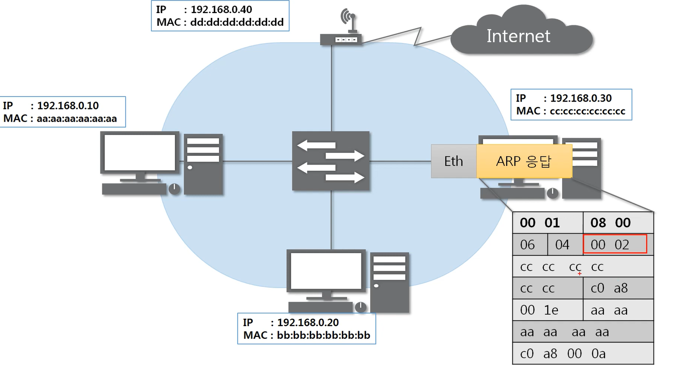
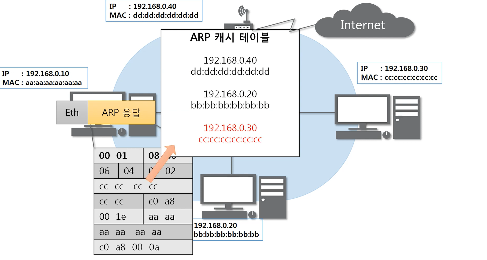
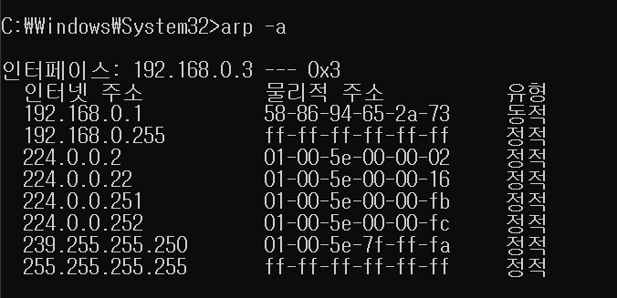

# Index 

1. ARP 프로토콜 : ARP가 하는 일, ARP 프로토콜의 구조
2. ARP 프로토콜의 통신 과정 : IP 주소로 MAC 주소를 알아오는 과정
3. ARP 테이블 : 나와 통신했던 컴퓨터들
4. 따라학 IT : ARP 테이블(통신한 것들을 기록하는 공간) 확인해보기, ARP 프로토콜 분석하기

# ARP 프로토콜

1. ARP가 하는 일

- ARP 프로토콜은 같은 네트워크 대역에서 통신을 하기 위해 필요한 MAC 주소를 IP 주소를 이용해서 알아오는 프로토콜!
- 우리가 딱히 뭔가를 해줄 필요는 없지만 컴퓨터가 계속해서 사용하고 있는 프로토콜이다.. 컴퓨터 힘내..

- 같은 네트워크 대역에서 통신을 한다고 하더라도 데이터를 보내기 위해서는 7계층부터 캡슐화를 통해 데이터를 보내기 때문에 IP 주소와 MAC 주소가 모두 필요하다
- 이때 IP 주소는 알고 MAC 주소는 모르더라도 ARP를 통해 통신이 가능하다

2. ARP 프로토콜의 구조
 

- 중간 친구들

    - 시작지의 하드웨어 주소, 목적지의 하드웨어 주소 : MAC(6바이트)
    - 시작지의 프로토콜 주소, 목적지의 프로토콜 주소 : IP(4바이트)
    - 총 28바이트 중에 20바이트가 소요된다
    - 이더넷 프로토콜만 목적지가 먼저오고 나머지는 출발지가 먼저 온다

- 앞부분 친구들..

    - 사용하는 하드웨어 타입(보통 이더넷(0001), 2바이트)
    - 사용하는 프로토콜 타입(보통 IPv4(0800), 2바이트)
    - 0001 0800 첫줄은 16진수로 들어간다고 보면 된다

    - 하드웨어 주소 길이(MAC 주소(06))
    - 프로토콜 주소 길이(IPv4 주소(04)) ... 여기까지 예외는 거의 없다

    - Opcode(Operation code) : 어떻게 동작하는지를 나타내는 코드값
        - 2가지 밖에 없다
        - 000(x) : 여기까지도 예외는 거의 없다
        - ARP 프로토콜에 대해 주소 요청을 하는지 응답을 하는지 2가지로 나뉜다고 함
        - 물어보면 1로 물어보고, 응답 받을때는 2로 받는다!!!

# ARP 프로토콜의 통신 과정

1. IP 주소로 MAC 주소를 알아오는 과정

    
    1. MAC 주소 알려달라고 arp 프로토콜에 요청 보내기
     

    
        - 목적지 ip 주소 모르면 000000000으로 쓴다
        - 목적지 mac 주소 모르면 fffffff로 쓴다
        - 어디로 보낼지 모르니까 브로드 캐스트로 보내야 함..
        - 같은 네트워크에 있는 곳들에 arp 요청을 하고 해당하는 ip를 가진곳에서 응답을 한다
        - 나머지는 패킷을 버림

    2. arp 응답보내기..
     

    
        - 다른건 목적지 주소가 출발지 주소로 간것이랑...
        - Opcode가 1에서 2로 변한것..

    3. 디캡슐레이션해서 arp 캐시 테이블에 해당 내용을 등록한다!!
     

    

    4. 통신 시작~~~

# 따라학 IT

- arp 캐시 테이블 확인
 

