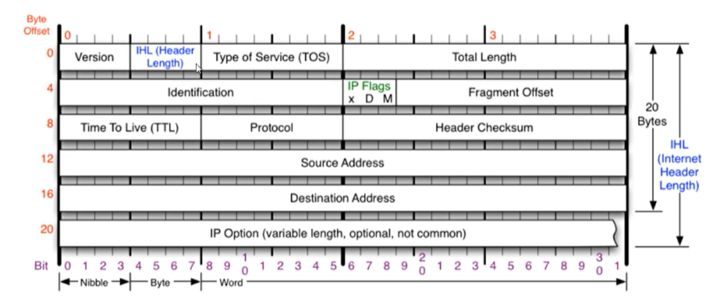
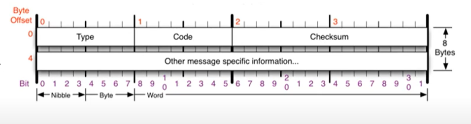
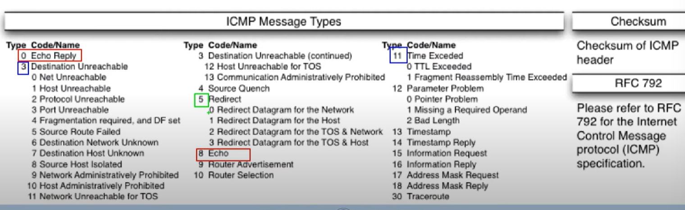

# 멀리 있는 컴퓨터끼리는 이렇게 데이터를 주고 받는다 

## INDEX..

1. IPv4 프로토콜 : IPv4가 하는 일, IPv4 프로토콜의 구조
2. ICMP 프로토콜 : ICMP가 하는 일, ICMP 프로토콜의 구조
3. 라우팅 테이블 : 내가 보낸 패킷은 어디로 가는가
4. 다른 네트워크와 통신 과정 : 다음 네트워크까지 내 패킷의 이동 과정
5. IPv4의 조각화 : 조각화란?, 조각화하는 과정
6. 따라학 IT : 라우팅 테이블 확인해보가, 패킷 분석하기


### IPv4 프로토콜

1. IPv4가 하는 일
- 네트워크 상에서 데이터를 교환하기 위한 프로토콜
- 데이터가 <strong>정확하게 전달될 것을 보장하지 않는다</strong> 데이터가 누락되거나 깨질 수도 있다고 함.. 당황스...
- 중복된 패킷을 전달하거나 패킷의 순서를 잘못 전달할 가능성도 있다(악의적으로 이용되면 Dos 공격이 됨)
- 데이터의 정확하고 순차적인 전달은 그보다 상위 프로토콜인 TCP에서 보장한다

2. IPv4의 구조



``` md
- 마지막 줄은 추가적으로 붙을 수도 있고 아닐 수도 있음
- IPv4는 20바이트라고 생각하면 된다
- 출발지, 목적지 주소에 4바이트씩 각각 든다
- 첫번째는 버전(4또는 6이지만 무조건 4... 6이 오는 경우는 구조 자체가 아예 다름)
- IPv4 프로토콜의 헤더의 길이 : 4비트(2진수 4개.. 1111 -> 15)
- TOS(주고 받는 데이터의 형식) : 굉장히 옛날 값... 0으로 비워둔다
- Total Length : 상위 계층에서 부터 내려온 데이터 그냥 다 전체의 길이..
- Identification, flag, Fragment Offset은 하나의 세트
- Identification : 쪼개진 여러개의 패킷이 원래는 하나였다는 것을 알 수 있도록 id를 식별할 수 있는것..
- IP Flags : 3비트로 이루어져 있고 D는 패킷을 보내는 사람이 데이터를 안 쪼개서 보내겠다고 명시... 근데 이렇게 지정하면 전송이 안된다는데 뭐야~~ 거의 안 쓴다고 함..., M밖에 안 씀.. 조각화가 일어났다는 말이심..
- Fragment Offset : 13비트, 원래로 복구할때 순서가 있을거 아님 받을 때는 어떤 순서로 받아야 할지 모르자나.. 조립을 똑바로 해야하자나.. 이 순서를 알아볼 수 있도록 offset을 지정(시작 부분으로 부터 얼마나 떨어져 있는지를 지정한다라고)
- TTL(Time To Live) : 패킷이 살아있을 수 있는 시간(시간이 줄어들다가 없어지면 버려버린다 -> 죽었다고 표현함), 상대방의 운영체제를 알 수 있다!
- Protocol : 이더넷에 상위 프로토콜이 뭔지 알려주는 것
- Header Checksum : 헤더에 오류가 있는지 없는지 체크하는 값(내가 계산한 값이 세팅한 값이랑 다르면 오류..), 자동으로 컴퓨터가 알아서 한다
```


### ICMP 프로토콜

1. ICMP가 하는 일

- ICMP(Internet Control Message Protocol, 인터넷 제어 메시지 프로토콜)
- 네트워크 컴퓨터 위에서 돌아가는 운영체제에서 오류 메시지를 전송 받는 데 주로 쓰인다
- 프로토콜 구조의 Type과 Code를 통해 오류 메시지를 전송 받는다

2. ICMP 프로토콜의 구조




```
Type : 카테고리(개분류), 많아요 아주... 너무...(0 - 응답, 8 - 요청, 3 - 목적지에 도달할 수 없다, 11 - 요청 시간이 만료되었습니다(약간 대표적인 예가... 상대방이 요청을 보냈는데 내 방화벽으로 씹은 경우..), 5 - 원격지에 있는 상대방의 라우팅 테이블을 ICMP가지고 수정할 떄 사용... 정도는 알아 두시기를..) -> 네트워크 엔지니어가 이것만 보고 알 수 있다
Code : 타입의 소분류.. 
```